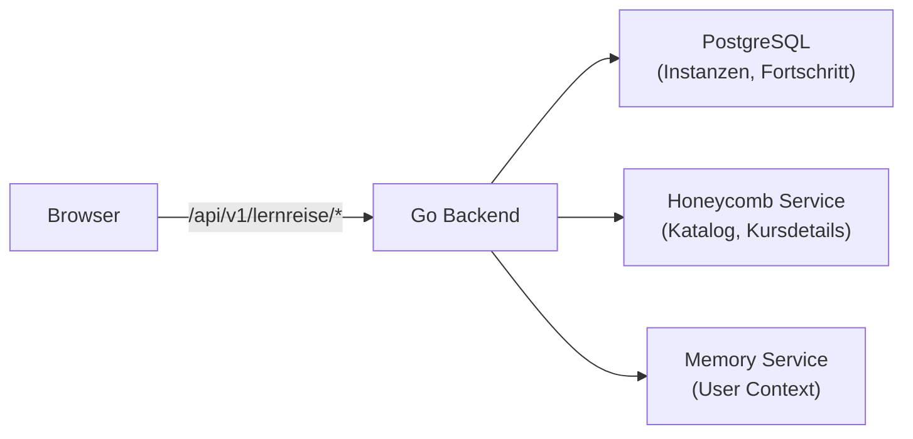
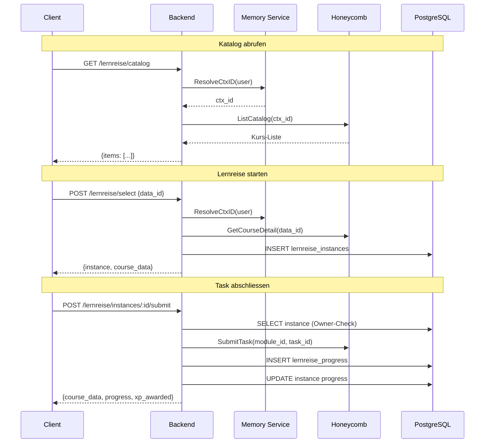

# Lernreise API

Die Lernreise API (FR-074, FR-075) ermoeglicht es Nutzern, strukturierte Lernreisen aus dem Honeycomb-Katalog auszuwaehlen, zu bearbeiten und ihren Fortschritt zu verfolgen. Die Lernreise-Daten werden in PostgreSQL gespeichert, der Katalog wird vom externen Honeycomb-Service bezogen.

## Ueberblick



## Authentifizierung

Alle Lernreise-Endpoints erfordern einen gueltigen Firebase JWT-Token:

```http
Authorization: Bearer <firebase-jwt>
```

## Endpoints

### GET /api/v1/lernreise/catalog

Verfuegbare Lernreisen aus dem Honeycomb-Katalog auflisten.

**Beschreibung:** Laedt den Kurs-Katalog vom Honeycomb-Service. Der User Context (ctx_id) wird automatisch erstellt oder wiederverwendet ueber den Memory Service.

```http
GET /api/v1/lernreise/catalog
Authorization: Bearer <token>
```

**Response (200 OK):**

```json
{
  "items": [
    {
      "data_id": "course-vuca-basics",
      "title": "VUCA Grundlagen",
      "description": "Einfuehrung in die VUCA-Dimensionen",
      "category": "vuca",
      "modules": 12,
      "estimated_hours": 8
    },
    {
      "data_id": "course-entrepreneur-path",
      "title": "Unternehmer-Pfad",
      "description": "Grundlagen des Unternehmertums",
      "category": "entrepreneur",
      "modules": 10,
      "estimated_hours": 6
    }
  ]
}
```

**Fehler:**

| Code | Meldung | Ursache |
|------|---------|--------|
| 401 | authentication required | Kein gueltiger JWT |
| 502 | failed to resolve user context | Memory Service nicht erreichbar |
| 502 | failed to fetch catalog | Honeycomb Service nicht erreichbar |

---

### GET /api/v1/lernreise/catalog/:dataId

Details eines einzelnen Kurses aus dem Honeycomb-Katalog abrufen.

```http
GET /api/v1/lernreise/catalog/course-vuca-basics
Authorization: Bearer <token>
```

**Response (200 OK):**

```json
{
  "data_id": "course-vuca-basics",
  "title": "VUCA Grundlagen",
  "description": "Einfuehrung in die VUCA-Dimensionen",
  "modules": [
    {
      "module_id": "v1",
      "title": "Volatilitaet verstehen",
      "tasks": [
        { "task_id": "v1-t1", "title": "Einfuehrungsvideo", "type": "video" },
        { "task_id": "v1-t2", "title": "Reflexionsfragen", "type": "quiz" }
      ]
    }
  ]
}
```

---

### POST /api/v1/lernreise/select

Eine Lernreise auswaehlen und starten. Erstellt eine neue Instanz in PostgreSQL.

```http
POST /api/v1/lernreise/select
Content-Type: application/json
Authorization: Bearer <token>

{
  "data_id": "course-vuca-basics"
}
```

**Response (201 Created):**

```json
{
  "instance": {
    "id": "uuid-der-instanz",
    "user_id": "uuid-des-nutzers",
    "ctx_id": "honeycomb-context-id",
    "honeycomb_data_id": "course-vuca-basics",
    "title": "VUCA Grundlagen",
    "status": "active",
    "progress_percent": 0,
    "progress_label": "",
    "started_at": "2026-02-21T10:00:00Z",
    "created_at": "2026-02-21T10:00:00Z",
    "updated_at": "2026-02-21T10:00:00Z"
  },
  "course_data": {
    "modules": [...]
  }
}
```

**Fehler:**

| Code | Meldung | Ursache |
|------|---------|--------|
| 400 | data_id is required | Pflichtfeld fehlt |
| 400 | (diverse) | Validierungsfehler (z.B. Kurs existiert nicht) |
| 502 | failed to resolve user context | Memory Service nicht erreichbar |

---

### GET /api/v1/lernreise/active

Die aktuell aktive Lernreise-Instanz des Nutzers abrufen.

```http
GET /api/v1/lernreise/active
Authorization: Bearer <token>
```

**Response (200 OK) -- aktive Instanz vorhanden:**

```json
{
  "instance": {
    "id": "uuid-der-instanz",
    "user_id": "uuid-des-nutzers",
    "honeycomb_data_id": "course-vuca-basics",
    "title": "VUCA Grundlagen",
    "status": "active",
    "progress_percent": 35,
    "progress_label": "Modul 2 von 4"
  }
}
```

**Response (200 OK) -- keine aktive Instanz:**

```json
{
  "instance": null
}
```

---

### GET /api/v1/lernreise/instances

Alle Lernreise-Instanzen des Nutzers auflisten (aktive, pausierte, abgeschlossene).

```http
GET /api/v1/lernreise/instances
Authorization: Bearer <token>
```

**Response (200 OK):**

```json
{
  "instances": [
    {
      "id": "uuid-1",
      "title": "VUCA Grundlagen",
      "status": "active",
      "progress_percent": 35
    },
    {
      "id": "uuid-2",
      "title": "Unternehmer-Pfad",
      "status": "completed",
      "progress_percent": 100,
      "completed_at": "2026-02-20T16:00:00Z"
    }
  ]
}
```

---

### GET /api/v1/lernreise/instances/:id

Detail einer einzelnen Instanz mit Honeycomb-Kursdaten abrufen.

```http
GET /api/v1/lernreise/instances/uuid-der-instanz
Authorization: Bearer <token>
```

**Response (200 OK):**

```json
{
  "instance": {
    "id": "uuid-der-instanz",
    "status": "active",
    "progress_percent": 35,
    "started_at": "2026-02-21T10:00:00Z"
  },
  "course_data": {
    "modules": [
      {
        "module_id": "v1",
        "title": "Volatilitaet verstehen",
        "tasks": [
          { "task_id": "v1-t1", "status": "done" },
          { "task_id": "v1-t2", "status": "open" }
        ]
      }
    ]
  }
}
```

**Fehler:**

| Code | Meldung | Ursache |
|------|---------|--------|
| 400 | invalid instance ID | UUID-Format ungueltig |
| 403 | access denied | Instanz gehoert einem anderen Nutzer |
| 404 | instance not found | Instanz existiert nicht |
| 502 | failed to fetch course data | Honeycomb nicht erreichbar |

---

### POST /api/v1/lernreise/instances/:id/submit

Task innerhalb einer Lernreise als abgeschlossen markieren. Aktualisiert den Fortschritt und vergibt XP.

```http
POST /api/v1/lernreise/instances/uuid-der-instanz/submit
Content-Type: application/json
Authorization: Bearer <token>

{
  "module_id": "v1",
  "task_id": "v1-t2"
}
```

**Response (200 OK):**

```json
{
  "course_data": {
    "modules": [
      {
        "module_id": "v1",
        "tasks": [
          { "task_id": "v1-t1", "status": "done" },
          { "task_id": "v1-t2", "status": "done" }
        ]
      }
    ]
  },
  "progress": {
    "id": "progress-uuid",
    "instance_id": "uuid-der-instanz",
    "module_id": "v1",
    "task_id": "v1-t2",
    "old_state": "open",
    "new_state": "done",
    "progress_p": 50
  },
  "xp_awarded": 20
}
```

**XP-Vergabe:**

| Aktion | XP |
|--------|-----|
| Task abgeschlossen | 20 |
| Modul abgeschlossen | 75 |
| Lernreise abgeschlossen | 200 |

**Fehler:**

| Code | Meldung | Ursache |
|------|---------|--------|
| 400 | module_id and task_id are required | Pflichtfelder fehlen |
| 400 | instance is not active | Instanz ist nicht im Status "active" |
| 403 | access denied | Instanz gehoert einem anderen Nutzer |
| 404 | instance not found | Instanz existiert nicht |
| 502 | failed to submit task | Honeycomb-Service Fehler |

---

### GET /api/v1/lernreise/instances/:id/progress

Fortschrittsereignisse einer Instanz abrufen -- chronologische Liste aller abgeschlossenen Tasks.

```http
GET /api/v1/lernreise/instances/uuid-der-instanz/progress
Authorization: Bearer <token>
```

**Response (200 OK):**

```json
{
  "events": [
    {
      "id": "event-uuid-1",
      "instance_id": "uuid-der-instanz",
      "module_id": "v1",
      "task_id": "v1-t1",
      "old_state": "open",
      "new_state": "done",
      "progress_p": 25,
      "created_at": "2026-02-21T10:15:00Z"
    },
    {
      "id": "event-uuid-2",
      "instance_id": "uuid-der-instanz",
      "module_id": "v1",
      "task_id": "v1-t2",
      "old_state": "open",
      "new_state": "done",
      "progress_p": 50,
      "created_at": "2026-02-21T11:00:00Z"
    }
  ]
}
```

## Instanz-Status

| Status | Beschreibung |
|--------|-------------|
| `active` | Lernreise wird aktuell bearbeitet |
| `paused` | Lernreise ist pausiert |
| `completed` | Alle Module und Tasks abgeschlossen |
| `abandoned` | Lernreise wurde abgebrochen |

## Datenfluss



!!! info "User Context Sync (FR-073)"
    Bei jedem Lernreise-Aufruf wird der User Context (ctx_id) ueber den Memory Service aufgeloest. Wenn der Nutzer noch keinen Honeycomb-Context hat, wird einer erstellt und in der `users`-Tabelle gespeichert.
