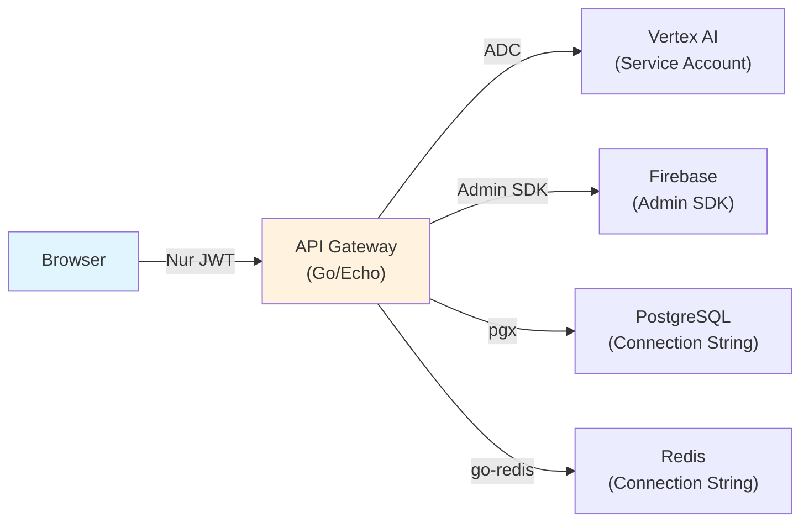
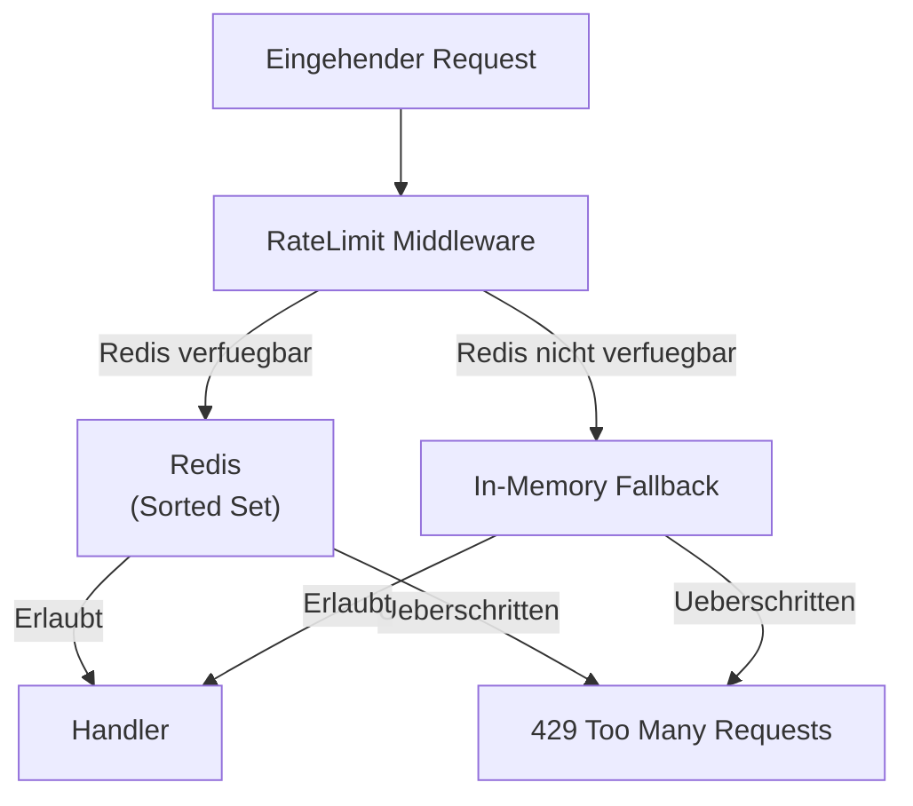

# API Gateway

Das Go-Backend fungiert als zentrales API Gateway. Es schuetzt alle Secrets server-seitig, verifiziert JWT-Tokens, erzwingt Rate Limits und routet Anfragen an die entsprechenden Backend-Services.

## Grundprinzip

Der Browser kommuniziert ausschliesslich mit dem API Gateway. Kein API-Key, kein Service-Account-Token und kein Datenbank-Passwort erreicht jemals den Client.



## Route-Struktur

### Oeffentliche Endpoints (kein Auth)

| Methode | Pfad | Beschreibung |
|---------|------|-------------|
| GET | `/api/health` | Health Check -- gibt nur `{"status": "ok"}` zurueck |
| GET | `/api/health/detailed` | Detaillierter Health Check (Token-geschuetzt) |
| GET | `/api/config` | Firebase-Konfiguration fuer das Frontend |
| GET | `/api/v1/portfolio/profile/public/:userId` | Oeffentliches Profil |
| GET/POST | `/api/v1/portfolio/evidence/verify/:id` | Evidence-Verifizierung |
| POST | `/api/v1/portfolio/endorsements-public` | Endorsement abgeben (rate-limited) |

### Auth-Endpoints (kein JWT, eigene Validierung)

| Methode | Pfad | Beschreibung |
|---------|------|-------------|
| POST | `/api/auth/login` | E-Mail/Passwort Login |
| POST | `/api/auth/register` | Neues Konto erstellen |
| POST | `/api/auth/login-provider` | Provider-Login (Google, Apple) |
| POST | `/api/auth/reset-password` | Passwort zuruecksetzen |
| DELETE | `/api/auth/account` | Konto loeschen (DSGVO Art. 17) |

### API v1 (Firebase JWT erforderlich)

| Gruppe | Pfad-Praefix | Beschreibung |
|--------|-------------|-------------|
| Sessions | `/api/v1/sessions/*` | CRUD fuer Chat-Sessions |
| Portfolio | `/api/v1/portfolio/*` | Reflections, Profile, Evidence, Endorsements, Artifacts, Journal, Engagement |
| Lernreise | `/api/v1/lernreise/*` | Katalog, Auswahl, Instanzen, Fortschritt |
| Pod | `/api/v1/pod/*` | Solid Pod Verbindung und Sync |

### AI-Endpoints (optionaler Auth)

| Methode | Pfad | Beschreibung |
|---------|------|-------------|
| POST | `/api/v1/ai/chat` | Konversation mit AI-Coach |
| POST | `/api/v1/ai/extract` | Strukturierte Datenextraktion |
| POST | `/api/v1/ai/generate` | Inhalts-Generierung |
| POST | `/api/v1/ai/tts` | Text-to-Speech |
| POST | `/api/v1/ai/stt` | Speech-to-Text |

!!! info "Optionale Authentifizierung bei AI-Routen"
    Die AI-Endpoints verwenden `OptionalFirebaseAuth` -- sie funktionieren sowohl mit als auch ohne JWT-Token. Dies ermoeglicht den Intro-Flow (Coach-Auswahl, Onboarding-Chat) **vor** der Nutzer-Registrierung.

### Admin-Endpoints (Admin-Rolle erforderlich)

| Methode | Pfad | Beschreibung |
|---------|------|-------------|
| GET | `/api/v1/prompts` | Alle Prompt-Templates auflisten |
| GET | `/api/v1/prompts/:promptId` | Einzelnes Prompt-Template |
| PUT | `/api/v1/prompts/:promptId` | Prompt aktualisieren |
| POST | `/api/v1/prompts/:promptId/test` | Prompt testen |
| GET | `/api/v1/prompts/:promptId/history` | Prompt-Versionshistorie |
| GET | `/api/v1/agents` | Alle Agents auflisten |
| GET | `/api/v1/agents/:agentId` | Einzelner Agent |
| PUT | `/api/v1/agents/:agentId` | Agent aktualisieren |
| GET | `/api/v1/agents/:agentId/executions` | Agent-Ausfuehrungslog |
| POST | `/api/v1/agents/:agentId/invoke` | Agent manuell ausfuehren |

## Rate Limiting

Rate Limiting ist Redis-basiert mit In-Memory-Fallback. Der Algorithmus verwendet Redis Sorted Sets fuer ein Sliding-Window-Verfahren.

### Architektur



### Rate-Limit-Tiers

| Tier | Routen | Limit | Fenster | Schluessel |
|------|--------|-------|---------|-----------|
| AI Standard | `/api/v1/ai/chat`, `/extract`, `/generate` | 30 | 1 min | User-ID oder IP |
| AI Media | `/api/v1/ai/tts`, `/stt` | 10 | 1 min | User-ID oder IP |
| Endorsement | `/api/v1/portfolio/endorsements-public` | 10 | 1 min | IP |

### Response-Header

Bei jedem Request werden Rate-Limit-Header gesetzt:

```http
X-RateLimit-Limit: 30
X-RateLimit-Remaining: 27
Retry-After: 45          # nur bei 429
```

### Fallback-Verhalten

Wenn Redis nicht verfuegbar ist, wechselt das System automatisch auf einen In-Memory-Counter:

- Funktioniert zuverlaessig auf einer einzelnen Instanz
- Bei Cloud-Run-Autoscaling sind die Counter pro Instanz isoliert (nicht ideal, aber besser als kein Limit)
- Maximale Anzahl In-Memory-Eintraege: 10.000 (Eviction abgelaufener Eintraege)

## CORS-Konfiguration

CORS wird ueber die Echo-Middleware konfiguriert:

```go
CORSConfig{
    AllowOrigins:     cfg.AllowedOrigins,  // aus ALLOWED_ORIGINS
    AllowMethods:     []string{"GET", "POST", "PUT", "DELETE", "OPTIONS"},
    AllowHeaders:     []string{"Origin", "Content-Type", "Accept", "Authorization"},
    AllowCredentials: true,  // false wenn "*" als Origin
    MaxAge:           3600,  // Preflight-Cache: 1 Stunde
}
```

!!! warning "Wildcard-Schutz"
    Wenn `*` in `ALLOWED_ORIGINS` steht, wird `AllowCredentials` automatisch auf `false` gesetzt. Dies verhindert eine unsichere Kombination gemaess CORS-Spezifikation.

## JWT-Authentifizierung

### Ablauf

1. Client sendet `Authorization: Bearer <firebase-jwt>` Header
2. Middleware extrahiert den Token
3. Firebase Admin SDK verifiziert den Token (`VerifyIDToken`)
4. Claims werden extrahiert: `uid`, `email`, `name`, `picture`, `role`
5. `UserInfo` wird im Request-Context gespeichert
6. Handler liest `UserInfo` ueber `middleware.GetUserInfo(c)`

### Autorisierungs-Level

| Level | Pruefung | Routen |
|-------|---------|--------|
| Oeffentlich | Kein JWT noetig | `/api/health`, `/api/config`, Evidence-Verify, Public Profile |
| Optional Auth | JWT wird genutzt falls vorhanden | `/api/v1/ai/*` |
| Authentifiziert | Gueltiger JWT erforderlich | Alle anderen `/api/v1/*` |
| Admin | JWT mit `role=admin` Custom Claim | `/api/v1/prompts/*`, `/api/v1/agents/*` |

## Fehlerbehandlung

Alle API-Fehler werden als strukturiertes JSON zurueckgegeben:

```json
{
  "error": "Fehlerbeschreibung fuer den Client"
}
```

AI-spezifische Fehler enthalten zusaetzlich einen `error_code`:

```json
{
  "error": "AI rate limit exceeded",
  "error_code": "ai_rate_limited"
}
```

### AI-Fehlercodes

| Code | HTTP-Status | Bedeutung |
|------|------------|-----------|
| `ai_credentials_missing` | 503 | GCP Credentials nicht konfiguriert |
| `ai_rate_limited` | 429 | Gemini-API Rate Limit erreicht |
| `ai_model_not_found` | 502 | Angefordertes Modell nicht verfuegbar |
| `ai_permission_denied` | 403 | Service Account hat keine Berechtigung |
| `ai_timeout` | 504 | Request-Timeout bei Gemini |
| `ai_network_error` | 503 | Gemini-API nicht erreichbar |
| `ai_internal_error` | 500 | Unbekannter AI-Fehler |

!!! danger "Sicherheit"
    Interne Fehlerdetails (Stack Traces, Connection Strings, etc.) werden **niemals** an den Client weitergegeben. Fehler werden serverseitig geloggt, der Client erhaelt nur generische Meldungen. Bei HTTP 500 wird immer `"internal server error"` zurueckgegeben.
