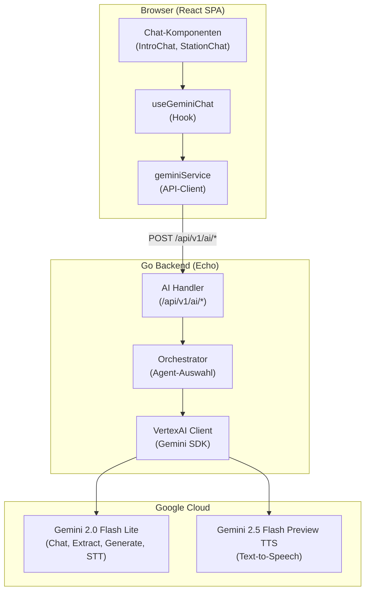
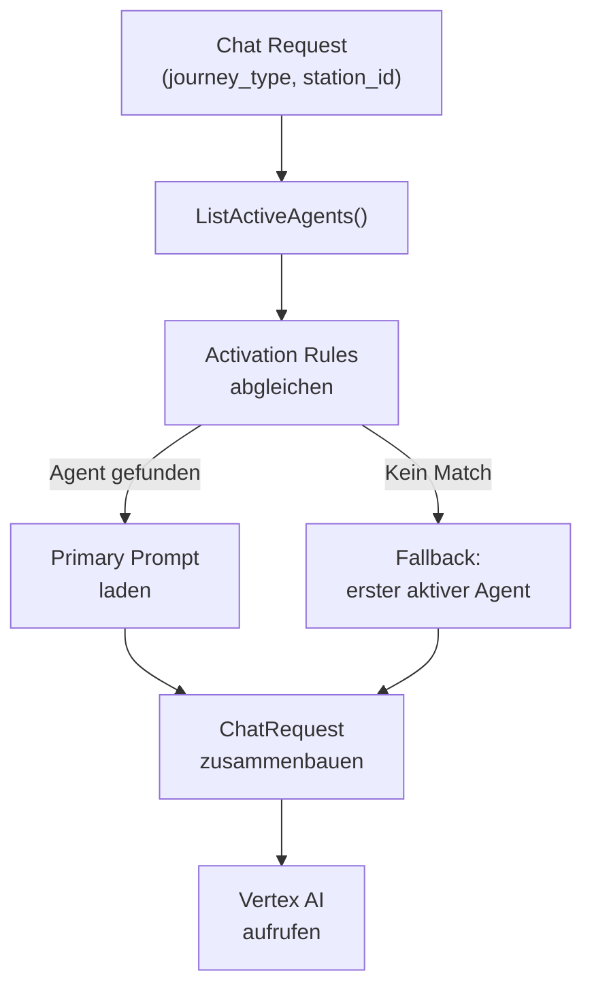
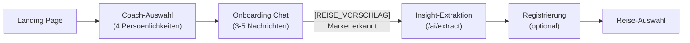

# Chat- und Dialog-Architektur

Die Chat- und Dialog-Architektur bildet das Herzstueck von Future SkillR. Sie steuert das AI-gesteuerte Onboarding, die VUCA-Stationen und alle Sprach-Interaktionen.

## Ueberblick



## AI-Endpoints

### POST /api/v1/ai/chat

Hauptendpoint fuer Konversationen. Unterstuetzt zwei Modi:

**Passthrough-Modus** -- Der Client liefert die `system_instruction` direkt mit:

```json
{
  "message": "Ich interessiere mich fuer Technik",
  "system_instruction": "Du bist ein freundlicher Coach...",
  "history": [
    {"role": "user", "content": "Hallo"},
    {"role": "model", "content": "Willkommen!"}
  ]
}
```

**Orchestrierter Modus** -- Der Orchestrator waehlt Agent und Prompt:

```json
{
  "message": "Ich interessiere mich fuer Technik",
  "session_id": "abc-123",
  "context": {
    "journey_type": "vuca"
  }
}
```

**Antwort:**

```json
{
  "response": "Das klingt spannend! Technik ist...",
  "text": "Das klingt spannend! Technik ist...",
  "agent_id": "onboarding-coach",
  "markers": ["[REISE_VORSCHLAG]"]
}
```

### POST /api/v1/ai/extract

Strukturierte Datenextraktion aus Gespraechen. Gibt immer JSON zurueck (`responseMimeType: application/json`).

**Built-in Extract-Typen:**

| Typ | Zweck | Ausgabe |
|-----|-------|---------|
| `insights` | Onboarding-Analyse | `{interests[], strengths[], preferredStyle, recommendedJourney, summary}` |
| `station-result` | Stations-Bewertung | `{dimensionScores: {dim: score}, summary}` |

### POST /api/v1/ai/generate

Inhalts-Generierung (Curriculum, Kurse). Gibt immer JSON zurueck.

**Built-in Generate-Typen:**

| Typ | Zweck | Ausgabe |
|-----|-------|---------|
| `curriculum` | VUCA-Lehrplan (12 Module, 3 pro Dimension) | `{goal, modules[]}` |
| `course` | Kursinhalt mit Quiz | `{title, sections[], quiz[]}` |

### POST /api/v1/ai/tts

Text-to-Speech ueber Gemini 2.5 Flash Preview TTS.

```json
// Request
{
  "text": "Willkommen bei Future SkillR!",
  "voice_dialect": "bayerisch"
}

// Response
{
  "audio": "base64-encoded-pcm-audio..."
}
```

**Unterstuetzte Dialekte:**

| Schluessel | Prompt |
|-----------|--------|
| `hochdeutsch` | Klares Hochdeutsch (Standard) |
| `bayerisch` | Bayerischer Akzent |
| `schwaebisch` | Schwaebischer Akzent |
| `berlinerisch` | Berliner Dialekt |
| `saechsisch` | Saechsischer Akzent |
| `koelsch` | Koelscher Akzent |

### POST /api/v1/ai/stt

Speech-to-Text -- transkribiert Audio auf Deutsch.

```json
// Request
{
  "audio": "base64-encoded-audio...",
  "mime_type": "audio/wav"
}

// Response
{
  "text": "Ich interessiere mich fuer Technik und Programmieren"
}
```

## AI-Orchestrator

Der Orchestrator waehlt dynamisch den passenden Agent und Prompt basierend auf dem Kontext der Konversation.



### Agent-Auswahl

1. Alle aktiven Agents werden aus Firebase geladen
2. Fuer jeden Agent werden die `activation_rules` geprueft
3. `journey_states` wird mit dem aktuellen `journey_type` abgeglichen
4. Der erste passende Agent wird verwendet
5. Fallback: Der erste verfuegbare aktive Agent

### Prompt-Loading

Prompts werden aus Firebase Firestore geladen. Jeder Prompt enthaelt:

- `system_instruction` -- System-Prompt fuer Gemini
- `model_config` -- Modell, Temperatur, Response-Format
- `completion_markers` -- Strings die Zustandsuebergaenge ausloesen

## Intro-Sequenz

Die Intro-Sequenz laeuft **vor** der Nutzer-Registrierung ab:



### Pre-Login-Flow

Die AI-Endpoints verwenden `OptionalFirebaseAuth`. Das bedeutet:

- **Ohne Token:** Request wird anonym verarbeitet. Rate Limiting erfolgt nach IP-Adresse.
- **Mit Token:** User-Info wird im Context gespeichert. Rate Limiting erfolgt nach User-ID.

Dieser Ansatz ermoeglicht es, dass Nutzer den Coach ausprobieren koennen, bevor sie sich registrieren.

## Marker-basierte Flow-Steuerung

AI-Antworten koennen spezielle Marker-Strings enthalten, die Zustandsuebergaenge im Frontend ausloesen:

| Marker | Aktion |
|--------|--------|
| `[REISE_VORSCHLAG]` | Onboarding abgeschlossen, Insight-Extraktion starten |
| Weitere Marker | Konfigurierbar pro Prompt-Template |

Der Handler prueft jede AI-Antwort auf konfigurierte Marker und gibt sie im `markers`-Array der Response zurueck. Das Frontend reagiert entsprechend.

!!! warning "Fragilität"
    Marker-basierte Steuerung ist prinzipbedingt fragil -- die AI kann Marker zu frueh, zu spaet oder gar nicht ausgeben. Die System-Prompts muessen sorgfaeltig formuliert werden.

## Prompt-Verwaltung

Prompts werden ueber die Admin-Konsole verwaltet (Endpoints `/api/v1/prompts/*`):

- **Versionierung** -- Jede Aenderung erzeugt eine neue Version
- **A/B-Testing** -- Mehrere Prompt-Versionen koennen parallel aktiv sein
- **Test-Endpoint** -- Prompts koennen direkt in der Admin-Konsole getestet werden
- **Audit-Trail** -- Alle Aenderungen werden in der Versionshistorie protokolliert

## Coach-Persoenlichkeiten

Future SkillR bietet verschiedene Coach-Persoenlichkeiten, die sich in Tonalitaet und Ansprache unterscheiden. Die Auswahl erfolgt in der Intro-Sequenz und beeinflusst den `system_instruction`-Prompt.

## Kontext-Injektion fuer Sponsoren

Sponsor-spezifischer Kontext (z.B. Brancheninformationen, Unternehmensprofile) kann ueber das `context`-Feld in Chat-Requests injiziert werden. Der Orchestrator kann diesen Kontext in den System-Prompt einbinden.

## Jugendschutz (JMStV SS5)

Alle Gemini-Aufrufe verwenden Safety-Settings fuer die Zielgruppe 14+:

```go
SafetySettings: []*genai.SafetySetting{
    {Category: HarmCategoryHateSpeech,         Threshold: HarmBlockMediumAndAbove},
    {Category: HarmCategoryDangerousContent,   Threshold: HarmBlockMediumAndAbove},
    {Category: HarmCategorySexuallyExplicit,   Threshold: HarmBlockMediumAndAbove},
    {Category: HarmCategoryHarassment,         Threshold: HarmBlockMediumAndAbove},
}
```

## Input-Validierung

| Feld | Validierung |
|------|------------|
| `message` | Pflichtfeld, max. 10.000 Zeichen |
| `text` (TTS) | Pflichtfeld, max. 5.000 Zeichen |
| `audio` (STT) | Pflichtfeld, max. 7 MB (Base64), gueltiges Base64 |
| `journey_type` | Pattern: `^[a-z0-9-]{1,50}$` |
| `station_id` | Pattern: `^[a-zA-Z0-9_-]{1,100}$` |
