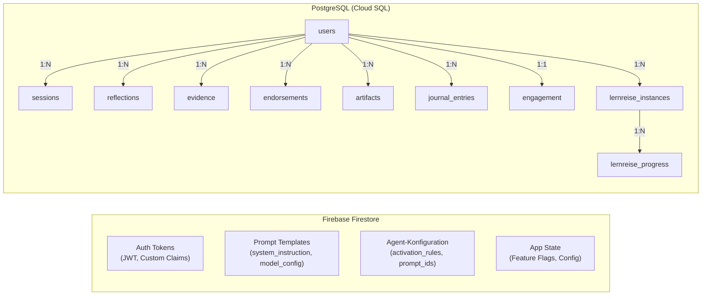
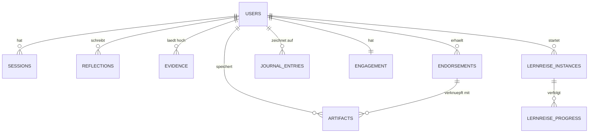

# Datenmodell

Future SkillR verwendet zwei Datenspeicher mit klar getrennten Verantwortlichkeiten:

- **Firebase Firestore** -- Persoenliche Nutzerdaten, Prompts, Agent-Konfiguration
- **PostgreSQL** -- Operationale Geschaeftsdaten, Sessions, Portfolio, Lernreisen

## Zwei-Speicher-Strategie



### Warum zwei Speicher?

| Kriterium | Firebase Firestore | PostgreSQL |
|-----------|-------------------|------------|
| **Datentyp** | Dokument-orientiert, schemalos | Relational, schema-gebunden |
| **Staerke** | Echtzeit-Sync, Security Rules, Auth-Integration | JOINs, Transaktionen, komplexe Abfragen |
| **Kosten** | Teuer bei vielen Reads (pro Dokument) | Flat-Rate (Cloud SQL Instance) |
| **Einsatz** | Auth, Prompts, Agent-Config (wenige Dokumente, haeufig gelesen) | Sessions, Portfolio, Lernreisen (viele Zeilen, relationale Abfragen) |

## PostgreSQL-Schema

### users

Zentrale Nutzer-Tabelle. Verknuepft Firebase Auth UID mit internen Daten.

```sql
CREATE TABLE users (
    id               UUID PRIMARY KEY,
    email            TEXT NOT NULL UNIQUE,
    display_name     TEXT NOT NULL,
    role             user_role NOT NULL DEFAULT 'user',  -- 'user' | 'admin'
    auth_provider    auth_provider NOT NULL,              -- 'email' | 'google' | 'apple' | 'meta'
    photo_url        TEXT,
    password_hash    TEXT,                                -- nur bei auth_provider='email'
    honeycomb_ctx_id TEXT,                                -- Honeycomb User Context (FR-073)
    pod_url          TEXT,                                -- Solid Pod URL (FR-076)
    pod_webid        TEXT,                                -- Solid Pod WebID
    pod_provider     TEXT DEFAULT 'none',                 -- Pod-Provider
    pod_connected_at TIMESTAMPTZ,
    pod_last_synced_at TIMESTAMPTZ,
    pod_sync_status  TEXT DEFAULT 'none',
    created_at       TIMESTAMPTZ NOT NULL DEFAULT NOW(),
    updated_at       TIMESTAMPTZ NOT NULL DEFAULT NOW()
);
```

### sessions

Chat-Sessions fuer die VUCA-Reise und Onboarding.

| Spalte | Typ | Beschreibung |
|--------|-----|-------------|
| `id` | UUID | Primaerschluessel |
| `user_id` | UUID (FK) | Referenz auf `users.id` |
| `journey_type` | TEXT | Art der Reise (vuca, entrepreneur, etc.) |
| `station_id` | TEXT | Aktuelle Station |
| `status` | TEXT | active, completed, abandoned |
| `created_at` | TIMESTAMPTZ | Erstellungszeitpunkt |

### reflections

Level-2-Reflexionen mit Capability-Scoring.

| Spalte | Typ | Beschreibung |
|--------|-----|-------------|
| `id` | UUID | Primaerschluessel |
| `user_id` | UUID (FK) | Referenz auf `users.id` |
| `session_id` | UUID (FK) | Zugehoerige Session |
| `dimension` | TEXT | VUCA-Dimension (V, U, C, A) |
| `content` | TEXT | Reflexionsinhalt |
| `capability_scores` | JSONB | AI-ermittelte Faehigkeitsbewertungen |
| `created_at` | TIMESTAMPTZ | Erstellungszeitpunkt |

### evidence

Nachweise und Belege fuer das Portfolio.

| Spalte | Typ | Beschreibung |
|--------|-----|-------------|
| `id` | UUID | Primaerschluessel |
| `user_id` | UUID (FK) | Referenz auf `users.id` |
| `dimension` | TEXT | VUCA-Dimension |
| `title` | TEXT | Titel des Nachweises |
| `description` | TEXT | Beschreibung |
| `evidence_type` | TEXT | Typ (certificate, project, etc.) |
| `verified` | BOOLEAN | Verifizierungsstatus |
| `created_at` | TIMESTAMPTZ | Erstellungszeitpunkt |

### endorsements

Empfehlungen von Dritten (Lehrer, Mentoren, Eltern).

| Spalte | Typ | Beschreibung |
|--------|-----|-------------|
| `id` | UUID | Primaerschluessel |
| `user_id` | UUID (FK) | Empfaenger |
| `endorser_name` | TEXT | Name des Empfehlenden |
| `endorser_email` | TEXT | E-Mail des Empfehlenden |
| `message` | TEXT | Empfehlungstext |
| `visibility` | TEXT | public, private |
| `invite_token` | TEXT | Token fuer Einladungslink |
| `created_at` | TIMESTAMPTZ | Erstellungszeitpunkt |

### artifacts

Hochgeladene Dateien (Projekte, Nachweise).

| Spalte | Typ | Beschreibung |
|--------|-----|-------------|
| `id` | UUID | Primaerschluessel |
| `user_id` | UUID (FK) | Eigentuemer |
| `title` | TEXT | Dateiname/Titel |
| `mime_type` | TEXT | MIME-Typ |
| `size_bytes` | BIGINT | Dateigroesse |
| `storage_url` | TEXT | Speicher-URL |
| `endorsement_id` | UUID | Verknuepfte Empfehlung (optional) |
| `created_at` | TIMESTAMPTZ | Erstellungszeitpunkt |

### journal_entries

Reise-Tagebuch -- alle Interaktionen waehrend der VUCA-Reise.

| Spalte | Typ | Beschreibung |
|--------|-----|-------------|
| `id` | UUID | Primaerschluessel |
| `user_id` | UUID (FK) | Nutzer |
| `session_id` | UUID | Zugehoerige Session |
| `station_id` | TEXT | Station-Identifier |
| `dimension` | TEXT | VUCA-Dimension |
| `interaction_type` | TEXT | chat, reflection, task |
| `content` | JSONB | Interaktionsdaten |
| `created_at` | TIMESTAMPTZ | Zeitpunkt |

### engagement

Gamification-Daten (XP, Level, Streak).

| Spalte | Typ | Beschreibung |
|--------|-----|-------------|
| `user_id` | UUID (PK, FK) | Nutzer (1:1 mit users) |
| `xp` | INTEGER | Erfahrungspunkte |
| `level` | INTEGER | Aktuelles Level (1-5) |
| `streak_days` | INTEGER | Aktuelle Serie in Tagen |
| `badges` | JSONB | Verdiente Abzeichen |
| `updated_at` | TIMESTAMPTZ | Letzte Aktualisierung |

### lernreise_instances

Bindet einen Nutzer an einen Honeycomb-Kurs (FR-074).

```sql
CREATE TABLE lernreise_instances (
    id               UUID PRIMARY KEY,
    user_id          UUID NOT NULL REFERENCES users(id) ON DELETE CASCADE,
    ctx_id           TEXT NOT NULL,          -- Honeycomb User Context
    honeycomb_data_id TEXT NOT NULL,          -- Kurs-ID im Honeycomb
    title            TEXT NOT NULL DEFAULT '',
    status           TEXT NOT NULL DEFAULT 'active',
        -- CHECK: 'active' | 'paused' | 'completed' | 'abandoned'
    progress_percent INT NOT NULL DEFAULT 0, -- 0-100
    progress_label   TEXT NOT NULL DEFAULT '',
    started_at       TIMESTAMPTZ NOT NULL DEFAULT NOW(),
    completed_at     TIMESTAMPTZ,
    last_synced_at   TIMESTAMPTZ,
    created_at       TIMESTAMPTZ NOT NULL DEFAULT NOW(),
    updated_at       TIMESTAMPTZ NOT NULL DEFAULT NOW()
);
```

### lernreise_progress

Task-Level Fortschrittsereignisse (FR-075).

```sql
CREATE TABLE lernreise_progress (
    id          UUID PRIMARY KEY,
    instance_id UUID NOT NULL REFERENCES lernreise_instances(id) ON DELETE CASCADE,
    module_id   TEXT NOT NULL,
    task_id     TEXT NOT NULL,
    old_state   TEXT NOT NULL DEFAULT 'open',
    new_state   TEXT NOT NULL DEFAULT 'done',
    progress_p  INT NOT NULL DEFAULT 0,
    created_at  TIMESTAMPTZ NOT NULL DEFAULT NOW()
);
```

## Firebase Firestore Collections

### prompts

Prompt-Templates fuer AI-gesteuerte Interaktionen. Verwaltet ueber die Admin-Konsole.

```json
{
  "prompt_id": "onboarding-coach-v1",
  "version": 3,
  "status": "active",
  "system_instruction": "Du bist ein freundlicher Coach...",
  "model_config": {
    "model": "gemini-2.0-flash-lite",
    "temperature": 0.7,
    "response_mime_type": ""
  },
  "completion_markers": ["[REISE_VORSCHLAG]"],
  "created_at": "2026-02-19T10:00:00Z",
  "updated_at": "2026-02-20T14:30:00Z"
}
```

### agents

Agent-Konfigurationen fuer den AI-Orchestrator.

```json
{
  "agent_id": "onboarding-coach",
  "display_name": "Onboarding Coach",
  "status": "active",
  "prompt_ids": ["onboarding-coach-v1"],
  "activation_rules": {
    "journey_states": ["onboarding", "intro"]
  },
  "created_at": "2026-02-19T10:00:00Z"
}
```

## XP-Vergabe (Lernreise)

| Aktion | XP |
|--------|-----|
| Lernreise gestartet | 15 |
| Task abgeschlossen | 20 |
| Modul abgeschlossen | 75 |
| Lernreise abgeschlossen | 200 |

## Entity-Beziehungen



!!! info "Kaskadierendes Loeschen"
    Alle Fremdschluessel verwenden `ON DELETE CASCADE`. Wenn ein Nutzerkonto geloescht wird (DSGVO Art. 17), werden automatisch alle zugehoerigen Daten entfernt.
