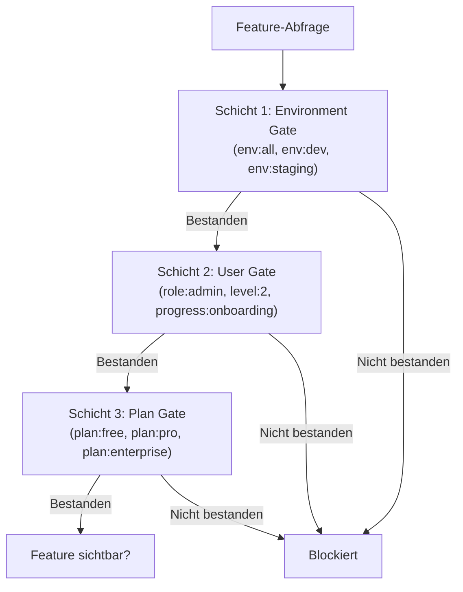
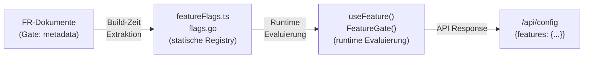

# Feature Toggles

Das Feature-Toggle-System (TC-024) steuert die Sichtbarkeit von Features ueber Umgebungen, Rollen und zukuenftige Abo-Stufen hinweg. Es basiert auf einem deklarativen Gate-DSL, das direkt in den Feature-Request-Dokumenten (FR) annotiert wird.

## Drei-Schichten-Gate-Modell



Alle Schichten muessen bestanden werden (UND-Logik). Features ohne `**Gate:**`-Annotation haben den Default `env:all`.

## Gate-DSL-Syntax

Format: `<schicht>:<wert>`, kombiniert mit `+` (logisches UND).

```
gate   := clause ( "+" clause )*
clause := layer ":" value
layer  := "env" | "role" | "level" | "progress" | "plan"
```

### Beispiele

| Gate | Bedeutung |
|------|-----------|
| `env:all` | Sichtbar in allen Umgebungen, fuer alle Nutzer |
| `env:dev` | Nur in Development und Staging sichtbar |
| `role:admin` | Nur fuer Admin-Nutzer |
| `env:all+level:2` | Alle Umgebungen, erfordert Engagement-Level 2+ |
| `env:dev+plan:enterprise` | Nur in Dev, erfordert Enterprise-Plan |
| `env:all+progress:onboarding` | Alle Umgebungen, Onboarding muss abgeschlossen sein |

## Schicht 1: Environment Gate

Steuert die Feature-Sichtbarkeit basierend auf der Deployment-Umgebung.

| Wert | Sichtbar in |
|------|-------------|
| `env:all` | Production, Staging, Development |
| `env:staging` | Staging, Development |
| `env:dev` | Nur Development |

Die Umgebung wird ueber die Variable `APP_MODE` bestimmt (`production`, `staging`, `development`). Fallback: `NODE_ENV`.

**Hierarchie:** `development > staging > production` -- ein Feature mit `env:staging` ist auch in `development` sichtbar.

## Schicht 2: User Gate

Gates Features anhand von Nutzereigenschaften.

| Wert | Datenquelle | Pruefung |
|------|------------|---------|
| `role:admin` | `AuthUser.role` | Custom Claim `role=admin` |
| `role:user` | `AuthUser` existiert | Jeder authentifizierte Nutzer |
| `level:N` | `EngagementState.level` | Engagement-Level N oder hoeher (1-5) |
| `progress:onboarding` | `UserProfile.onboardingInsights` | Onboarding abgeschlossen |
| `progress:journey:vuca` | `UserProfile.journeyProgress` | Mindestens 1 VUCA-Station abgeschlossen |

## Schicht 3: Plan Gate (Zukunft)

Zukuenftige Abo-Stufen fuer V2.0. Das Schema ist definiert, die Implementierung wird bei der Monetarisierung umgesetzt.

| Wert | Zielgruppe | Modell |
|------|-----------|--------|
| `plan:free` | Schueler (Standard) | Kostenlos |
| `plan:pro` | Power-User, Eltern | Monatsabo |
| `plan:enterprise` | Kammern (IHK), Unternehmen | B2B-Vertrag |

!!! info "Plan Gates vor V2.0"
    `plan:*` Gates evaluieren in Production zu `false`. In Development und Staging evaluieren sie zu `true`, damit Features getestet werden koennen.

## Gate-Metadata in Feature Requests

Jedes FR-Dokument enthaelt eine `**Gate:**`-Zeile:

```markdown
# FR-NNN: Feature-Titel

**Status:** done
**Priority:** must
**Gate:** env:all
**Created:** 2026-02-17
```

Damit sind Feature-Sichtbarkeitsregeln Teil der Spezifikation, nicht ein Nachgedanke im Code.

## Aktuelle Feature Flags

Die folgenden Feature Flags werden ueber Umgebungsvariablen gesteuert:

| Flag / Variable | Default | Beschreibung |
|----------------|---------|-------------|
| `REDIS_URL` | (leer) | Redis aktivieren (Rate Limiting) |
| `SOLID_POD_ENABLED` | `false` | Solid Pod Integration aktivieren |
| `HEALTH_CHECK_TOKEN` | (leer) | Detaillierten Health Check aktivieren |
| `HONEYCOMB_URL` | (leer) | Honeycomb/Lernreise Integration aktivieren |
| `MEMORY_SERVICE_URL` | (leer) | User Context Sync aktivieren |

Jedes Feature prueft beim Start, ob seine Abhaengigkeiten konfiguriert sind. Nicht konfigurierte Features werden uebersprungen, ohne das System zu beeintraechtigen.

## Implementierungs-Blueprint

### Frontend

1. **Feature-Flag-Registry** (`featureFlags.ts`) -- Statische Map von Feature-IDs zu Gate-Expressions
2. **`useFeature()` Hook** -- Evaluiert eine Gate-Expression gegen den aktuellen Context
3. **`<FeatureGate>` Komponente** -- Rendert Children nur wenn das Gate passiert
4. **Dev-Overrides** -- `localStorage.setItem('ff:FR-021', 'true')` fuer lokales Testing

### Backend (Go)

1. **Feature-Registry** (`feature/flags.go`) -- Statische Map von Feature-IDs zu Gate-Expressions
2. **`FeatureGate()` Middleware** -- Echo-Middleware nach dem `RequireAdmin()`-Pattern
3. **`/api/config` Erweiterung** -- Resolved Feature Flags werden an das Frontend geliefert

### Konfigurationsfluss



## Neues Feature Toggle hinzufuegen

1. Gate-Annotation im FR-Dokument setzen: `**Gate:** env:dev+role:admin`
2. Feature-ID zur Registry hinzufuegen (Frontend und/oder Backend)
3. Gate-Expression im Code verwenden:
   - Frontend: `const visible = useFeature('FR-NNN')`
   - Backend: `v1.Group("/feature", feature.Gate("FR-NNN"))`
4. Testen: In Development auf `env:dev` pruefen, in Staging auf `env:staging`
5. Rollout: Gate auf `env:all` aendern wenn bereit

!!! warning "Gate-Annotation nicht vergessen"
    Jedes neue Feature **muss** mit einer Gate-Annotation versehen werden. Features ohne Gate-Annotation defaulten auf `env:all` und sind sofort in Production sichtbar.
