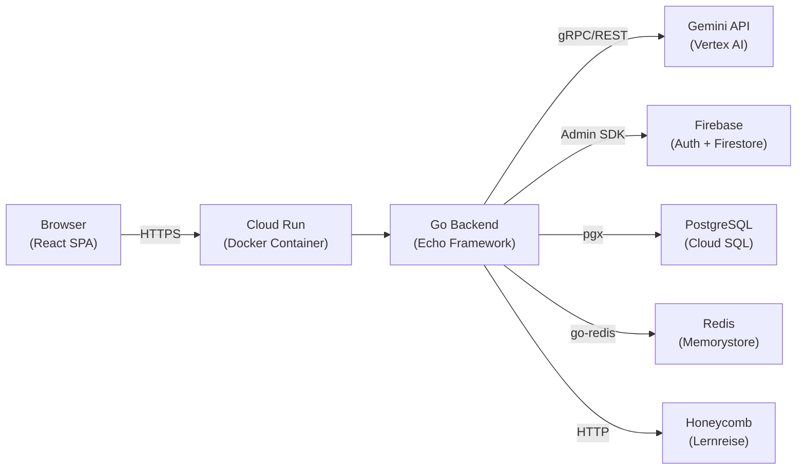
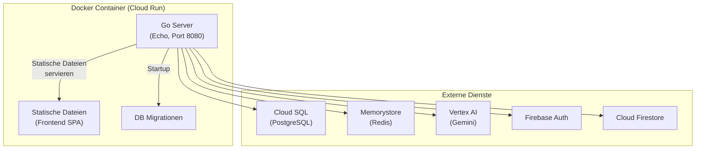

# Architektur-Ueberblick

Diese Sektion dokumentiert die technische Architektur von Future SkillR. Sie richtet sich an Entwickler, Architekten und DevOps-Engineers, die am System arbeiten oder es bewerten.

## System auf einen Blick

Future SkillR ist eine **Single-Page-Application (SPA)** mit einem monolithischen Go-Backend, das als einzelner Docker-Container auf Google Cloud Run laeuft. Der Container buendelt das kompilierte Frontend (statische Dateien), den Go-Server und alle Datenbank-Migrationen.

## Architektur-Prinzipien

- **Alle Secrets serverseitig** -- API-Keys, Service-Account-Credentials und Datenbank-Passwoerter erreichen niemals den Browser
- **Ein Container, alle Umgebungen** -- Das gleiche Docker-Image laeuft in Development, Staging und Production; Konfiguration erfolgt ueber Umgebungsvariablen
- **Firebase fuer persoenliche Daten** -- User-Authentifizierung und persoenliche Daten liegen in Firebase; operationale Daten in PostgreSQL
- **Graceful Degradation** -- Redis, Honeycomb und AI-Services sind optional; das System laeuft (eingeschraenkt) auch ohne sie

## Architektur-Seiten

| Seite | Beschreibung |
|-------|-------------|
| [Tech Stack](tech-stack.md) | Detaillierte Technologie-Tabelle mit Versionen und Begruendungen |
| [Systemuebersicht](system-uebersicht.md) | Komponentendiagramm und Request-Flow |
| [Datenmodell](datenmodell.md) | Firebase Firestore und PostgreSQL Schemata |
| [API Gateway](api-gateway.md) | Routing, Middleware, Rate Limiting, CORS |
| [Chat & Dialog](chat-dialog.md) | Gemini-Integration, AI-Orchestrator, Intro-Sequenz |
| [Feature Toggles](feature-toggles.md) | Gate-System fuer Feature-Sichtbarkeit (TC-024) |
| [Sicherheit](sicherheit.md) | Security-Schichten, DSGVO, Jugendschutz |
| [Entscheidungen (ADR)](entscheidungen/index.md) | Index aller Architecture Decision Records |

## Deployment-Modell

!!! info "Build-Prozess"
    Das Docker-Image wird in einem **Multi-Stage-Build** erstellt:

    1. **Stage 1** -- Node.js: `npm run build` erzeugt die Frontend-SPA (Vite)
    2. **Stage 2** -- Go: `go build` kompiliert das Backend zu einem einzelnen Binary
    3. **Stage 3** -- Production: Binary + statische Dateien in einem minimalen Image
