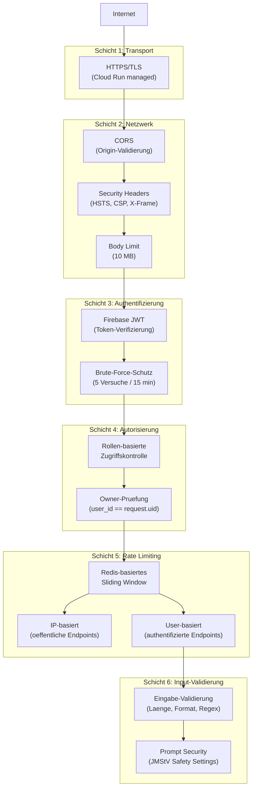
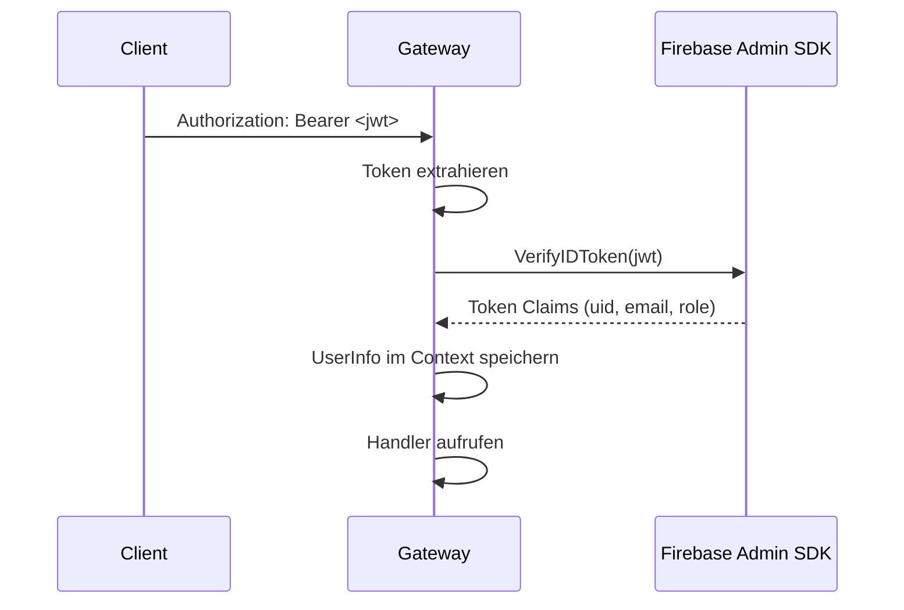

# Sicherheitsarchitektur

Die Sicherheitsarchitektur von Future SkillR umfasst mehrere Schichten, die zusammen einen umfassenden Schutz bieten. Ein besonderer Fokus liegt auf dem Jugendschutz (Zielgruppe 14+) und der DSGVO-Konformitaet.

## Sicherheitsschichten



## HTTPS/TLS

Google Cloud Run stellt automatisch TLS-Terminierung bereit. Alle Verbindungen sind verschluesselt. Der Go-Server setzt zusaetzlich den `Strict-Transport-Security` Header:

```
Strict-Transport-Security: max-age=31536000; includeSubDomains
```

## Security Headers

Folgende Sicherheits-Header werden bei jedem Response gesetzt:

| Header | Wert | Zweck |
|--------|------|-------|
| `X-Frame-Options` | `DENY` | Verhindert Clickjacking (kein Einbetten in iframes) |
| `X-Content-Type-Options` | `nosniff` | Verhindert MIME-Type-Sniffing |
| `Referrer-Policy` | `strict-origin-when-cross-origin` | Kontrolliert Referrer-Informationen |
| `Strict-Transport-Security` | `max-age=31536000; includeSubDomains` | Erzwingt HTTPS |
| `Permissions-Policy` | `camera=(), microphone=(), geolocation=()` | Deaktiviert Browser-APIs |

## JWT-Authentifizierung

### Firebase Auth

Die Authentifizierung basiert auf Firebase Authentication mit zwei Methoden:

1. **Google OAuth** -- primaere Methode, Single Sign-On
2. **E-Mail/Passwort** -- alternative Methode, Firebase Auth oder lokaler Fallback

### Token-Verifizierung



### Rollen-Modell

| Rolle | Beschreibung | Custom Claim |
|-------|-------------|-------------|
| `user` | Standard-Nutzer (Default) | `role: "user"` oder kein Claim |
| `admin` | Administrator | `role: "admin"` |

Admin-Claims werden ueber Firebase Custom Claims gesetzt. Der erste registrierte Nutzer erhaelt automatisch die Admin-Rolle (H10: First-User-Gets-Admin).

### Brute-Force-Schutz

Login-Versuche werden pro IP-Adresse verfolgt:

- **Limit:** 5 fehlgeschlagene Versuche
- **Fenster:** 15 Minuten
- **Reaktion:** `429 Too Many Requests`
- **Anti-Enumeration:** Login-Fehler geben immer die gleiche Meldung zurueck ("E-Mail oder Passwort falsch"), unabhaengig davon ob die E-Mail existiert

### Passwort-Anforderungen

- Mindestens 8 Zeichen
- Mindestens ein Grossbuchstabe
- Mindestens ein Kleinbuchstabe
- Mindestens eine Ziffer

## CORS-Konfiguration

| Parameter | Wert | Beschreibung |
|-----------|------|-------------|
| `AllowOrigins` | Aus `ALLOWED_ORIGINS` | Kommaseparierte Liste erlaubter Origins |
| `AllowMethods` | GET, POST, PUT, DELETE, OPTIONS | Erlaubte HTTP-Methoden |
| `AllowHeaders` | Origin, Content-Type, Accept, Authorization | Erlaubte Request-Header |
| `AllowCredentials` | `true` (ausser bei `*`) | Cookies und Auth-Header erlauben |
| `MaxAge` | 3600 | Preflight-Cache: 1 Stunde |

!!! danger "Wildcard-Warnung"
    `ALLOWED_ORIGINS=*` ist nur fuer Development akzeptabel. In Production **muessen** explizite Origins konfiguriert werden. Bei `*` wird `AllowCredentials` automatisch deaktiviert.

## Rate Limiting

### Redis-basierter Sliding-Window-Algorithmus

```
1. Entferne abgelaufene Eintraege (ZRemRangeByScore)
2. Zaehle aktuelle Eintraege im Fenster (ZCard)
3. Fuege aktuellen Request hinzu (ZAdd)
4. Setze TTL auf das Fenster (Expire)
5. Wenn count >= limit: 429 mit Retry-After
```

### Schluessel-Strategie

- **Authentifizierte Requests:** `ratelimit:{prefix}:{user_id}`
- **Anonyme Requests:** `ratelimit:{prefix}:{ip}`

### Fallback bei Redis-Ausfall

In-Memory-Counter mit denselben Limits. Begrenzt auf 10.000 Eintraege mit automatischer Eviction abgelaufener Eintraege.

## API-Key-Schutz

Kein API-Key erreicht den Browser:

| Service | Authentifizierung | Ort |
|---------|------------------|-----|
| Vertex AI (Gemini) | Application Default Credentials (Service Account) | Cloud Run IAM |
| Firebase Admin | Service Account | Cloud Run IAM |
| PostgreSQL | Connection String | Umgebungsvariable / Secret Manager |
| Redis | Connection String | Umgebungsvariable / Secret Manager |
| Honeycomb | API Key | Umgebungsvariable |
| Memory Service | API Key | Umgebungsvariable |

!!! info "Kein GEMINI_API_KEY"
    Im Gegensatz zum MVP3-Express-Gateway benoetigt das Go-Backend keinen API-Key fuer Gemini. Vertex AI authentifiziert ueber den GCP Service Account (Application Default Credentials). Dies eliminiert die Gefahr eines API-Key-Leaks.

## Admin-Zugriffskontrolle

Admin-Endpoints (`/api/v1/prompts/*`, `/api/v1/agents/*`) sind doppelt geschuetzt:

1. **Firebase JWT** -- Validierung durch `FirebaseAuthMiddleware`
2. **Admin-Rolle** -- Pruefung durch `RequireAdmin()` Middleware

```go
func RequireAdmin() echo.MiddlewareFunc {
    return func(next echo.HandlerFunc) echo.HandlerFunc {
        return func(c echo.Context) error {
            userInfo := GetUserInfo(c)
            if userInfo == nil {
                return echo.NewHTTPError(401, "authentication required")
            }
            if userInfo.Role != "admin" {
                return echo.NewHTTPError(403, "admin role required")
            }
            return next(c)
        }
    }
}
```

## Input-Validierung

### Allgemeine Limits

| Feld | Limit | Erzwingung |
|------|-------|-----------|
| Request Body | 10 MB | Echo `BodyLimit` Middleware |
| Chat-Nachricht | 10.000 Zeichen | Handler-Validierung |
| TTS-Text | 5.000 Zeichen | Handler-Validierung |
| Audio (STT) | 7 MB Base64 | Handler-Validierung |
| E-Mail | Regex-Validierung | `^[^@\s]+@[^@\s]+\.[^@\s]+$` |

### Format-Validierung

| Feld | Pattern | Beschreibung |
|------|---------|-------------|
| `journey_type` | `^[a-z0-9-]{1,50}$` | Nur Kleinbuchstaben, Ziffern, Bindestrich |
| `station_id` | `^[a-zA-Z0-9_-]{1,100}$` | Alphanumerisch plus Unterstrich/Bindestrich |
| UUID-Parameter | `uuid.Parse()` | Standard-UUID-Format |

### SSRF-Schutz (Pod-Endpoints)

Pod-URLs werden validiert gegen:

- Cloud-Metadata-IPs (`169.254.169.254`)
- Private Netzwerke (RFC 1918)
- `metadata.google.internal`
- Nur HTTP/HTTPS-Schemas erlaubt

## DSGVO-Konformitaet

### Recht auf Loeschung (Art. 17)

Der Endpoint `DELETE /api/auth/account` ermoeglicht vollstaendige Kontoloeschung:

1. Nutzer authentifiziert sich mit E-Mail und Passwort
2. Alle Nutzerdaten werden kaskadierend geloescht (ON DELETE CASCADE)
3. Loeschung wird serverseitig protokolliert
4. Bestaetigung an den Client

### Datenminimierung

- Nur notwendige Daten werden erhoben
- `password_hash` nur bei E-Mail-Auth (nicht bei OAuth)
- Firebase Auth verwaltet OAuth-Tokens -- das Backend speichert keine Tokens
- Honeycomb- und Pod-Daten sind optional

### Einwilligung fuer Minderjaehrige

- Cookie-Consent-Banner (FR-066)
- Elterliche Einwilligung fuer die Datenverarbeitung (geplant fuer V1.0)
- Altersgerechte Sprache in allen Datenschutzerklaerungen

### Passwort-Reset ohne Enumeration

Der Endpoint `/api/auth/reset-password` gibt unabhaengig davon, ob die E-Mail existiert, immer die gleiche Antwort zurueck:

```json
{
  "ok": true,
  "message": "Falls ein Konto existiert, wurde eine E-Mail gesendet."
}
```

## Jugendschutz (JMStV SS5)

Alle AI-Aufrufe verwenden `HarmBlockMediumAndAbove` Safety-Settings:

| Kategorie | Schwellenwert |
|-----------|--------------|
| Hassrede | Medium und hoeher blockiert |
| Gefaehrliche Inhalte | Medium und hoeher blockiert |
| Sexuell explizite Inhalte | Medium und hoeher blockiert |
| Belaestigung | Medium und hoeher blockiert |

## Fehlerbehandlung und Informationslecks

- Interne Fehler geben immer `"internal server error"` zurueck
- Stack Traces werden nie an den Client gesendet
- Datenbank-Fehler werden serverseitig geloggt, nicht an den Client weitergegeben
- AI-spezifische Fehler werden klassifiziert und mit generischen Codes zurueckgegeben
- Connection Strings und Credentials erscheinen nie in Logs (DSN-Maskierung)

## Security-Hardening-Uebersicht (TC-025)

Die Security-Hardening-Phase hat 76 Findings adressiert:

| Schweregrad | Anzahl | Status |
|-------------|--------|--------|
| Kritisch | 6 | Alle behoben |
| Hoch | 14 | Alle behoben |
| Mittel | 24 | In Arbeit |
| Niedrig | 18 | Geplant |
| Informational | 14 | Geplant |

Siehe [Entscheidungen](entscheidungen/index.md) fuer die vollstaendige Liste der Security-relevanten Architecture Decision Records.
