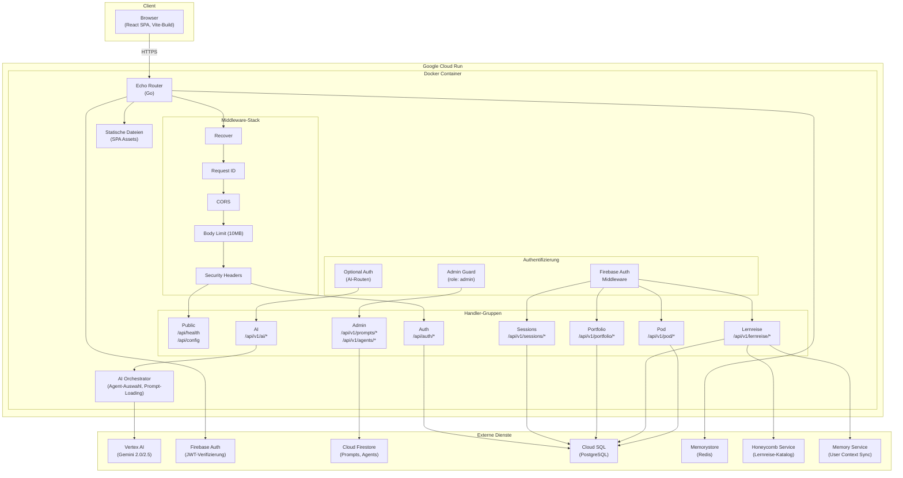
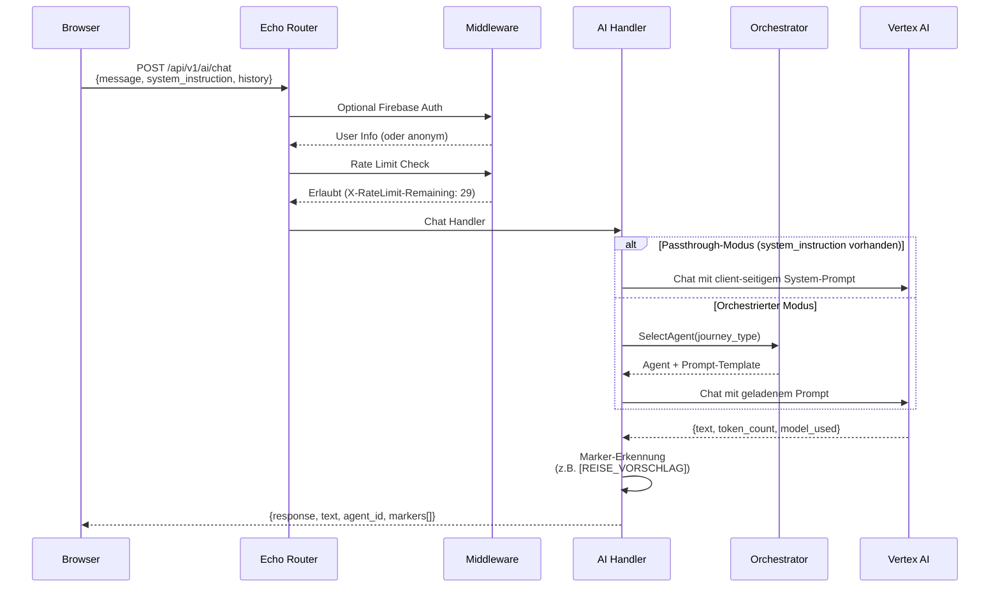
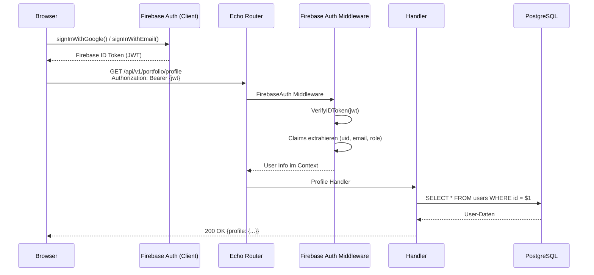

# Systemuebersicht

Detaillierte Darstellung der Systemarchitektur, Komponenteninteraktion und typische Request-Flows.

## Architekturdiagramm



## Middleware-Stack

Jeder Request durchlaeuft den folgenden Middleware-Stack in dieser Reihenfolge:

| Schritt | Middleware | Funktion |
|---------|-----------|----------|
| 1 | `Recover` | Faengt Panics ab, verhindert Server-Absturz |
| 2 | `RequestID` | Weist jedem Request eine eindeutige ID zu |
| 3 | `CORS` | Prueft und setzt Cross-Origin-Header |
| 4 | `BodyLimit` | Begrenzt Request-Body auf 10 MB |
| 5 | `Security Headers` | Setzt `X-Frame-Options`, `X-Content-Type-Options`, `HSTS`, `Referrer-Policy`, `Permissions-Policy` |
| 6 | `FirebaseAuth` | JWT-Verifizierung (nur `/api/v1/*` ausser AI) |
| 7 | `RateLimit` | Redis-basiertes Rate Limiting (pro Route konfigurierbar) |

## Request-Flow: AI-Chat-Interaktion

Typischer Ablauf einer Chat-Nachricht vom Browser bis zur Gemini-Antwort:



## Request-Flow: Authentifizierter API-Aufruf



## Statische Dateien

Das Go-Backend serviert die Frontend-SPA als statische Dateien:

- Alle Pfade unter `/` die nicht mit `/api/` beginnen liefern statische Assets
- Nicht gefundene Pfade liefern `index.html` (SPA-Fallback fuer Client-Side-Routing)
- Assets aus dem Vite-Build liegen im Verzeichnis `static/` innerhalb des Containers

## Container-Architektur

```
/app/
  server          # Go Binary (kompiliert in Stage 2)
  static/         # Frontend SPA (gebaut in Stage 1)
    index.html
    assets/
      *.js
      *.css
  migrations/     # PostgreSQL Migrationen
    000001_*.up.sql
    000017_*.up.sql
    000018_*.up.sql
  solid-config/   # Community Solid Server Konfiguration
  entrypoint.sh   # Startskript (CSS + Go Server)
```

## Umgebungsvariablen

Die Konfiguration erfolgt vollstaendig ueber Umgebungsvariablen. Es gibt keine Konfigurationsdateien im Container.

| Variable | Pflicht | Default | Beschreibung |
|----------|---------|---------|-------------|
| `PORT` | Nein | `8080` | Server-Port |
| `DATABASE_URL` | Ja | - | PostgreSQL Connection String |
| `REDIS_URL` | Nein | - | Redis Connection String |
| `FIREBASE_PROJECT_ID` | Nein | - | Firebase Projekt-ID |
| `GCP_PROJECT_ID` | Nein | `FIREBASE_PROJECT_ID` | GCP Projekt fuer Vertex AI |
| `GCP_REGION` | Nein | `europe-west3` | GCP Region |
| `ALLOWED_ORIGINS` | Nein | `localhost:5173,localhost:9090` | CORS-Origins (kommasepariert) |
| `HEALTH_CHECK_TOKEN` | Nein | - | Token fuer `/api/health/detailed` |
| `RUN_MIGRATIONS` | Nein | `false` | Auto-Migration beim Start |

!!! warning "Produktions-Hinweis"
    In der Produktion **muss** `ALLOWED_ORIGINS` gesetzt werden. Ohne explizite Konfiguration werden nur localhost-Origins akzeptiert. Cloud Run setzt zusaetzlich eine Warnung ins Log.
