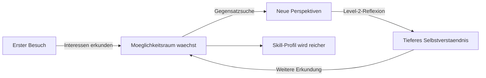

# Die Methodik

**Interessen entdecken statt Leistung bewerten. Moeglichkeiten eroeffnen statt Wege vorgeben.**

Future SkillR verfolgt einen grundlegend anderen Ansatz als herkoemmliche Berufsorientierungstools. Kein Fragebogen, keine Noten, keine Berufsempfehlung. Stattdessen: eine dialogbasierte Reise, auf der Jugendliche ihre eigenen Interessen erkunden — begleitet von einer KI, die als Reisebegleiter agiert.

---

## Drei Saeulen der Methodik

### 1. VUCA-Vollstaendigkeit

Die Reise nach VUCA ist kein beliebiger Parcours. Hinter dem spielerischen Rahmen steht ein paedagogisches Geruest mit vier Dimensionen:

- **Volatilitaet** — Veraenderung erkennen und Anpassungsfaehigkeit entwickeln
- **Unsicherheit** — Entscheidungen unter Ungewissheit treffen lernen
- **Komplexitaet** — Zusammenhaenge und Systeme verstehen
- **Ambiguitaet** — Mehrdeutigkeit aushalten und verschiedene Perspektiven einnehmen

Die **VUCA-Bingo-Matrix** (4 Dimensionen, je 4 Erfahrungen) stellt sicher, dass kein Bereich uebersprungen wird. Zwei Jugendliche mit voellig unterschiedlichen Interessen durchlaufen beide alle vier Dimensionen — der eine ueber Holzhandwerk und Nachhaltigkeit, die andere ueber Programmierung und Spieledesign.

[:octicons-arrow-right-24: Mehr zum VUCA Framework](vuca-framework.md)

### 2. Gegensatzsuche fuer Perspektiverweiterung

Die meisten Erkundungstools verfolgen Interessen linear: Wer Technik mag, bekommt mehr Technik. Future SkillR durchbricht dieses Muster bewusst.

Die **Gegensatzsuche** praesentiert kontrastierende Vorschlaege: Wer sich fuer Holzhandwerk begeistert, entdeckt digitale Fertigung. Wer gerne allein arbeitet, erlebt, was Teamarbeit reizvoll macht. Der Moeglichkeitsraum erweitert sich — und die Selbsterkenntnis schaerft sich.

Denn: Wer weiss, was er *nicht* will, weiss genauer, was er will.

[:octicons-arrow-right-24: Mehr zur Gegensatzsuche](gegensatzsuche.md)

### 3. Level-2-Reflexion fuer tiefere Selbsterkenntnis

Ein gaengiges Problem dialogbasierter Systeme: Nutzer klicken sich durch, ohne nachzudenken. Die **Level-2-Reflexion** verhindert das.

Waehrend der Reise wechselt die KI gezielt vom Informationslieferanten (Level 1) zum Coaching-Partner (Level 2). Sie stellt offene Fragen, hinterfragt Antworten und gibt Denkanstoesse — genau so, wie ein erfahrener Coach es tun wuerde. Die Reaktionen der Jugendlichen liefern dabei Faehigkeitssignale, die in das Skill-Profil einfliessen.

[:octicons-arrow-right-24: Mehr zur Level-2-Reflexion](level2-reflexion.md)

---

## Der Moeglichkeitsraum

Das zentrale Konzept hinter der gesamten Methodik ist der **Moeglichkeitsraum** — der sich staendig erweiternde Raum aller Moeglichkeiten an Berufen, Faehigkeiten, Interessen und Lebenswegen, die einem Menschen offenstehen.

!!! warning "Keine Berufsempfehlung"
    Future SkillR empfiehlt bewusst keine konkreten Berufe. Statt den Moeglichkeitsraum einzuengen ("Du solltest X werden"), erweitert das System ihn ("Hast du schon an Y gedacht?"). Das Ziel ist ein reichhaltiges, persoenliches Profil — keine Schublade.

### Erweitern statt Einengen

Herkoemmliche Tools filtern: Von allen Berufen bleiben am Ende drei uebrig, die "passen". Future SkillR funktioniert umgekehrt:

| Herkoemmlicher Ansatz | Future-Skiller-Ansatz |
|-----------------------|-----------------------|
| Noten als Ausgangspunkt | Interessen als Ausgangspunkt |
| Fragebogen mit festen Antworten | Offener Dialog mit KI-Coach |
| Filtern und Einengen | Erweitern und Vertiefen |
| Ergebnis: 3 Berufsempfehlungen | Ergebnis: ein wachsendes Skill-Profil |
| Einmalige Nutzung | Fortlaufende Reise |

---

## KI als Reisebegleiter

Die KI in Future SkillR ist kein Chatbot und kein Tutor. Sie ist ein **Reisebegleiter** — auf Deutsch: ein dialogbasierter Coach, der die Rolle eines erfahrenen Begleiters auf einer Entdeckungsreise einnimmt.

### Was der Reisebegleiter tut

- **Fragt statt antwortet** — Die KI stellt offene Fragen und reagiert auf die Antworten der Jugendlichen
- **Schlaegt Orte und Themen vor** — Basierend auf den Interessen, aber auch mit Gegensatzvorschlaegen
- **Wechselt die Ebene** — Zwischen Informationsaustausch (Level 1) und Reflexion (Level 2)
- **Dokumentiert unsichtbar** — Jede Interaktion traegt zum Skill-Profil bei, ohne dass die Jugendlichen einen Test erleben
- **Motiviert durch Neugier** — Gamifizierte Elemente (VUCA Bingo, Reisepass-Stempel) halten die Motivation hoch

### Was der Reisebegleiter NICHT tut

- Noten geben oder bewerten
- Berufe empfehlen oder abraten
- Richtige oder falsche Antworten definieren
- Persoenliche Daten fuer Dritte aufbereiten

!!! tip "Der paedagogische Kern"
    Hinter dem Reisebegleiter stehen die Prinzipien erfahrener Coaches: offene Fragen, aktives Zuhoeren, Perspektivwechsel, Reflexionsanregung. Die KI skaliert diese Prinzipien — sie erfindet sie nicht neu.

---

## Die Rolle von Coaches im System

Coaches und Paedagogen sind nicht passive Beobachter von Future SkillR. Sie gestalten das System aktiv mit:

1. **Lernreisen gestalten** — Kuratierte Pfade durch VUCA-Stationen, die spezifische methodische Schwerpunkte abbilden. Ueber den Meta-Kurs-Editor koennen Coaches eigene Reisen erstellen, die von der KI moderiert und von Tausenden durchlaufen werden.

2. **Methodische Grundlagen liefern** — Die Gegensatzsuche, die Level-2-Reflexion und die VUCA-Matrix basieren auf paedagogischen Konzepten, die von Coaches entwickelt und validiert wurden.

3. **Qualitaet sichern** — Coaches koennen Lernreisen bewerten, Feedback geben und die paedagogische Qualitaet des Systems begleiten.

!!! info "Lernreisen als Multiplikator"
    Eine einzelne Lernreise, gestaltet von einem erfahrenen Coach, kann Tausende Jugendliche erreichen. Die KI moderiert den Dialog, aber die methodische Struktur stammt vom Coach. Das ist der Kern der Skalierung: Ihre Expertise, multipliziert durch Technologie.

    [:octicons-arrow-right-24: Mehr zu Lernreisen](lernreisen.md)
