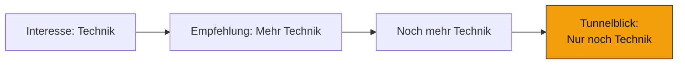
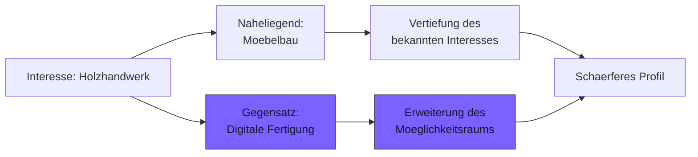
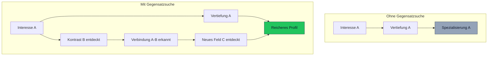

# Gegensatzsuche

**Selbsterkenntnis entsteht durch Kontrast.**

Die Gegensatzsuche ist eine paedagogische Methode, die bewusst kontrastierende oder gegenlaefige Perspektiven in den Erkundungsprozess einbringt. Wenn ein Jugendlicher Interesse an einem Thema zeigt, praesentiert die KI gezielt ein Kontrastthema — nicht als Ablenkung, sondern als Spiegel.

---

## Das Problem: Interessenbasierter Tunnelblick

Die meisten Empfehlungssysteme verstaerken bestehende Interessen: Wer Technik mag, bekommt mehr Technik. Wer Sport mag, bekommt mehr Sport. Das fuehlt sich bestaerkend an — fuehrt aber zu einem immer engeren Moeglichkeitsraum.

Fuer Jugendliche in der Orientierungsphase ist das besonders problematisch: Wer sich mit 14 auf ein Thema festlegt, verpasst Moeglichkeiten, die er nie kennengelernt hat.

!!! warning "Bestaetigung ist kein Coaching"
    Ein guter Coach nickt nicht einfach. Er fragt: "Hast du schon mal daran gedacht, dass...?" Die Gegensatzsuche uebersetzt genau dieses Prinzip in den KI-Dialog.

---

## Die Loesung: Kontrastierende Vorschlaege

Die Gegensatzsuche funktioniert nach einem einfachen Prinzip: Bei jeder Navigationsentscheidung bietet das System neben thematisch naheliegenden Optionen auch eine **kontrastierende Option** an.

### Beide Reaktionen sind wertvoll

Das Besondere an der Gegensatzsuche: Sowohl Annehmen als auch Ablehnen des Kontrastvorschlags liefert wertvolle Profilinformationen.

| Reaktion | Was sie verraet | Profilwirkung |
|----------|-----------------|---------------|
| **Kontrastthema annehmen** | Offenheit, Neugier, breites Interessenspektrum | Moeglichkeitsraum erweitert sich |
| **Kontrastthema ablehnen** | Klare Praeferenz, bewusste Entscheidung | Bestehendes Interesse wird geschaerft |
| **Zunaechst ablehnen, spaeter annehmen** | Reifungsprozess, wachsende Offenheit | Entwicklung wird sichtbar |

!!! info "Ablehnung ist Information"
    Ein Jugendlicher, der bewusst sagt "Nein, digitale Fertigung interessiert mich nicht — ich mag das Taktile am Holz", hat etwas Wichtiges ueber sich gelernt. Diese bewusste Abgrenzung ist genauso wertvoll wie die Entdeckung eines neuen Interesses.

---

## Praxisbeispiele

### Beispiel 1: Holzhandwerk und Digitale Fertigung

| Schritt | Was passiert |
|---------|-------------|
| Jugendlicher erkundet "Holzhandwerk" in der Reise nach VUCA | |
| KI bietet naechste Station an: | |
| **Option A:** "In Finnland gibt es eine Werkstatt, die alte Moebel restauriert. Willst du vorbei?" | Vertiefung |
| **Option B (Gegensatz):** "In Rotterdam druckt ein Architekt ganze Haeuser mit einem 3D-Drucker — aus recyceltem Plastik. Wuerdest du dir das anschauen?" | Kontrast |

### Beispiel 2: Kochen und Lebensmittelchemie

| Schritt | Was passiert |
|---------|-------------|
| Jugendlicher zeigt starkes Interesse an "Kochen" | |
| KI bietet Kontrastperspektive: | |
| **Naheliegend:** "In Lyon kochst du mit einem Meisterkoch ein 5-Gaenge-Menue." | Vertiefung |
| **Gegensatz:** "In einem Labor in Zuerich analysieren Chemiker, warum Schokolade schmilzt und Brot aufgeht. Willst du wissen, was Kochen mit Chemie zu tun hat?" | Kontrast |

### Beispiel 3: Einzelarbeit und Teamarbeit

| Schritt | Was passiert |
|---------|-------------|
| Jugendlicher bevorzugt durchgehend Einzelaufgaben | |
| KI bietet Kontrastsituation: | |
| **Naheliegend:** "Du loest ein kniffliges Raetsel allein — ein Code, den noch niemand geknackt hat." | Vertiefung |
| **Gegensatz:** "In einer Raumstation muessen vier Leute zusammenarbeiten, um ein Problem zu loesen. Keiner hat alle Informationen. Wuerdest du das Team fuehren?" | Kontrast |

### Beispiel 4: Sport und Sportwissenschaft

| Schritt | Was passiert |
|---------|-------------|
| Jugendlicher interessiert sich fuer "Sport und Fitness" | |
| KI bietet Kontrastperspektive: | |
| **Naheliegend:** "In Barcelona trainierst du mit einem Fitnesstrainer neue Techniken." | Vertiefung |
| **Gegensatz:** "In einem Biomechanik-Labor filmst du Athleten mit Hochgeschwindigkeitskameras und analysierst ihre Bewegungen Millimeter fuer Millimeter. Was kann Technik ueber den Koerper verraten?" | Kontrast |

---

## Wo die Gegensatzsuche angewendet wird

Die Gegensatzsuche ist kein einzelnes Feature, sondern ein durchgaengiges Prinzip:

### 1. VUCA-Navigation

Bei jeder Stationswahl in der Reise nach VUCA bietet das System mindestens eine kontrastierende Option an. Die KI identifiziert das "semantische Gegenteil" oder die "kontrastierende Domaene" des aktuellen Themas.

### 2. Job-Navigator

Im Job-Navigator werden neben Berufsvorschlaegen, die zum Interessenprofil passen, auch kontrastierende Berufe angezeigt. Ein Jugendlicher, der sich fuer Grafikdesign interessiert, sieht auch Berufe wie Vermessungstechnik oder Metallbau — Bereiche, die auf den ersten Blick nichts gemeinsam haben, aber ueberraschende Verbindungen offenbaren koennen.

### 3. Level-2-Reflexion

In der Level-2-Reflexion nutzt die KI Gegensaetze als Denkanstoesse: "Du hast gesagt, du arbeitest lieber allein. Was waere, wenn du ein Team leiten muestest — was wuerde dich daran reizen?" Die Antworten liefern besonders tiefe Profilinformationen.

---

## Das paedagogische Fundament

Die Gegensatzsuche basiert auf einem bewaehrten paedagogischen Prinzip: **Differenzierung durch Kontrast**.

### Kognitive Wirkung

- **Vergleichen schaerft das Urteil** — Wer nur Aepfel kennt, weiss nicht, was einen Apfel ausmacht. Erst im Vergleich mit einer Birne wird das Profil deutlich.
- **Kontrast erzeugt Reflexion** — Die Konfrontation mit dem Gegenteil zwingt zu bewusster Positionierung. Das ist der Kern von Selbsterkenntnis.
- **Ueberraschung foerdert Lernen** — Unerwartete Vorschlaege erzeugen kognitive Reibung, die nachweislich zu tieferer Verarbeitung fuehrt.

### Was die Gegensatzsuche NICHT ist

!!! warning "Wichtige Abgrenzung"
    - **Keine Provokation** — Kontrastvorschlaege sind respektvoll und relevant, nie absurd oder verletzend
    - **Kein Zwang** — Jugendliche koennen jeden Kontrastvorschlag ablehnen, ohne Nachteile
    - **Keine Manipulation** — Ziel ist Horizonterweiterung, nicht Meinungsaenderung
    - **Kein Zufall** — Die KI waehlt Gegensaetze intelligent aus, basierend auf semantischer Analyse

---

## Erweiterung des Moeglichkeitsraums

Die Gegensatzsuche ist der primaere Mechanismus zur Erweiterung des **Moeglichkeitsraums**. Waehrend die regulaere Erkundung den Raum innerhalb bekannter Interessen vertieft, stossen Gegensatzvorschlaege die Grenzen nach aussen:

!!! tip "Fuer Coaches"
    Die Gegensatzsuche ist im Kern das, was erfahrene Coaches intuitiv tun: den Blick weiten, Annahmen hinterfragen, neue Verbindungen aufzeigen. Future SkillR macht dieses Prinzip systematisch und skalierbar — fuer jeden Jugendlichen, bei jeder Interaktion.
