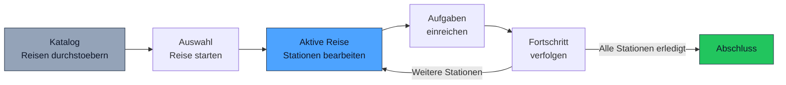
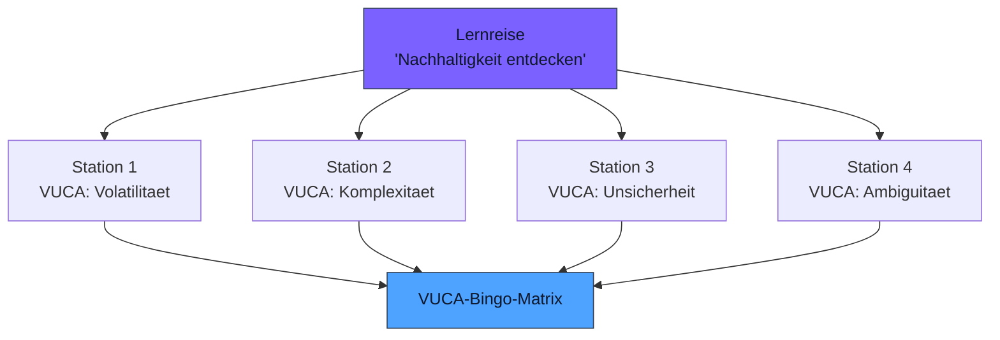

# Lernreisen

**Ihre Methodik. Strukturiert als Reise. Erlebt von Tausenden.**

Lernreisen sind kuratierte Pfade durch mehrere VUCA-Stationen. Sie verbinden einzelne Erkundungsschritte zu einer zusammenhaengenden Erfahrung — mit klarem Anfang, strukturiertem Verlauf und messbarem Abschluss. Coaches und Paedagogen gestalten diese Reisen; die KI moderiert den Dialog mit jedem einzelnen Jugendlichen.

---

## Was ist eine Lernreise?

Eine Lernreise ist ein strukturierter Parcours aus mehreren Stationen, die thematisch und paedagogisch zusammenhaengen. Im Gegensatz zur freien Erkundung in der Reise nach VUCA folgt eine Lernreise einem vordefinierten Pfad — mit Aufgaben, Reflexionsmomenten und einem klaren Abschlussziel.

| Eigenschaft | Freie VUCA-Reise | Lernreise |
|-------------|------------------|-----------|
| **Struktur** | Offene Erkundung, selbstgewaehlt | Kuratierter Pfad mit fester Reihenfolge |
| **Navigation** | Jugendlicher waehlt Stationen frei | Stationen sind vorgegeben, Reihenfolge definiert |
| **Ziel** | VUCA-Bingo-Matrix fuellen | Spezifisches Thema vertiefen |
| **Dauer** | Unbegrenzt, ueber viele Sessions | Definierte Laenge (z.B. 30-60 Minuten) |
| **Erstellt von** | System (dynamisch) | Coaches, Paedagogen, Sponsoren |
| **Abschluss** | Matrix vollstaendig | Alle Stationen und Aufgaben erledigt |

---

## Lebenszyklus einer Lernreise

Von der Idee bis zum Abschluss durchlaeuft eine Lernreise diese Phasen:

### 1. Katalog

Jugendliche durchstoebern den Lernreise-Katalog und sehen verfuegbare Reisen mit Titel, Beschreibung, geschaetzter Dauer und thematischem Schwerpunkt.

### 2. Auswahl

Ein Jugendlicher waehlt eine Reise aus und startet sie. Pro Jugendlichem ist immer nur eine Reise gleichzeitig aktiv — Fokus statt Verzettelung.

### 3. Aktive Reise

Die Reise fuehrt durch mehrere Stationen. An jeder Station interagiert der Jugendliche mit der KI, die den paedagogischen Kontext der Station moderiert.

### 4. Aufgaben und Fortschritt

An bestimmten Stationen werden Aufgaben gestellt. Nach dem Einreichen einer Aufgabe wird der Fortschritt aktualisiert. Erfahrungspunkte (XP) belohnen den Abschluss.

### 5. Abschluss

Wenn alle Stationen und Aufgaben erledigt sind, ist die Lernreise abgeschlossen. Der Fortschritt fliesst in das Skill-Profil und die VUCA-Bingo-Matrix ein.

---

## Typen von Lernreisen

Future SkillR bietet drei grundlegende Reise-Typen, die unterschiedliche Aspekte der Persoenlichkeitsentwicklung adressieren:

### Reise nach VUCA

*"Wer bin ich? Was interessiert mich?"*

Die klassische Erkundungsreise, in der Jugendliche die Welt entlang ihrer Interessen bereisen. Fokus auf Selbsterkenntnis und Interessenerkundung durch die vier VUCA-Dimensionen.

### Unternehmergeist

*"Was kann ich erschaffen?"*

Eine Reise, die unternehmerisches Denken foerdert. Statt die Welt zu beobachten, gestalten Jugendliche sie aktiv: Ideen entwickeln, Prototypen bauen, Maerkte verstehen, Scheitern als Lernchance begreifen.

### Selbstlernkompetenz

*"Wie lerne ich selbst?"*

Eine Meta-Reise, die Jugendliche befaehigt, eigenstaendig zu lernen: Quellen bewerten, Lernstrategien entwickeln, Durchhaltevermoegen aufbauen, Fortschritt reflektieren.

!!! info "Ein Profil, drei Perspektiven"
    Alle drei Reise-Typen speisen dasselbe Skill-Profil. Ein Jugendlicher, der alle drei Reisen durchlaeuft, hat ein besonders reichhaltiges und differenziertes Profil.

---

## Verbindung zur VUCA-Bingo-Matrix

Lernreisen und die VUCA-Bingo-Matrix arbeiten zusammen, nicht gegeneinander:

- Jede Station einer Lernreise ist einer oder mehreren **VUCA-Dimensionen** zugeordnet
- Der Abschluss einer Station **zaehlt fuer die Matrix** — die Reise traegt zur Gesamtvollstaendigkeit bei
- Coaches koennen Lernreisen so gestalten, dass sie gezielt **unterbesetzte Dimensionen** adressieren

---

## Lernreisen gestalten

Coaches und Paedagogen koennen eigene Lernreisen erstellen und veroeffentlichen. Der **Meta-Kurs-Editor** bietet dafuer eine strukturierte Oberflaeche.

### Eine Station definieren

Jede Station einer Lernreise besteht aus:

| Element | Beschreibung | Beispiel |
|---------|--------------|---------|
| **Titel** | Name der Station | "Die Fabrik der Zukunft" |
| **Setting** | Beschreibung der Umgebung/Situation | "Du stehst in einer Fabrikhalle in Stuttgart. Statt Fliessbaendern siehst du Roboterarme und 3D-Drucker." |
| **VUCA-Dimension** | Welche Dimension wird adressiert | Komplexitaet |
| **Skill-Verknuepfung** | Welche Faehigkeiten werden angesprochen | 3D-Modellierung, Prozesssteuerung |
| **Charakter** | Wer spricht an dieser Station? | Eine Ingenieurin, die den Uebergang von klassischer zu digitaler Fertigung erlebt hat |

### Erfahrungspunkte

Der Abschluss von Lernreise-Stationen wird mit Erfahrungspunkten (XP) belohnt:

| Aktion | XP |
|--------|-----|
| Lernreise gestartet | 15 |
| Aufgabe abgeschlossen | 20 |
| Modul vollstaendig | 75 |
| Lernreise abgeschlossen | 200 |

!!! tip "Motivation durch Sichtbarkeit"
    Jugendliche sehen ihren Fortschritt waehrend der Reise in Echtzeit. Der Fortschrittsbalken und die XP-Vergabe schaffen Motivation, ohne Druck aufzubauen — der naechste Schritt ist immer freiwillig.

---

## Lernreisen als Multiplikator

Das Kernversprechen von Lernreisen fuer Coaches:

> **Eine Reise. Von Ihnen gestaltet. Von Tausenden erlebt.**

Statt jeden Jugendlichen einzeln durch einen Workshop zu fuehren, gestalten Sie einen strukturierten Pfad, den die KI fuer jeden Teilnehmer individuell moderiert. Ihre methodischen Entscheidungen — welche Stationen, welche Reihenfolge, welche Reflexionsfragen — bleiben erhalten. Die KI sorgt dafuer, dass jeder Jugendliche eine persoenliche Erfahrung macht.

### Was die KI uebernimmt

- Dialog an jeder Station individuell fuehren
- Antworten in Echtzeit verarbeiten und reagieren
- Level-2-Reflexion an geeigneten Stellen einsetzen
- Gegensatzvorschlaege in den Kontext der Station einbetten
- Fortschritt tracken und XP vergeben

### Was der Coach beibringt

- Thematische Struktur und Reihenfolge der Stationen
- Paedagogische Schwerpunkte und Lernziele
- Situationsbeschreibungen und Charaktere
- VUCA-Dimension-Zuordnung
- Skill-Verknuepfungen

!!! info "Keine Programmierkenntnisse noetig"
    Der Meta-Kurs-Editor ist ein visuelles Werkzeug. Sie definieren Stationen, ordnen VUCA-Dimensionen zu und beschreiben das Setting — den Rest erledigt das System. Technisches Wissen ist nicht erforderlich.

---

## Qualitaetssicherung

Lernreisen durchlaufen einen Qualitaetsprozess, bevor sie fuer Jugendliche sichtbar werden:

1. **Entwurf** — Coach erstellt die Reise im Editor
2. **Vorschau** — Coach kann die Reise aus Schueler-Perspektive testen
3. **Veroeffentlichung** — Reise wird im Katalog sichtbar
4. **Feedback** — Nutzungsdaten zeigen, wo Jugendliche abbrechen oder besonders engagiert sind
5. **Iteration** — Coach passt die Reise basierend auf Feedback an

Die Vorschau-Funktion ist besonders wichtig: Sie erlaubt Coaches, die Reise selbst zu durchlaufen und zu erleben, wie die KI ihre Stationen moderiert — bevor ein einziger Jugendlicher sie sieht.
