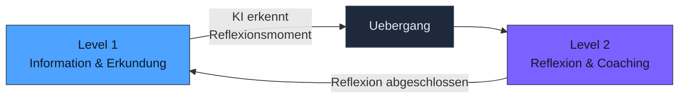
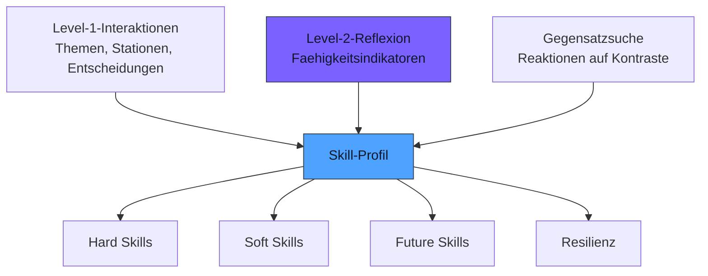

# Level-2-Reflexion

**Nicht nur was Jugendliche sagen, sondern wie sie denken.**

Die Level-2-Reflexion ist der Uebergang vom einfachen Informationsaustausch zu echtem Coaching. Die KI wechselt von der Rolle des Informationslieferanten zur Rolle des Coaches — sie stellt offene Fragen, hinterfragt Antworten und beobachtet, wie Jugendliche reagieren.

---

## Zwei Ebenen des Dialogs

!!! info "Level 1 — Informationsaustausch"
    Der Jugendliche erkundet, die KI antwortet. Fragen werden gestellt, Themen vorgeschlagen, Stationen besucht. Der Fokus liegt auf **Inhalt**: Was interessiert den Jugendlichen? Welche Themen waehlt er? Welche ueberspringt er?

    **Beispiel:** "In Melbourne gibt es eine Designschule, die Moebel aus Ozeanplastik herstellt. Willst du mehr darueber erfahren?"

!!! tip "Level 2 — Coaching und Reflexion"
    Die KI geht tiefer. Sie fragt nicht mehr nur, was den Jugendlichen interessiert, sondern warum. Sie hinterfragt Antworten, bietet Denkanstoesse und beobachtet die Reaktion — genau wie ein erfahrener Coach.

    **Beispiel:** "Du hast gesagt, Nachhaltigkeit ist dir wichtig. Was genau meinst du damit? Ist es das Gefuehl, etwas Gutes zu tun — oder eher die technische Herausforderung, Materialien wiederzuverwerten?"

---

## Wie Level 2 funktioniert

### Natuerlicher Uebergang

Der Wechsel von Level 1 zu Level 2 geschieht **nicht abrupt**. Die KI wechselt die Ebene an natuerlichen Gespraechspunkten — wie ein Reisebegleiter, der nach dem Besuch eines Ortes fragt: "Was hat dich am meisten ueberrascht?"

### Ausloesende Momente

Die KI initiiert Level-2-Reflexion in bestimmten Situationen:

| Ausloesender Moment | Beispiel |
|---------------------|----------|
| Nach einer Stationserkundung | "Du hast dir die Roboterfabrik angeschaut. Was hat dich am meisten fasziniert — die Technik oder die Tatsache, dass Menschen dadurch anders arbeiten?" |
| Nach einer Entscheidung | "Du hast dich gegen die Teamaufgabe entschieden. War das, weil du lieber allein arbeitest — oder weil dir das Thema nicht gefallen hat?" |
| Nach einem Gegensatzvorschlag | "Du hast den Gegensatz angenommen und dir die Lebensmittelchemie angeschaut. Was hat dich ueberrascht?" |
| Bei wiederholten Mustern | "Du waehlst oft Themen, die mit Kreativitaet zu tun haben. Was bedeutet 'kreativ sein' fuer dich?" |
| Bei VUCA-Dimension-Uebergaengen | "Gerade hast du eine Situation mit viel Unsicherheit erlebt. Wie hast du dich dabei gefuehlt?" |

---

## Was Level 2 erfasst

Die Level-2-Reflexion analysiert nicht nur den Inhalt der Antworten, sondern auch deren Qualitaet und die Verhaltensmerkmale waehrend der Interaktion.

### Inhaltliche Signale

| Signal | Was es verraet | Beispiel |
|--------|----------------|----------|
| **Differenzierungsgrad** | Kann der Jugendliche Nuancen benennen? | "Nachhaltigkeit ist wichtig" vs. "Mich fasziniert, wie man aus Abfall neue Materialien macht" |
| **Begruendungstiefe** | Kann er seine Praeferenzen erklaeren? | "Ich mag Technik" vs. "Technik gibt mir das Gefuehl, Probleme loesen zu koennen" |
| **Transferfaehigkeit** | Kann er Verbindungen zwischen Themen herstellen? | "Das erinnert mich an..." oder "Das ist aehnlich wie..." |
| **Perspektivwechsel** | Kann er andere Sichtweisen einnehmen? | "Fuer den Koch waere das anders, weil..." |

### Verhaltenssignale

| Signal | Was es verraet |
|--------|----------------|
| **Antwortzeit** | Schnelle Antworten deuten auf Sicherheit hin, laengeres Nachdenken auf vertiefte Reflexion |
| **Engagementdauer** | Wie lange beschaeftigt sich der Jugendliche mit einem Reflexionsthema? |
| **Bearbeitungsintensitaet** | Werden Antworten ueberarbeitet oder sofort abgeschickt? |
| **Reaktion auf Nachfragen** | Vertieft der Jugendliche seine Antwort oder weicht er aus? |

!!! warning "Keine Bewertung, sondern Muster"
    Level-2-Signale werden **nicht** als "gut" oder "schlecht" bewertet. Sie fliessen als **Muster** in das Skill-Profil ein. Ein Jugendlicher, der schnell antwortet, ist nicht "besser" als einer, der lange nachdenkt — er zeigt ein anderes Faehigkeitsprofil.

---

## Faehigkeitsindikatoren

Aus der Kombination von inhaltlichen und verhaltensbezogenen Signalen entstehen **Faehigkeitsindikatoren**, die in das Skill-Profil einfliessen:

| Indikator | Beschreibung | Quelle |
|-----------|-------------- |--------|
| **Analytische Tiefe** | Faehigkeit, Sachverhalte zu zerlegen und Zusammenhaenge zu erkennen | Inhalt: Differenzierungsgrad + Transferfaehigkeit |
| **Kreativitaet** | Faehigkeit, unerwartete Verbindungen herzustellen und neue Ideen zu generieren | Inhalt: Originalitaet der Antworten + Reaktion auf Gegensatzvorschlaege |
| **Entscheidungssicherheit** | Faehigkeit, Positionen einzunehmen und zu begruenden | Verhalten: Antwortzeit + Inhalt: Begruendungstiefe |
| **Unsicherheitstoleranz** | Faehigkeit, mit offenen Situationen produktiv umzugehen | Verhalten: Engagement bei ambigen Themen + Inhalt: Perspektivwechsel |
| **Reflexionsfaehigkeit** | Faehigkeit, das eigene Denken und Handeln zu hinterfragen | Inhalt: Reaktion auf Level-2-Fragen + Verhalten: Vertiefungsbereitschaft |

---

## Integration in das Skill-Profil

Level-2-Signale fliessen als **weiche Signale** (Soft Signals) in das Skill-Profil ein — neben den harten Signalen aus der VUCA-Navigation (welche Stationen besucht, welche Themen gewaehlt):

---

## Datenschutz und Transparenz

Die Level-2-Reflexion erhebt Verhaltensdaten — und das erfordert besondere Sorgfalt:

!!! info "Aggregierte Muster, kein Keystroke-Tracking"
    Future SkillR erfasst **keine** Einzelanschlaege, keine Mausbewegungen und keine Bildschirmaufnahmen. Die Verhaltenssignale sind **aggregiert**: Antwortzeit pro Reflexionsfrage (nicht pro Buchstabe), Gesamtengagement pro Session (nicht pro Sekunde).

### Prinzipien der Datenverarbeitung

| Prinzip | Umsetzung |
|---------|-----------|
| **Transparenz** | Jugendliche und Eltern werden darueber informiert, dass Antwortverhalten (nicht Inhalte) zur Profilbildung beitraegt |
| **Aggregation** | Keine Rohdaten gespeichert — nur abgeleitete Muster und Indikatoren |
| **Keine Weitergabe** | Faehigkeitsindikatoren verlassen nie das persoenliche Profil. Dritte sehen nur, was der Jugendliche explizit freigibt |
| **Loeschbarkeit** | Alle Level-2-Daten sind jederzeit vollstaendig loeschbar |
| **Keine Echtzeit-Ueberwachung** | Verhaltenssignale werden erst nach Abschluss einer Reflexionseinheit verarbeitet |

---

## Die Coaching-Parallele

Level-2-Reflexion bildet ab, was erfahrene Coaches intuitiv tun:

| Was ein Coach tut | Was Level 2 tut |
|-------------------|-----------------|
| Offene Fragen stellen | KI stellt Reflexionsfragen statt Multiple-Choice |
| Antworten hinterfragen | KI fragt nach: "Was genau meinst du damit?" |
| Koerpersprache lesen | KI analysiert Antwortverhalten (Timing, Engagement) |
| Muster erkennen | KI aggregiert Signale ueber viele Interaktionen |
| Ohne zu bewerten | Keine "richtig"- oder "falsch"-Rueckmeldungen |
| Reflexion anregen | Denkanstoesse und Perspektivwechsel |

!!! tip "Fuer Coaches"
    Level-2-Reflexion ersetzt nicht das persoenliche Coaching-Gespraech. Aber sie gibt jedem Jugendlichen Zugang zu einer strukturierten Reflexionserfahrung — auch ohne Termin beim Berufsberater. Die Qualitaet der Reflexionsfragen basiert auf den Prinzipien, die Sie als Coaches taeglich anwenden.

---

## Intensitaetsverlauf

Level-2-Reflexion passt sich dem Reiseverlauf an. Fruehe Interaktionen sind leichter, spaetere gehen tiefer:

| Reisephase | Level-2-Intensitaet | Beispiel |
|------------|---------------------|----------|
| **Beginn** (erste 2-3 Stationen) | Gering — einfache Rueckfragen | "Hat dir das Spass gemacht?" |
| **Mitte** (VUCA-Matrix zur Haelfte gefuellt) | Mittel — Begruendungen und Vergleiche | "Was war der Unterschied zwischen dieser und der letzten Station fuer dich?" |
| **Fortgeschritten** (3 von 4 Dimensionen voll) | Hoch — Tiefenreflexion und Synthese | "Du hast jetzt viel erlebt. Wenn du zurueckschaust — welches Thema hat dich am meisten ueberrascht, und warum?" |

Dieser Verlauf stellt sicher, dass Jugendliche nicht ueberfordert werden und gleichzeitig mit wachsender Erfahrung zu tieferer Reflexion faehig sind.
