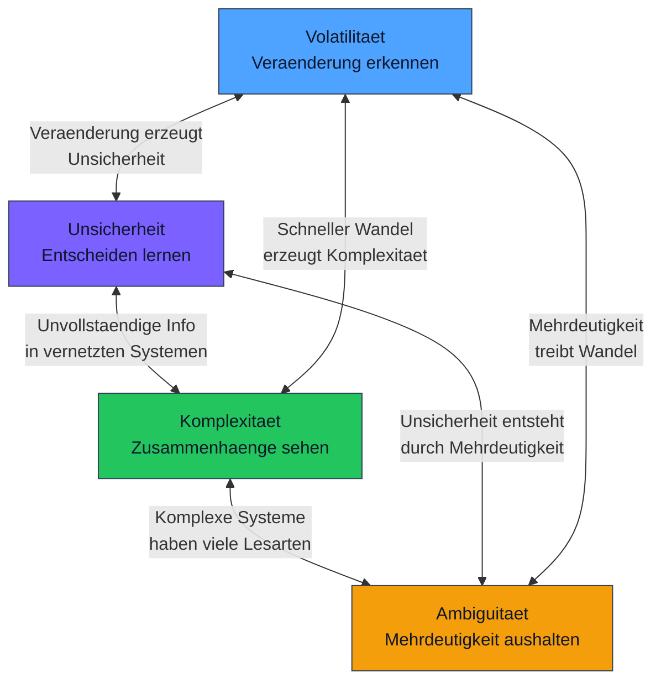

# VUCA Framework

**Vier Dimensionen. Vier Perspektiven auf die Welt. Ein vollstaendiges Bild.**

VUCA steht fuer **Volatilitaet**, **Unsicherheit**, **Komplexitaet** und **Ambiguitaet** — vier Eigenschaften, die die moderne Arbeits- und Lebenswelt praegen. Future SkillR nutzt dieses Framework nicht als abstraktes Modell, sondern als konkretes paedagogisches Geruest: Jede Dimension wird fuer Jugendliche erlebbar gemacht, durch Themen und Situationen aus ihrer Lebenswelt.

---

## Die vier Dimensionen

### Volatilitaet — Veraenderung und Anpassung

*Die Welt veraendert sich schnell. Wer das erkennt, kann sich anpassen.*

Volatilitaet beschreibt die Geschwindigkeit und das Ausmass von Veraenderungen. Fuer Jugendliche bedeutet das: Trends kommen und gehen, Berufe entstehen und verschwinden, Technologien veraendern Alltag und Arbeit innerhalb weniger Jahre.

| Aspekt | Beispiel fuer Jugendliche |
|--------|---------------------------|
| Technologischer Wandel | Der Beruf "Social Media Manager" existierte vor 15 Jahren nicht |
| Trendgeschwindigkeit | Plattformen wie TikTok veraendern, wie Menschen kommunizieren und arbeiten |
| Anpassungsfaehigkeit | Wer programmieren lernt, nutzt in 5 Jahren vermutlich andere Sprachen |
| Berufswandel | Handwerksberufe integrieren zunehmend digitale Werkzeuge (CNC, 3D-Druck) |

!!! tip "Paedagogisches Ziel"
    Jugendliche erkennen, dass Veraenderung normal ist — und dass die Faehigkeit, sich anzupassen, wertvoller ist als statisches Wissen.

### Unsicherheit — Entscheiden ohne vollstaendige Information

*Nicht alles ist vorhersehbar. Trotzdem muss man Entscheidungen treffen.*

Unsicherheit beschreibt Situationen, in denen Informationen unvollstaendig, widersprüchlich oder einfach nicht verfuegbar sind. Jugendliche stehen vor genau solchen Situationen: Welche Ausbildung passt? Was will ich in fuenf Jahren? Woher weiss ich, ob das die richtige Wahl ist?

| Aspekt | Beispiel fuer Jugendliche |
|--------|---------------------------|
| Entscheidung unter Ungewissheit | "Soll ich eine Ausbildung machen oder studieren?" — ohne zu wissen, was besser passt |
| Informationsluecken | "Wie ist der Arbeitsalltag als Mechatronikerin wirklich?" |
| Risikoabschaetzung | "Was passiert, wenn mir der Beruf nicht gefaellt?" |
| Umgang mit Nicht-Wissen | Akzeptieren, dass man nicht alles planen kann — und trotzdem handeln |

!!! tip "Paedagogisches Ziel"
    Jugendliche lernen, dass Unsicherheit kein Hindernis ist, sondern ein natuerlicher Bestandteil jeder Orientierungsphase. Entscheiden unter Unsicherheit ist eine Faehigkeit, die man ueben kann.

### Komplexitaet — Zusammenhaenge und Systeme

*Die Welt besteht aus Zusammenhaengen. Wer sie erkennt, versteht mehr.*

Komplexitaet beschreibt Situationen, in denen viele Faktoren miteinander verbunden sind und sich gegenseitig beeinflussen. Fuer Jugendliche bedeutet das: Ein einzelnes Interesse haengt mit vielen anderen Bereichen zusammen. Ein Beruf existiert nicht isoliert, sondern in einem Netzwerk aus Branchen, Faehigkeiten und Lebensentscheidungen.

| Aspekt | Beispiel fuer Jugendliche |
|--------|---------------------------|
| Vernetzte Systeme | Kochen verbindet Chemie, Ernaehrung, Kultur, Wirtschaft und Kreativitaet |
| Multiple Perspektiven | Ein Krankenhaus braucht nicht nur Aerzte — auch IT, Logistik, Verwaltung, Psychologie |
| Wechselwirkungen | Die Wahl des Wohnorts beeinflusst Joboptionen, und umgekehrt |
| Systemdenken | Klimaschutz betrifft gleichzeitig Technik, Politik, Wirtschaft und Verhalten |

!!! tip "Paedagogisches Ziel"
    Jugendliche erfahren, dass Interessen keine isolierten Punkte sind, sondern Teil eines Netzwerks. Die Faehigkeit, Zusammenhaenge zu sehen, erweitert den Moeglichkeitsraum enorm.

### Ambiguitaet — Mehrdeutigkeit und Perspektiven

*Nicht alles hat eine einzige richtige Antwort. Und das ist in Ordnung.*

Ambiguitaet beschreibt Situationen, in denen mehrere Interpretationen gleichzeitig gueltig sein koennen. Fuer Jugendliche ist das besonders relevant: Die Frage "Was willst du werden?" hat keine eindeutige Antwort — und das muss sie auch nicht.

| Aspekt | Beispiel fuer Jugendliche |
|--------|---------------------------|
| Mehrere gueltige Wege | Sowohl Ausbildung als auch Studium koennen zum selben Ziel fuehren |
| Widersprueche aushalten | "Ich mag Technik UND Kunst" — das ist kein Widerspruch, sondern ein Profil |
| Perspektivwechsel | Ein Beruf sieht von aussen anders aus als von innen |
| Ambiguitaetstoleranz | Akzeptieren, dass man mehrere Interessen gleichzeitig haben kann |

!!! tip "Paedagogisches Ziel"
    Jugendliche entwickeln Toleranz fuer Mehrdeutigkeit. Statt nach DER einen Antwort zu suchen, lernen sie, mit offenen Moeglichkeiten produktiv umzugehen.

---

## Wie die Dimensionen zusammenwirken

Die vier VUCA-Dimensionen sind nicht isoliert — sie greifen ineinander. Ein einzelnes Thema kann mehrere Dimensionen gleichzeitig ansprechen:

!!! info "Ganzheitliche Erkundung"
    In der Praxis laesst sich ein Thema selten auf eine einzige Dimension reduzieren. Die VUCA-Matrix fordert Jugendliche auf, jedes Thema aus mehreren Perspektiven zu betrachten — und genau darin liegt ihr paedagogischer Wert.

---

## Die 4x4-Matrix: Vollstaendigkeit sicherstellen

Die **VUCA-Bingo-Matrix** ist das zentrale Qualitaetsinstrument der Reise. Sie stellt sicher, dass keine Dimension zu kurz kommt:

| | Volatilitaet | Unsicherheit | Komplexitaet | Ambiguitaet |
|---|:---:|:---:|:---:|:---:|
| **Erfahrung 1** | _ | _ | _ | _ |
| **Erfahrung 2** | _ | _ | _ | _ |
| **Erfahrung 3** | _ | _ | _ | _ |
| **Erfahrung 4** | _ | _ | _ | _ |

### So funktioniert die Matrix

1. **Jede Dialoginteraktion** wird von der KI-Engine einer oder mehreren VUCA-Dimensionen zugeordnet
2. **Ein Fortschrittszaehler** zaehlt die Erfahrungen pro Dimension
3. **Mindestens 4 Erfahrungen** pro Dimension sind erforderlich, um die Reise abzuschliessen
4. **Die Visualisierung** zeigt den Fortschritt als Bingo-Karte oder Fortschrittsbalken

!!! warning "Unsichtbar fuer Jugendliche"
    Die Matrix arbeitet im Hintergrund. Jugendliche sehen ihren Fortschritt (z.B. als Reisepass-Stempel), aber nicht die paedagogische Struktur dahinter. Sie erleben eine spannende Reise — nicht ein Pflichtprogramm.

### Warum 4x4?

- **4 Dimensionen** decken die wesentlichen Aspekte der modernen Welt ab
- **4 Erfahrungen pro Dimension** sind genug fuer fundiertes Verstaendnis, aber nicht so viele, dass die Reise ermuedet
- **16 Erfahrungen insgesamt** sind in mehreren kurzen Sessions (je 5-10 Minuten) erreichbar
- **Die Matrix ist ein Minimum** — Jugendliche koennen weit mehr als 4 Erfahrungen pro Dimension sammeln

---

## VUCA in der Praxis: Ein Beispiel

Ein Jugendlicher interessiert sich fuer **Kochen**. So koennte die KI die vier Dimensionen einweben:

| Dimension | Beispiel-Station |
|-----------|-----------------|
| **Volatilitaet** | "In Tokyo hat ein Koch seinen Job an einen Roboter verloren. Jetzt erfindet er Rezepte, die kein Roboter nachkochen kann. Was denkst du — welche Gerichte waeren das?" |
| **Unsicherheit** | "Du hast 200 EUR und musst fuer 50 Gaeste kochen. Du weisst nicht, wer kommt und was sie moegen. Wie planst du?" |
| **Komplexitaet** | "Ein Gericht in Berlin: Das Gemuese kommt aus Spanien, das Gewuerz aus Indien, die Verpackung aus China. Was hat dein Teller mit der Weltwirtschaft zu tun?" |
| **Ambiguitaet** | "Zwei Koechinnen bereiten das gleiche Rezept zu — und es schmeckt voellig anders. Wer hat es 'richtig' gemacht? Gibt es 'richtig' beim Kochen?" |

In jeder dieser Situationen erkundet der Jugendliche sein Interesse (Kochen) und entwickelt gleichzeitig VUCA-Kompetenzen — ohne es als Unterricht zu empfinden.

---

## Verbindung zu anderen Methoden

Das VUCA Framework wirkt nicht allein. Es ist eingebettet in das Gesamtsystem:

- **Gegensatzsuche** sorgt dafuer, dass die VUCA-Erfahrungen nicht eindimensional bleiben — kontrastierende Themen erweitern die Perspektive innerhalb jeder Dimension
- **Level-2-Reflexion** vertieft das Verstaendnis — die KI hinterfragt, ob der Jugendliche die Dimension wirklich durchdrungen hat
- **Lernreisen** bieten kuratierte Pfade, die gezielt bestimmte VUCA-Dimensionen adressieren
- **Das Skill-Profil** aggregiert die VUCA-Erfahrungen zu sichtbaren Faehigkeiten wie Anpassungsfaehigkeit, Entscheidungskompetenz, Systemdenken und Ambiguitaetstoleranz
