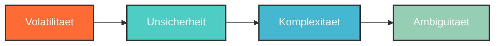

# Was sieht mein Kind?

**Ihr Kind erlebt eine spielerische Entdeckungsreise. Hier zeigen wir Ihnen, was dabei passiert — und wo die Grenze zwischen Einblick und Privatsphaere liegt.**

---

## Die Reise nach VUCA — Schritt fuer Schritt

### 1. Anmeldung und Coach-Wahl

Nach der Anmeldung waehlt Ihr Kind einen von drei KI-Coaches, die sich in Persoenlichkeit und Stil unterscheiden. Der Coach begleitet die gesamte Reise und merkt sich, was Ihr Kind bereits entdeckt hat.

!!! tip "Die Coach-Wahl ist persoenlich"
    Die Wahl des Coaches sagt etwas darueber aus, wie Ihr Kind kommunizieren moechte — nicht darueber, was es lernen wird. Alle drei Coaches fuehren durch dieselbe Reise, nur der Ton ist anders.

### 2. Die VUCA-Reise

Die Reise fuehrt durch vier Dimensionen der VUCA-Welt:

In jeder Dimension fuehrt der KI-Coach ein Gespraech mit Ihrem Kind:

- Er stellt offene Fragen zu Interessen und Vorlieben
- Er schlaegt Themen, Berufe und Taetigkeiten vor
- Er bietet bewusst Gegensaetze an, um den Horizont zu erweitern
- Er erkennt Muster und fasst Entdeckungen zusammen

### 3. VUCA Bingo

Das VUCA Bingo ist eine **Fortschrittsanzeige** in Form einer Matrix. Pro Dimension gibt es vier Felder, die Ihr Kind durch Interaktionen freischaltet — insgesamt 16 Felder fuer die gesamte Reise.

| | Volatilitaet | Unsicherheit | Komplexitaet | Ambiguitaet |
|---|:---:|:---:|:---:|:---:|
| **Feld 1** | :material-check-circle: | :material-check-circle: | :material-circle-outline: | :material-circle-outline: |
| **Feld 2** | :material-check-circle: | :material-circle-outline: | :material-circle-outline: | :material-circle-outline: |
| **Feld 3** | :material-circle-outline: | :material-circle-outline: | :material-circle-outline: | :material-circle-outline: |
| **Feld 4** | :material-circle-outline: | :material-circle-outline: | :material-circle-outline: | :material-circle-outline: |

*Beispiel: Die Reise hat gerade erst begonnen — drei Felder sind bereits freigeschaltet.*

### 4. Das Skill-Profil

Mit jeder Interaktion waechst das persoenliche Skill-Profil. Es wird als **Radar-Diagramm** dargestellt und zeigt:

- **Hard Skills** — Fachliche Faehigkeiten und Wissensgebiete, die Ihr Kind interessieren
- **Soft Skills** — Soziale und kommunikative Staerken, die im Gespraech sichtbar werden
- **Future Skills** — Zukunftskompetenzen wie kreatives Denken, digitale Kompetenz und Nachhaltigkeit
- **Resilienz** — Wie Ihr Kind mit Veraenderung, Unsicherheit und Herausforderungen umgeht

!!! info "Das Profil ist dynamisch"
    Das Skill-Profil veraendert sich mit jeder Session. Interessen koennen wachsen, neue koennen hinzukommen, andere koennen in den Hintergrund treten. Das ist gewollt — es bildet die natuerliche Entwicklung Ihres Kindes ab.

### 5. Progress Cards

Am Ende jeder Etappe erhaelt Ihr Kind eine **Progress Card** — eine visuelle Zusammenfassung dessen, was in dieser Session entdeckt wurde. Diese Karten bilden zusammen ein digitales Reisetagebuch.

---

## Was Sie als Eltern sehen koennen

Als Elternteil oder Erziehungsberechtigter haben Sie Zugang zu folgenden Informationen:

-   :material-check-circle:{ style="color: #43a047" } **Reisefortschritt**

    ---

    Sie sehen, wie weit die Reise fortgeschritten ist — welche VUCA-Dimensionen begonnen und welche Felder freigeschaltet wurden.

-   :material-check-circle:{ style="color: #43a047" } **Skill-Profil-Uebersicht**

    ---

    Sie sehen das Radar-Diagramm mit den vier Bereichen und die erkannten Hauptinteressen Ihres Kindes.

-   :material-check-circle:{ style="color: #43a047" } **Abgeschlossene Dimensionen**

    ---

    Sie sehen, welche der vier VUCA-Dimensionen vollstaendig durchlaufen wurden.

-   :material-check-circle:{ style="color: #43a047" } **Letzte Aktivitaet**

    ---

    Sie sehen, wann Ihr Kind zuletzt aktiv war und wie viele Sessions es absolviert hat.

---

## Was Sie als Eltern NICHT sehen koennen

-   :material-close-circle:{ style="color: #e53935" } **KI-Gespraeche**

    ---

    Die einzelnen Nachrichten zwischen Ihrem Kind und dem KI-Coach sind privat und nicht einsehbar.

-   :material-close-circle:{ style="color: #e53935" } **Einzelne Antworten**

    ---

    Was Ihr Kind auf konkrete Fragen geantwortet hat, bleibt vertraulich.

-   :material-close-circle:{ style="color: #e53935" } **Gespraechsverlauf**

    ---

    Der vollstaendige Chatverlauf ist nur fuer Ihr Kind sichtbar.

-   :material-close-circle:{ style="color: #e53935" } **Detaillierte Skill-Werte**

    ---

    Die exakten numerischen Werte hinter dem Profil sind nur fuer Ihr Kind bestimmt.

!!! warning "Warum diese Grenze?"
    Diese Trennung ist **bewusst gewaehlt** und paedagogisch begruendet. Jugendliche entdecken ihre Interessen ehrlicher und offener, wenn sie wissen, dass ihre Antworten privat sind. Die Forschung zeigt: Wer sich beobachtet fuehlt, antwortet anders — oft so, wie es von den Eltern erwartet wird, statt so, wie es wirklich ist.

    **Vertrauen Sie dem Prozess.** Wenn Ihr Kind etwas Spannendes entdeckt hat, wird es von selbst davon erzaehlen wollen.

---

## Ein typischer Gespraechsverlauf

So koennte eine Interaktion zwischen Ihrem Kind und dem KI-Coach aussehen:

???+ example "Beispiel-Dialog (vereinfacht)"

    **Coach:** Stell dir vor, du reist an einen Ort, an dem alles staendig neu erfunden wird. Was wuerdest du dort am liebsten tun?

    **Jugendlicher:** Ich wuerde mir anschauen, wie Sachen gebaut werden.

    **Coach:** Spannend! Dich interessiert also, wie Dinge entstehen. Ist es eher das Planen und Entwerfen — oder das Bauen mit den eigenen Haenden?

    **Jugendlicher:** Eher das Entwerfen. Ich zeichne gern.

    **Coach:** Zeichnen und Entwerfen — das ist eine tolle Kombination. Hast du schon mal von Industriedesign gehoert? Oder von Architektur? Beides verbindet Kreativitaet mit Technik.

    **Jugendlicher:** Architektur klingt cool, aber auch Gamedesign.

    **Coach:** Interessant! Architektur und Gamedesign haben mehr gemeinsam, als man denkt — beide erschaffen Welten, in denen sich Menschen bewegen. Was, wenn ich dir sage, dass es auch VR-Architektur gibt?

Der Coach folgt den Interessen Ihres Kindes, bietet Verbindungen an und erweitert den Moeglichkeitsraum — ohne zu bewerten oder zu steuern.

---

## Bildschirmzeit und Nutzung

!!! tip "Empfohlene Nutzung"
    Future SkillR ist fuer **kurze Sessions von 5 bis 10 Minuten** konzipiert. Der KI-Coach setzt natuerliche Gespraechspausen, und die Reise kann jederzeit unterbrochen und spaeter fortgesetzt werden.

**Hinweise zur Nutzung:**

- Es gibt keinen Zeitdruck — die Reise hat kein Ablaufdatum
- Der Fortschritt wird automatisch gespeichert
- Jede Session bringt das Profil ein Stueck weiter
- Es gibt keine Benachrichtigungen oder Push-Nachrichten, die zur Nutzung draengen
- Kein "Streak"-System oder andere suchtfoerdernde Mechanismen

---

## Naechste Schritte

- [:material-frequently-asked-questions: Haeufige Fragen](haeufige-fragen.md) — Antworten auf weitere Eltern-Fragen
- [:material-shield-lock: Sicherheit & Datenschutz](sicherheit-und-datenschutz.md) — Technische Details zum Datenschutz
- [:material-heart: Warum Future SkillR?](warum-future-skiller.md) — Was Ihr Kind davon hat
