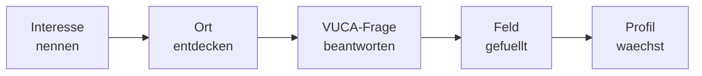

# VUCA Bingo

Das **VUCA Bingo** ist das Spielelement deiner Reise. Es ist eine 4x4-Matrix mit 16 Feldern, die du waehrend deiner Weltreise mit Erfahrungen fuellst — wie Stempel in einem Reisepass.

---

## Die Idee

Stell dir einen Bingo-Zettel vor, aber statt Zahlen stehen dort Erfahrungen. Dein Ziel: **Alle 16 Felder fuellen.** Jede Reihe steht fuer eine VUCA-Dimension, und jede Dimension hat vier Felder.

Wenn du alle Felder einer Dimension gefuellt hast, hast du diese Dimension abgeschlossen. Wenn alle vier Dimensionen komplett sind, hast du die Reise nach VUCA geschafft.

---

## Die 4x4-Matrix

| Dimension | Feld 1 | Feld 2 | Feld 3 | Feld 4 | Thema |
|-----------|--------|--------|--------|--------|-------|
| **V** — Volatilitaet | :material-checkbox-blank-outline: | :material-checkbox-blank-outline: | :material-checkbox-blank-outline: | :material-checkbox-blank-outline: | Veraenderung & Anpassung |
| **U** — Unsicherheit | :material-checkbox-blank-outline: | :material-checkbox-blank-outline: | :material-checkbox-blank-outline: | :material-checkbox-blank-outline: | Entscheidung & Vertrauen |
| **K** — Komplexitaet | :material-checkbox-blank-outline: | :material-checkbox-blank-outline: | :material-checkbox-blank-outline: | :material-checkbox-blank-outline: | Zusammenhaenge & Systeme |
| **A** — Ambiguitaet | :material-checkbox-blank-outline: | :material-checkbox-blank-outline: | :material-checkbox-blank-outline: | :material-checkbox-blank-outline: | Perspektiven & Vielfalt |

!!! tip "So wird ein Feld gefuellt"
    Ein Feld wird gefuellt, wenn du an einem Ort eine Erfahrung in der jeweiligen VUCA-Dimension gemacht hast. Das passiert automatisch waehrend deines Gespraechs mit dem KI-Coach. Du siehst nach jeder Session, welche neuen Felder dazugekommen sind.

---

## Die vier Dimensionen im Detail

### :material-lightning-bolt: V — Volatilitaet

**Was bedeutet das?**
Volatilitaet beschreibt, wie schnell und unvorhersehbar sich Dinge veraendern. Heute ist ein Beruf gefragt, morgen vielleicht ein ganz anderer.

**Was lernst du hier?**
Wie du mit Veraenderung umgehst. Dass Wandel normal ist und du dich anpassen kannst — ohne dich selbst zu verlieren.

**Beispiel-Frage vom Coach:**
> *"Stell dir vor, dein Lieblingsberuf existiert in 10 Jahren nicht mehr. Was wuerdest du stattdessen machen?"*

---

### :material-help-circle-outline: U — Unsicherheit

**Was bedeutet das?**
Unsicherheit bedeutet, dass wir die Zukunft nicht vorhersagen koennen. Wir muessen Entscheidungen treffen, ohne alles zu wissen.

**Was lernst du hier?**
Wie du trotz Unsicherheit handeln kannst. Dass es okay ist, nicht alles zu wissen, und dass Selbstvertrauen wichtiger ist als Sicherheit.

**Beispiel-Frage vom Coach:**
> *"Du stehst vor zwei Tueren, aber du weisst nicht, was dahinter ist. Wie entscheidest du dich?"*

---

### :material-link-variant: K — Komplexitaet

**Was bedeutet das?**
Komplexitaet beschreibt, dass alles mit allem zusammenhaengt. Kleine Veraenderungen koennen grosse Auswirkungen haben.

**Was lernst du hier?**
Wie du Zusammenhaenge erkennst und in Systemen denkst. Dass die Welt selten einfach ist — und das spannend sein kann.

**Beispiel-Frage vom Coach:**
> *"Wie haengt das Wetter in Brasilien mit deinem Fruehstueck zusammen?"*

---

### :material-swap-horizontal: A — Ambiguitaet

**Was bedeutet das?**
Ambiguitaet bedeutet Mehrdeutigkeit — dass Dinge gleichzeitig wahr und falsch, gut und schlecht sein koennen. Es gibt selten nur eine richtige Antwort.

**Was lernst du hier?**
Wie du verschiedene Perspektiven aushaeltst und schaetzt. Dass "sowohl-als-auch" oft klüger ist als "entweder-oder".

**Beispiel-Frage vom Coach:**
> *"Kann Technik gleichzeitig die Welt retten und zerstoeren? Was denkst du?"*

---

## Wie fuellst du die Felder?

Jedes Feld wird durch eine **Interaktion** mit dem KI-Coach an einem bestimmten Reiseziel gefuellt. Eine typische Interaktion sieht so aus:

1. Du nennst ein Interesse (z.B. "Musik")
2. Der Coach nimmt dich mit zu einem Ort (z.B. Nashville)
3. Der Coach stellt dir eine Frage zu einer VUCA-Dimension
4. Du antwortest und reflektierst
5. Ein Feld in deiner Matrix wird gefuellt
6. Dein Skill-Profil waechst

!!! info "Automatische Zuordnung"
    Du musst nicht selbst entscheiden, zu welcher VUCA-Dimension ein Gespraech gehoert. Das macht der Coach automatisch basierend auf dem Thema und deinen Antworten.

---

## Fortschritt im Blick

Du kannst deinen Bingo-Fortschritt jederzeit in der App einsehen. Die Matrix zeigt dir:

- :material-checkbox-marked: **Gefuellte Felder** — Erfahrungen, die du bereits gesammelt hast
- :material-checkbox-blank-outline: **Offene Felder** — Dimensionen, die noch erkundet werden wollen
- :material-star: **Abgeschlossene Dimensionen** — Reihen, in denen alle vier Felder gefuellt sind

### Beispiel: Fortschritt nach 8 Sessions

| Dimension | Feld 1 | Feld 2 | Feld 3 | Feld 4 | Status |
|-----------|--------|--------|--------|--------|--------|
| **V** — Volatilitaet | :material-checkbox-marked: | :material-checkbox-marked: | :material-checkbox-marked: | :material-checkbox-blank-outline: | 3 von 4 |
| **U** — Unsicherheit | :material-checkbox-marked: | :material-checkbox-marked: | :material-checkbox-blank-outline: | :material-checkbox-blank-outline: | 2 von 4 |
| **K** — Komplexitaet | :material-checkbox-marked: | :material-checkbox-blank-outline: | :material-checkbox-blank-outline: | :material-checkbox-blank-outline: | 1 von 4 |
| **A** — Ambiguitaet | :material-checkbox-marked: | :material-checkbox-marked: | :material-checkbox-blank-outline: | :material-checkbox-blank-outline: | 2 von 4 |

**Gesamt: 8 von 16 Feldern** — Du bist auf halbem Weg!

---

## Gegensatzsuche im Bingo

Wenn du in einer Dimension schon einige Felder gefuellt hast, nutzt der Coach die **Gegensatzsuche**: Er schlaegt dir bewusst Themen vor, die das Gegenteil deiner bisherigen Interessen darstellen.

!!! tip "Warum Gegensaetze?"
    Wenn du bisher nur Technik-Orte besucht hast, schlaegt der Coach vielleicht einen Kunst-Ort vor. Nicht, weil du Kunst moegen *musst* — sondern weil du vielleicht eine ueberraschende Verbindung entdeckst. Viele spannende Berufe liegen an der Schnittstelle zwischen scheinbaren Gegensaetzen.

---

## Was passiert am Ende?

Wenn alle 16 Felder gefuellt sind, hast du die Reise nach VUCA abgeschlossen. Das bedeutet:

- Dein **Skill-Profil** ist vollstaendig und zeigt ein differenziertes Bild deiner Interessen
- Du hast alle **vier VUCA-Dimensionen** erfahren und reflektiert
- Dein **Reisetagebuch** ist voll mit Erlebnissen aus aller Welt

!!! info "Kein Ende — ein neuer Anfang"
    Auch nach dem Abschluss kannst du Future SkillR weiter nutzen. Dein Profil entwickelt sich weiter, und du kannst neue Interessen erkunden.

---

## Weiter lesen

- [Dein Skill-Profil](dein-skill-profil.md) — Was am Ende der Reise steht
- [Dein KI-Coach](ki-coach.md) — Wer dich auf der Reise begleitet
- [Die Reise nach VUCA](../uebersicht/die-reise-nach-vuca.md) — Das grosse Ganze
