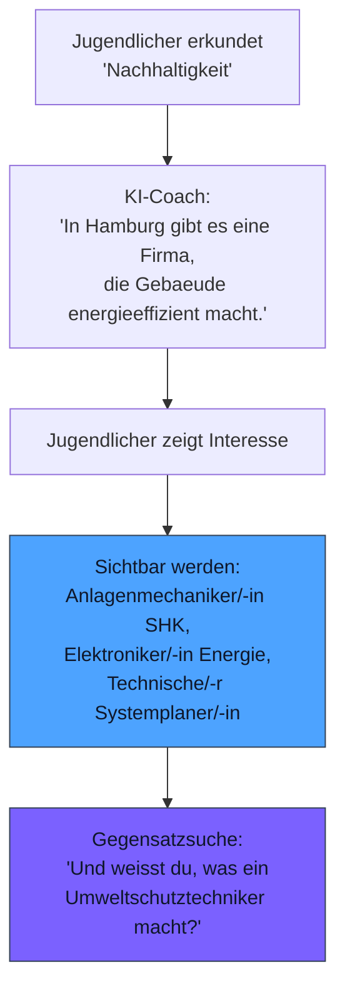

# Ausbildungslandschaft

**Alle Berufe sichtbar. Nicht als Liste, sondern als Erlebnis.**

Deutschland bietet ueber 300 anerkannte Ausbildungsberufe. Jugendliche kennen davon durchschnittlich 20 — und konzentrieren sich auf noch weniger. Future SkillR macht die gesamte Ausbildungslandschaft zugaenglich: nicht als Jobborse oder Broschuere, sondern eingebettet in eine dialogbasierte Erkundungsreise, die sich an den persoenlichen Interessen jedes einzelnen Jugendlichen orientiert.

---

## Zwei Ebenen der Sichtbarkeit

### 1. Allgemeine Sichtbarkeit

Die gesamte Landschaft der verfuegbaren Ausbildungsberufe wird waehrend der VUCA-Reise und im Job-Navigator praesentiert. Jugendliche begegnen Berufen, von denen sie nie gehoert haetten — weil das System Verbindungen zwischen Interessen und Berufsfeldern herstellt.

| Interesse des Jugendlichen | Verbundene Ausbildungsberufe |
|---------------------------|-------------------------------|
| Kochen | Koch/Koechin, Fachkraft fuer Lebensmitteltechnik, Restaurantfachmann/-frau, Laborant/-in Lebensmittelchemie |
| Gaming | Fachinformatiker/-in, Mediengestalter/-in Digital, Mathematisch-technische/-r Softwareentwickler/-in |
| Tiere | Tierpfleger/-in, Tiermedizinische/-r Fachangestellte/-r, Landwirt/-in, Biologielaborant/-in |
| Musik | Veranstaltungstechniker/-in, Mediengestalter/-in Bild/Ton, Musikfachhaendler/-in |

!!! info "Keine Jobborse"
    Future SkillR zeigt Berufe nicht als Stellenanzeigen. Sie tauchen natuerlich im Dialog auf — als Teil der Geschichte, die der KI-Coach erzaehlt. Ein Jugendlicher, der in der VUCA-Reise eine Fabrikstation besucht, erfaehrt beilaeufig, welche Berufe dort arbeiten und was sie taeglich tun.

### 2. Regionale Sichtbarkeit

Neben der allgemeinen Sichtbarkeit bietet Future SkillR **regionale Sichtbarkeit**: Konkrete Ausbildungspositionen aus dem Einzugsbereich der Kammer werden hervorgehoben, wenn das Interessenprofil eines Jugendlichen dazu passt.

| Allgemeine Sichtbarkeit | Regionale Sichtbarkeit |
|--------------------------|------------------------|
| "Es gibt den Beruf Mechatroniker/-in" | "Bei der Firma Mueller in Heilbronn wird gerade eine Mechatronikerin gesucht" |
| Berufsbild und Taetigkeitsbeschreibung | Konkreter Betrieb, konkreter Standort |
| Fuer alle Jugendlichen sichtbar | Nur fuer Jugendliche mit passendem Interessenprofil und in der Region |
| Immer verfuegbar | Abhaengig von aktuellen Ausbildungsangeboten der Kammer |

---

## Integration in die VUCA-Reise

Ausbildungsberufe werden nicht als separate Sektion praesentiert, sondern sind in den Erkundungsprozess eingewoben:

### Der Ablauf im Detail

1. **Interesse zeigen** — Der Jugendliche beschaeftigt sich mit einem Thema, das ihn interessiert
2. **Kontext herstellen** — Die KI bettet Berufsbilder natuerlich in den Dialog ein
3. **Berufe entdecken** — Relevante Ausbildungsberufe werden sichtbar — inklusive solcher, die der Jugendliche nicht kennt
4. **Gegensatzsuche** — Die Gegensatzsuche erweitert die Perspektive auch auf kontrastierende Berufsfelder
5. **Regional verankern** — Wenn regionale Angebote vorliegen, werden lokale Optionen hervorgehoben

---

## Was Kammern beitragen

Die Rolle der Kammer ist **kuratorisch**: Sie stellt die Vollstaendigkeit und Qualitaet der regionalen Daten sicher, die in die Erkundungsreise einfliessen.

### Datenpflege

| Was die Kammer liefert | Wofuer es genutzt wird |
|------------------------|------------------------|
| Vollstaendige Liste regionaler Ausbildungsberufe | Allgemeine Sichtbarkeit in der VUCA-Reise |
| Aktuelle Ausbildungspositionen der Mitgliedsbetriebe | Regionale Sichtbarkeit im Job-Navigator |
| Berufsbeschreibungen und Taetigkeitsprofile | Kontextinformationen fuer den KI-Dialog |
| Branchenschwerpunkte der Region | Regionale Gewichtung in der Erkundung |

### Qualitaetssicherung

- **Aktualitaet** — Positionen werden regelmaessig aktualisiert
- **Vollstaendigkeit** — Alle relevanten Ausbildungsberufe der Region sind erfasst
- **Korrektheit** — Berufsbezeichnungen und Beschreibungen entsprechen den offiziellen Standards

!!! warning "Abhaengigkeit von Datenqualitaet"
    Die Qualitaet der regionalen Sichtbarkeit haengt direkt von der Datenpflege der Kammer ab. Unvollstaendige oder veraltete Daten fuehren dazu, dass Jugendliche relevante Optionen nicht sehen. Future SkillR bietet dafuer ein Dashboard, das den Datenstand transparent macht.

---

## Vorteile gegenueber klassischen Formaten

| Klassisches Format | Future SkillR |
|--------------------|----------------|
| **Jobmesse**: Einmalig, ortsgebunden, begrenzte Reichweite | Digital, jederzeit verfuegbar, unbegrenzte Reichweite |
| **Broschuere**: Statisch, generisch, wird selten gelesen | Dynamisch, personalisiert, in den Dialog eingebettet |
| **Berufsberatung**: Termingebunden, personalintensiv | KI-gestuetzt, sofort verfuegbar, skalierbar |
| **Jobborse**: Suchbasiert (setzt Vorwissen voraus) | Erkundungsbasiert (kein Vorwissen noetig) |
| **Schulbesuch**: Einzelne Klassen, begrenzte Zeit | Alle Jugendlichen, unbegrenzte Nutzungsdauer |

!!! tip "Ergaenzung, nicht Ersatz"
    Future SkillR ersetzt keine Jobmesse und keine Berufsberatung. Es ergaenzt bestehende Massnahmen durch einen digitalen Kanal, der Jugendliche dort erreicht, wo traditionelle Formate scheitern: im Alltag, auf dem Smartphone, freiwillig und selbstgesteuert.

---

## Wirkung auf die Berufswahrnehmung

Durch die Integration in eine interessenbasierte Erkundungsreise veraendert sich, wie Jugendliche Ausbildungsberufe wahrnehmen:

- **Von "nie gehoert" zu "kenne ich"** — Berufe, die vorher unsichtbar waren, werden im Kontext persoenlicher Interessen entdeckt
- **Von "langweilig" zu "spannend"** — Durch erlebnisorientierte Praeesentation (Stationen, Geschichten, Dialoge) werden Berufe lebendig
- **Von "abstrakt" zu "konkret"** — Regionale Sichtbarkeit zeigt: "Diesen Beruf gibt es bei dir um die Ecke"
- **Von "entweder oder" zu "sowohl als auch"** — Die Gegensatzsuche zeigt, dass scheinbar unvereinbare Interessen in ueberraschenden Berufen zusammenkommen
