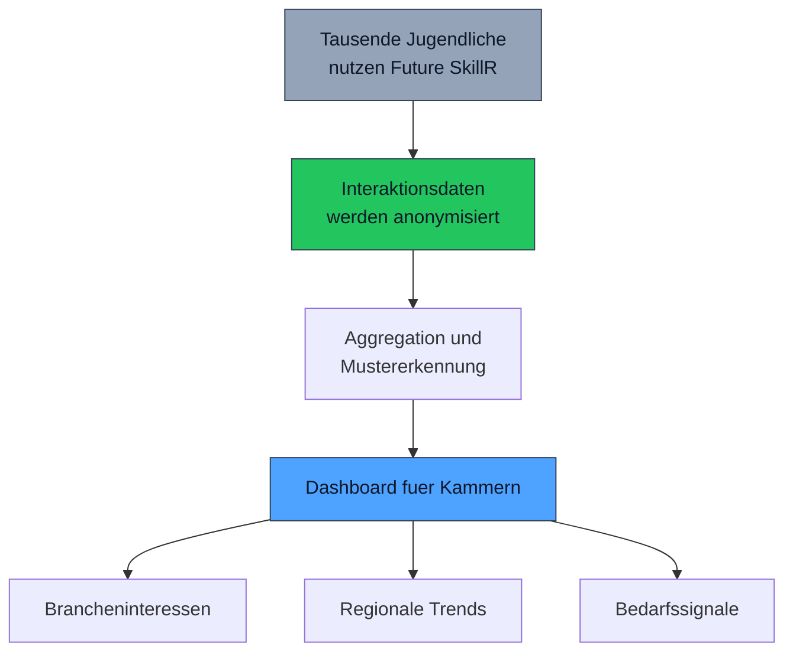

# Bedarfserfassung

**Wissen, was Jugendliche wirklich interessiert — bevor es zu spaet ist.**

Kammern beraten ihre Mitgliedsbetriebe zu Ausbildungskapazitaeten, Nachwuchsgewinnung und Branchenentwicklung. Doch die Datenbasis fuer diese Beratung ist duenn: Wie viele Jugendliche interessieren sich aktuell fuer Handwerksberufe? Welche Branchen gewinnen an Attraktivitaet? Wo drohen Engpaesse?

Future SkillR liefert genau diese Daten — anonymisiert, aggregiert und in Echtzeit.

---

## Was die Bedarfserfassung leistet

Aus den Interaktionen tausender Jugendlicher mit der VUCA-Reise entstehen Datenmuster, die fuer Kammern wertvoll sind — ohne dass individuelle Daten preisgegeben werden.

### Datenquellen

| Datenquelle | Was sie liefert |
|-------------|-----------------|
| **Stationsbesuche** | Welche Themen und Branchen erkunden Jugendliche? |
| **Dialoginteraktionen** | Wie intensiv beschaeftigen sich Jugendliche mit einem Thema? |
| **Gegensatzsuche-Reaktionen** | Welche kontrastierenden Berufe werden angenommen, welche abgelehnt? |
| **Skill-Profile** | Welche Faehigkeiten und Interessen haeufen sich regional? |
| **Lernreise-Abschluesse** | Welche thematischen Pfade werden besonders haeufig durchlaufen? |

### Aggregierte Einblicke

Aus diesen Datenquellen entstehen aggregierte Einblicke, die Kammern auf einem **Dashboard** abrufen koennen:

---

## Dashboard-Inhalte

### 1. Brancheninteressen

Welche Branchen wecken das meiste Interesse bei Jugendlichen in der Region?

| Kennzahl | Beschreibung |
|----------|--------------|
| **Interessenverteilung nach Branche** | Prozentuale Verteilung der Erkundungszeit auf Branchen |
| **Trendentwicklung** | Wachsende vs. schrumpfende Brancheninteressen ueber Zeitraeume |
| **Neue Interessen** | Berufsfelder, die erstmals signifikante Erkundung erfahren |
| **Unbekannte Berufe** | Berufe, die trotz regionaler Relevanz kaum erkundet werden |

!!! tip "Fruehwarnsystem"
    Wenn das Interesse an einer Branche stark zurueckgeht, kann die Kammer fruehzeitig reagieren — z.B. durch gezielte Sichtbarkeitsmassnahmen oder Gespraeche mit Mitgliedsbetrieben ueber die Attraktivitaet ihrer Ausbildungsangebote.

### 2. Regionale Trends

Wie unterscheiden sich die Interessen in verschiedenen Teilen des Kammergebiets?

| Kennzahl | Beschreibung |
|----------|--------------|
| **Regionale Interessencluster** | Welche Themen dominieren in welchen Gebieten? |
| **Stadt-Land-Vergleich** | Unterschiede zwischen urbanen und laendlichen Interessen |
| **Pendlerbereitschaft** | Wie weit wuerden Jugendliche fuer eine Ausbildung fahren? (abgeleitet aus regionaler Erkundung) |
| **Vergleich mit Vorjahr** | Verschiebungen in den regionalen Praeferenzen |

### 3. Bedarfssignale

Wo entsteht Bedarf — und wo Ueberangebot?

| Signal | Bedeutung |
|--------|-----------|
| **Hohes Interesse, wenig Angebot** | Potenzial fuer neue Ausbildungsplaetze |
| **Niedriges Interesse, viel Angebot** | Sichtbarkeitsproblem — Berufe sind unbekannt, nicht unattraktiv |
| **Wachsendes Interesse** | Branche gewinnt an Attraktivitaet — Kapazitaeten planen |
| **Sinkendes Interesse** | Handlungsbedarf bei der Nachwuchsgewinnung |

---

## Datenschutz: Aggregation als Prinzip

!!! warning "Keine individuellen Daten"
    Die Bedarfserfassung basiert ausschliesslich auf **anonymisierten, aggregierten Daten**. Kammern erhalten zu keinem Zeitpunkt Zugriff auf individuelle Profile, Dialogverlaeufe oder persoenliche Informationen von Jugendlichen.

### So funktioniert die Anonymisierung

| Ebene | Was passiert |
|-------|-------------|
| **Individuelle Interaktion** | Jugendlicher besucht Station "Holzhandwerk" in der VUCA-Reise |
| **Anonymisierung** | Individuelle Zuordnung wird entfernt |
| **Aggregation** | Eintrag wird zu "Branche: Handwerk, Region: Heilbronn, Zeitraum: KW 8/2026" |
| **Dashboard** | Kammer sieht: "Handwerk-Interesse in Heilbronn: +12% ggue. Vormonat" |

### Prinzipien

- **Mindestgruppengroesse** — Datenpunkte werden nur angezeigt, wenn mindestens N Jugendliche in einer Kategorie vorhanden sind (k-Anonymitaet)
- **Keine Rueckrechenbarkeit** — Aus aggregierten Daten kann kein individuelles Profil rekonstruiert werden
- **Keine Rohdaten** — Kammern erhalten ausschliesslich aufbereitete Kennzahlen und Visualisierungen
- **DSGVO-konform** — Alle Datenverarbeitungsprozesse entsprechen der Datenschutz-Grundverordnung

---

## Mehrwert fuer die Kammerarbeit

Die Bedarfserfassung liefert eine Datenbasis, die es bisher nicht gab: systematische, aktuelle Einblicke in die tatsaechlichen Interessen von Jugendlichen.

### Anwendungsbeispiele

| Anwendung | Nutzen |
|-----------|--------|
| **Beratung von Mitgliedsbetrieben** | "In Ihrer Region waechst das Interesse an Mechatronik um 18%. Haben Sie genuegend Ausbildungsplaetze?" |
| **Kapazitaetsplanung** | Fruehzeitig erkennen, welche Berufsfelder mehr oder weniger Nachwuchs erwarten koennen |
| **Sichtbarkeitsmassnahmen** | Gezielt in Berufe investieren, die trotz regionaler Relevanz unbekannt sind |
| **Berufsorientierungsangebote** | Schulbesuche und Workshops thematisch auf aktuelle Interessen abstimmen |
| **Politische Kommunikation** | Datenbasierte Argumentation fuer Ausbildungsfoerderung und Branchenentwicklung |

!!! info "Planung statt Bauchgefuehl"
    Bisher basieren viele Entscheidungen zur Nachwuchsgewinnung auf Erfahrungswerten und Einzelgespraechen. Die Bedarfserfassung ergaenzt diese Praxis durch systematische Daten — aktuell, regional differenziert und an den realen Interessen der Zielgruppe orientiert.

---

## Aktualisierungsrhythmus

Die Dashboard-Daten werden regelmaessig aktualisiert:

| Kennzahl | Aktualisierung |
|----------|----------------|
| Brancheninteressen | Woechentlich |
| Regionale Trends | Monatlich |
| Bedarfssignale | Monatlich |
| Jahresvergleiche | Quartalsweise |

Kammern erhalten zudem die Moeglichkeit, bei signifikanten Veraenderungen automatische Benachrichtigungen zu konfigurieren — etwa wenn das Interesse an einer Schluesselbranche um mehr als 20% sinkt.
