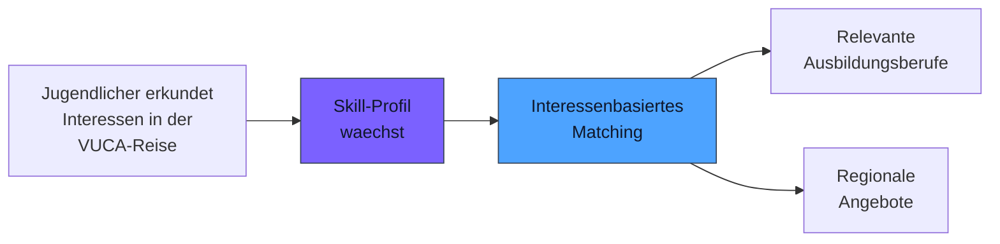
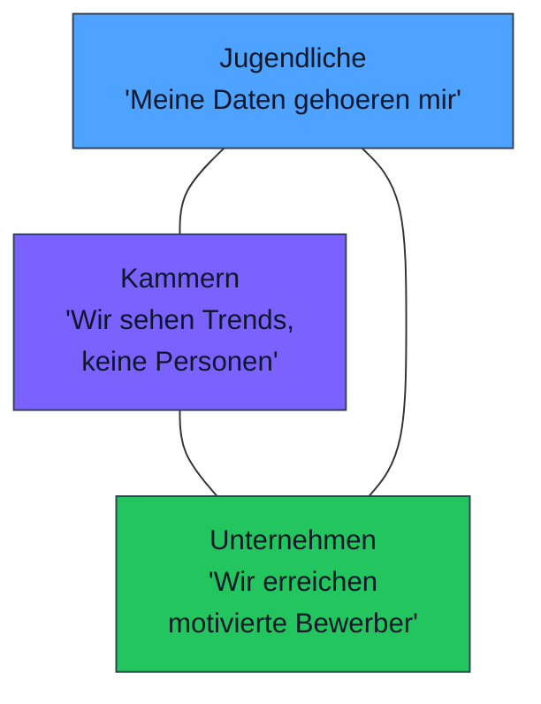

# Matching-Perspektive

**Motivation statt Notendurchschnitt. Interessen statt Filterlogik.**

Das klassische Matching in der Berufsorientierung funktioniert ueber Noten, Abschluesse und Schulfaecher. Future SkillR verfolgt einen anderen Ansatz: Jugendliche werden ueber ihre **echten Interessen** mit Ausbildungsangeboten verbunden — nicht ueber formale Qualifikationen.

---

## Interessenbasiertes Matching

### Das Problem mit notenbasiertem Matching

| Notenbasiert | Was dabei schiefgeht |
|--------------|----------------------|
| "Mathe 2, Physik 3 → Mechatroniker" | Ignoriert, ob der Jugendliche Mechatronik ueberhaupt interessant findet |
| "Deutsch 1 → Journalist" | Verwechselt schulische Leistung mit beruflichem Interesse |
| "Durchschnitt 3,5 → reduzierte Optionen" | Schliesst Berufe aus, die der Jugendliche mit Begeisterung erlernen koennte |

### Der Ansatz von Future SkillR

Future SkillR stellt eine andere Frage: **Was begeistert dich?** Das Matching basiert auf dem Skill-Profil, das waehrend der VUCA-Reise entsteht — ein Profil aus Interessen, Faehigkeitssignalen und Verhaltensmustern.

| Matching-Kriterium | Quelle |
|--------------------|--------|
| Thematische Interessen | VUCA-Reise: Welche Stationen wurden besucht? |
| Arbeitsweisen | Profilsignale: Bevorzugt Einzel- oder Teamarbeit? Handwerklich oder analytisch? |
| VUCA-Kompetenzen | Bingo-Matrix: Welche Dimensionen sind stark? |
| Faehigkeitsindikatoren | Level-2-Reflexion: Kreativitaet, analytische Tiefe, Entscheidungssicherheit |
| Gegensatzsuche-Reaktionen | Akzeptierte Kontraste zeigen verborgene Interessen |

---

## Gegensatzsuche im Matching

Die **Gegensatzsuche** erweitert das Matching ueber offensichtliche Verbindungen hinaus. Ein Jugendlicher, der sich fuer Grafikdesign interessiert und im Kontrast auch Architektur annimmt, hat ein breiteres Matching-Spektrum als einer, der nur Grafikdesign vertieft.

!!! tip "Breitere Optionen durch Kontraste"
    Die Gegensatzsuche ist der Schluessel zu einem differenzierten Matching. Sie verhindert, dass Jugendliche in einer Interessenblase landen, und eroeffnet Berufsfelder, die auf den ersten Blick nicht passen — auf den zweiten aber umso mehr.

### Beispiel

| Primaeres Interesse | Gegensatz (akzeptiert) | Matching-Erweiterung |
|---------------------|-----------------------|----------------------|
| Grafikdesign | Architektur | Technische/-r Produktdesigner/-in, Bauzeichner/-in |
| Kochen | Lebensmittelchemie | Laborant/-in, Milchwirtschaftlicher Laborant/-in |
| Sport | Biomechanik | Orthopaedietechnik-Mechaniker/-in, Sportfachmann/-frau |
| Programmierung | Paedagogik | Fachinformatiker/-in mit Schulungsanteil, E-Learning-Entwickler/-in |

---

## Datensouveraenitaet

!!! warning "Jugendliche kontrollieren ihre Sichtbarkeit"
    Kein Matching geschieht ohne Zustimmung. Der Jugendliche entscheidet, ob und in welchem Umfang sein Profil fuer Ausbildungsbetriebe sichtbar wird.

### Stufen der Sichtbarkeit

| Stufe | Was sichtbar ist | Wer sieht es |
|-------|------------------|--------------|
| **Privat** (Standard) | Nichts | Niemand ausser dem Jugendlichen |
| **Anonymisiertes Profil** | Interessen und Skills ohne Name | Kammern sehen es als Teil der aggregierten Statistik |
| **Sichtbares Profil** | Interessen, Skills, Region | Ausbildungsbetriebe koennen Kontakt anbieten |
| **Vollstaendiges Profil** | Alles inklusive Name und Kontakt | Nur nach expliziter Freigabe durch den Jugendlichen |

Die Standard-Einstellung ist **Privat**. Jede Erhoehung der Sichtbarkeit erfordert eine aktive, informierte Entscheidung des Jugendlichen.

---

## Vorteile fuer Kammern

### Besser vorbereitete Bewerber

Jugendliche, die ueber Future SkillR einen Ausbildungsberuf entdecken, bringen mit:

- **Echtes Interesse** — Sie haben den Beruf nicht aus einer Liste gewaehlt, sondern durch Erkundung entdeckt
- **Informiertheit** — Sie wissen, was der Beruf beinhaltet, weil sie ihn in der VUCA-Reise erlebt haben
- **Breite Perspektive** — Durch die Gegensatzsuche kennen sie auch verwandte und kontrastierende Berufe
- **Reflexionsfaehigkeit** — Level-2-Reflexion hat sie dazu gebracht, ueber ihre Motivation nachzudenken

### Passgenauigkeit statt Masse

| Herkoemmlich | Future SkillR |
|--------------|----------------|
| 100 Bewerbungen, 10 passen | 30 Bewerbungen, 25 passen |
| Bewerber wissen wenig ueber den Beruf | Bewerber haben den Beruf bereits erkundet |
| Motivation unklar | Motivation durch Interaktionsdaten belegt |
| Abbruchquote hoch | Abbruchrisiko sinkt durch Passung |

---

## Revenue-Modell (V2.0)

!!! info "Zukuenftige Entwicklung"
    Das Matching-Revenue-Modell ist fuer Version 2.0 geplant und befindet sich aktuell in der Konzeptionsphase.

In der Zukunft wird das Matching zwischen Kammern, Unternehmen und Jugendlichen monetarisiert:

| Leistung | Beschreibung |
|----------|--------------|
| **Sichtbarkeitsgebuehr** | Kammern und Unternehmen zahlen fuer die Platzierung regionaler Angebote im Erkundungskontext |
| **Matching-Gebuehr** | Bei erfolgreicher Kontaktaufnahme zwischen Jugendlichem und Betrieb |
| **Analytics-Zugang** | Erweiterte Bedarfserfassung und Trendanalysen als Premium-Funktion |

Die Grundfunktion — interessenbasierte Erkundung und Skill-Profil — bleibt fuer Jugendliche **immer kostenlos**.

---

## Vertrauensdreieck

Das Matching funktioniert nur, wenn alle drei Seiten Vertrauen haben:

| Partei | Vertrauensbasis |
|--------|-----------------|
| **Jugendliche** | Datensouveraenitaet, Privatsphaere als Standard, keine Bewertung |
| **Kammern** | Anonymisierte Einblicke, verlassliche Datenbasis, neutrale Plattform |
| **Unternehmen** | Zugang zu motivierten Bewerbern, qualitaetsgesichertes Matching |

Dieses Vertrauensdreieck ist die Grundlage des gesamten Matching-Modells. Jede Seite gewinnt — und keine Seite wird auf Kosten der anderen bedient.
