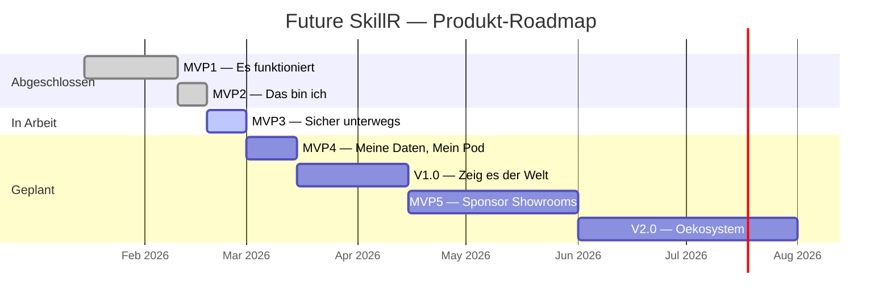

# Produkt-Roadmap

**82 Feature Requests. 7 Phasen. Ein Ziel: Jugendliche entdecken, was in ihnen steckt.**

Future SkillR wird in klar abgegrenzten Phasen entwickelt. Jede Phase hat einen Codenamen, ein messbares Ziel und einen definierten Umfang an Feature Requests (FRs). Diese Seite gibt einen Ueberblick ueber alle Phasen, ihren aktuellen Status und die Abhaengigkeiten untereinander.

---

## Phasenuebersicht

| Phase | Codename | Ziel | Status | FRs |
|-------|----------|------|--------|-----|
| **MVP1** | "Es funktioniert" | Core-Loop stabil, demo-faehig | Abgeschlossen | 16 |
| **MVP2** | "Das bin ich" | Jugendliche sagen "Das bin ich" beim Profil | Abgeschlossen | 10 |
| **MVP3** | "Sicher unterwegs" | API-Gateway schuetzt Secrets, lokales Staging | In Arbeit | 2 |
| **MVP4** | "Meine Daten, Mein Pod" | SOLID Pod als Transparenzspiegel | Geplant | 3 |
| **MVP5** | "Sponsor Showrooms" | Multi-Tenant B2B-Plattform fuer Bildungssponsoring | Geplant | 7 |
| **V1.0** | "Zeig es der Welt" | Produktionsstart, DSGVO, echte Daten | Geplant | 12 |
| **V2.0** | "Oekosystem" | Kammer-Oekosystem, Matching-Erloese | Geplant | 7 |

**Gesamt: 57 dedizierte FRs + 25 plattformuebergreifende FRs = 82 Feature Requests**

---

## Zeitlicher Verlauf

---

## Aktueller Stand

!!! success "MVP1 + MVP2 abgeschlossen"
    26 von 26 Feature Requests sind implementiert oder stabilisiert. Die Kern-Journey (Onboarding, VUCA-Station, Profil, 3D-Globus, Engagement) funktioniert End-to-End.

!!! info "MVP3 in Arbeit"
    Das API-Gateway (FR-051) und das lokale Staging (FR-052) sind die naechsten Meilensteine. Ziel: Kein API-Key im JS-Bundle, Rate Limiting, Health Check. Danach kann die URL oeffentlich geteilt werden.

---

## Phasen im Detail

| Phase | Detailseite | Schwerpunkt |
|-------|-------------|-------------|
| MVP1 | [Es funktioniert](mvp1.md) | Auth, Onboarding, VUCA-Station, Profil, Firebase, Admin |
| MVP2 | [Das bin ich](mvp2.md) | 3D-Globus, Streaks/XP, Mikro-Sessions, Meta-Kurs-Editor, Reflexion, Audio |
| MVP3 | [Sicher unterwegs](mvp3.md) | API-Gateway, Docker Compose, Security |
| MVP4 | [Meine Daten, Mein Pod](mvp4.md) | SOLID Pod, Datentransparenz, Datensouveraenitaet |
| MVP5 | [Sponsor Showrooms](mvp5.md) | Multi-Tenant, B2B, Bildungssponsoring, Stripe |
| V1.0 | [Zeig es der Welt](v1.md) | DSGVO, Job-Navigator, Eltern-Dashboard, Produktionsstart |
| V2.0 | [Oekosystem](v2.md) | Kammer-Dashboard, Bedarfserfassung, Matching-Erloese |

---

## Uebergreifende Philosophie

Jede Phase folgt drei Prinzipien:

1. **Klarer Codename** — Jede Phase hat einen einpraegsamen Namen, der das Ziel auf den Punkt bringt.
2. **Messbare Exit-Kriterien** — Die Phase ist erst abgeschlossen, wenn alle Kriterien erfuellt sind.
3. **Definierter FR-Umfang** — Kein Feature-Creep: Nur die zugewiesenen FRs gehoeren zur Phase.

Mehr zur MVP-Philosophie und zum kritischen Pfad: [MVP-Uebersicht](mvp-uebersicht.md)
