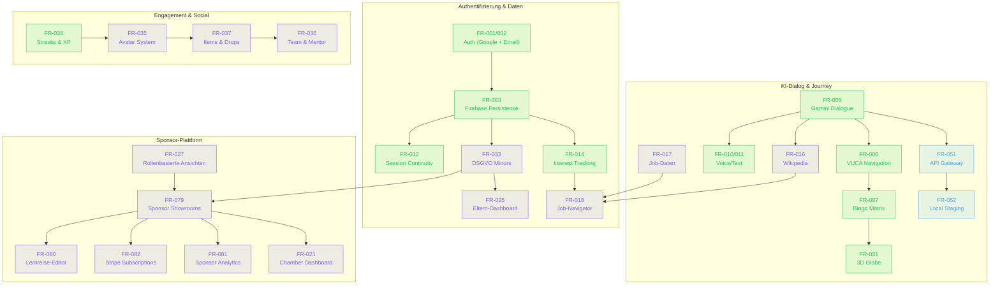
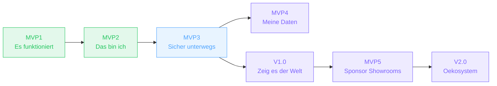

# MVP-Uebersicht

**82 Feature Requests. 7 Phasen. Ein roter Faden.**

Diese Seite erklaert die Philosophie hinter der phasenbasierten Entwicklung, zeigt den kritischen Pfad durch die Abhaengigkeiten und dokumentiert die bekannten Risiken.

---

## MVP-Philosophie

Jede Phase von Future SkillR folgt einem strengen Muster:

| Eigenschaft | Beschreibung |
|-------------|--------------|
| **Codename** | Ein einpraegsamer Name, der das Kernziel auf den Punkt bringt ("Es funktioniert", "Das bin ich", ...) |
| **Messbare Exit-Kriterien** | Eine Checkliste, die objektiv pruefbar ist. Die Phase gilt erst als abgeschlossen, wenn alle Kriterien erfuellt sind. |
| **Definierter FR-Umfang** | Jede Phase hat eine feste Menge an Feature Requests. Neue Anforderungen werden der naechsten Phase zugewiesen, nicht in die laufende Phase geschoben. |
| **Aufbauendes Fundament** | Jede Phase baut auf den Ergebnissen der vorherigen auf. MVP2 braucht MVP1, MVP3 sichert alles ab, MVP4 fuegt Datensouveraenitaet hinzu. |

### Verteilung der Feature Requests

| Phase | FRs | Anteil |
|-------|-----|--------|
| MVP1 "Es funktioniert" | 16 | 20 % |
| MVP2 "Das bin ich" | 10 | 12 % |
| MVP3 "Sicher unterwegs" | 2 | 2 % |
| MVP4 "Meine Daten, Mein Pod" | 3 | 4 % |
| MVP5 "Sponsor Showrooms" | 7 | 9 % |
| V1.0 "Zeig es der Welt" | 12 | 15 % |
| V2.0 "Oekosystem" | 7 | 9 % |
| Plattformuebergreifend | 25 | 30 % |
| **Gesamt** | **82** | **100 %** |

---

## Abhaengigkeitsgraph

Der folgende Graph zeigt den kritischen Pfad durch die wichtigsten Feature Requests. Pfeile bedeuten: "wird benoetigt fuer".

### Kritische Pfade

Es gibt drei Hauptstraenge, die den Projektfortschritt bestimmen:

1. **Auth-Strang:** Auth → Firebase → Session Continuity → DSGVO → Eltern-Dashboard
2. **Journey-Strang:** Gemini → VUCA Navigation → Bingo → 3D Globe → API Gateway → Local Staging → Oeffentliche URL
3. **B2B-Strang:** Rollenbasierte Ansichten → Sponsor Showrooms → Lernreise-Editor + Stripe + Analytics → Kammer-Dashboard

Der Auth-Strang und der Journey-Strang sind bereits weitgehend abgeschlossen (MVP1 + MVP2). Der naechste Engpass liegt beim API-Gateway (MVP3), das den oeffentlichen Zugang freischaltet.

---

## Risikoregister

| Risiko | Auswirkung | Eintrittswahrscheinlichkeit | Massnahme | Phase |
|--------|------------|----------------------------|-----------|-------|
| **Gemini API-Key im Bundle exponiert** | Key-Missbrauch, Kostenexplosion | Hoch (ohne MVP3) | FR-051: Server-seitiger Proxy. Key nie im Browser. | MVP3 |
| **Gemini Rate Limits (Free Tier)** | Kern-UX blockiert | Mittel | Response-Caching implementieren; bei Pilot auf Paid Tier upgraden | MVP2+ |
| **DSGVO fuer Minderjaehrige verzoegert Launch** | Kein Go-Live moeglich | Mittel | Rechtliche Pruefung bereits in MVP2-Phase starten, nicht auf V1.0 warten | V1.0 |
| **3D-Globus Performance auf Mobilgeraeten** | Schlechte UX auf Zielgeraeten | Niedrig (mitigiert) | Frueh in MVP2 prototypisiert; 2D-Fallback implementiert und getestet | MVP2 |
| **Go-Backend noch nicht gestartet** | FR-014 (Backend), FR-019 blockiert | Mittel | Prototyp mit Firebase Functions moeglich; Go ist V1.0-Scope | V1.0 |
| **TTS-Modell nicht verfuegbar** | Voice-Features unzuverlaessig | Niedrig | Browser-Fallback (Web Speech API) bereits implementiert | MVP2 |
| **Stripe-Integration Komplexitaet** | Verzoegerung bei MVP5 | Mittel | Standard Stripe Checkout + Subscription API nutzen, keine eigene Rechnungsstellung | MVP5 |
| **Wildcard-DNS fuer Sponsor-Subdomains** | Showroom-Routing funktioniert nicht | Niedrig | Cloud Run unterstuetzt Custom Domains; Wildcard-CNAME konfigurierbar | MVP5 |

---

## Phasenabhaengigkeiten

!!! note "MVP4 und V1.0 sind parallel moeglich"
    MVP4 (SOLID Pod) und V1.0 (Produktionsstart) teilen MVP3 als Voraussetzung, koennen aber weitgehend parallel entwickelt werden. MVP5 (Sponsor Showrooms) benoetigt jedoch V1.0-Fundamente (Rollensystem, DSGVO, Theming).
