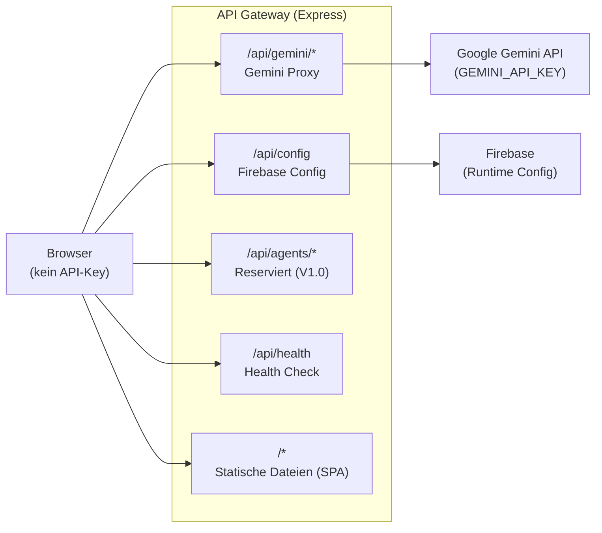

# MVP3 — "Sicher unterwegs"

<span class="status-badge status-badge--in-progress">In Arbeit</span>

> **Ziel:** Die App ist sicher genug fuer den oeffentlichen Zugang. Ein zentrales API-Gateway verpackt alle Secret Keys server-seitig — Gemini, Firebase-Konfiguration und reservierter Agent-Namespace. Docker Compose spiegelt die Cloud-Run-Umgebung lokal. Danach kann die URL oeffentlich geteilt werden.

---

## Ueberblick

MVP3 ist die kleinste Phase mit nur 2 Feature Requests — aber sie ist entscheidend. Ohne das API-Gateway liegt der Gemini-API-Key im JS-Bundle und kann von jedem extrahiert werden. MVP3 schliesst diese Sicherheitsluecke und schafft die Grundlage fuer oeffentliches Teilen.

| Kennzahl | Wert |
|----------|------|
| Feature Requests | 2 |
| Status | <span class="status-badge status-badge--in-progress">In Arbeit</span> |
| Schwerpunkt | Security, API-Gateway, lokales Staging |

---

## Feature Requests

| FR | Titel | Prioritaet | Abhaengigkeiten | Status |
|----|-------|------------|-----------------|--------|
| FR-051 | Secure API Gateway | must | FR-005, TC-016 | <span class="status-badge status-badge--in-progress">In Arbeit</span> |
| FR-052 | Docker Compose Local Staging | must | FR-051, FR-040 | <span class="status-badge status-badge--in-progress">In Arbeit</span> |

---

## Architektur

Das API-Gateway sitzt als zentrale Schicht zwischen Browser und externen Diensten. Kein Secret verlasst den Server.



### Layer 1: Gemini Proxy (`/api/gemini/*`)

Sieben Endpunkte spiegeln die sieben `geminiService`-Methoden:

| Endpunkt | Client-Methode | Beschreibung |
|----------|---------------|--------------|
| `POST /api/gemini/chat` | `sendMessage()` | KI-Dialog |
| `POST /api/gemini/extract-insights` | `extractInsights()` | Interessen-Extraktion |
| `POST /api/gemini/extract-station-result` | `extractStationResult()` | Stations-Auswertung |
| `POST /api/gemini/generate-curriculum` | `generateCurriculum()` | Curriculum-Generierung |
| `POST /api/gemini/generate-course` | `generateCourse()` | Kurs-Generierung |
| `POST /api/gemini/tts` | `textToSpeech()` | Text-to-Speech |
| `POST /api/gemini/stt` | `speechToText()` | Speech-to-Text |

Der `GEMINI_API_KEY` bleibt ausschliesslich auf dem Server. Die Client-seitigen Funktionssignaturen aendern sich nicht — nur die Internals wechseln von SDK-Aufrufen zu `fetch('/api/gemini/...')`.

### Layer 2: Firebase Config Injection (`/api/config`)

`GET /api/config` liefert die Firebase-Konfiguration als JSON zur Laufzeit. Kein Hardcoding im JS-Bundle. Ermoeglicht Rotation und umgebungsspezifische Konfiguration ohne Neubau.

### Layer 3: Agent Communication (`/api/agents/*`)

Namespace reserviert fuer FR-024 (Multi-Agent Reisebegleiter, V1.0). Gibt aktuell HTTP 501 (Not Implemented) zurueck. Keys fuer Agent-zu-Agent-Kommunikation werden spaeter hier angebunden.

### Rate Limiting

| Endpunkt-Typ | Limit |
|--------------|-------|
| Chat, Extract, Generate | 30 Requests/Minute |
| TTS | 10 Requests/Minute |
| STT | 10 Requests/Minute |
| Config | 60 Requests/Minute |

Ueberschreitung: HTTP 429 mit `Retry-After`-Header.

### Health Check

`GET /api/health` gibt `{ "status": "ok" }` mit HTTP 200 zurueck. Dient als Liveness-Probe fuer Cloud Run und Monitoring.

---

## Lokales Staging (FR-052)

`docker-compose.yml` im Projektstamm baut und startet denselben Container wie Cloud Run:

```yaml
services:
  app:
    build: .
    ports:
      - "9090:8080"
    env_file: .env.local
    environment:
      - PORT=8080
```

| Aspekt | Dev Server | Lokales Staging |
|--------|-----------|-----------------|
| Statische Dateien | Vite HMR | `express.static` (Produktion) |
| API-Gateway | Nicht aktiv | Vollstaendiges `/api/*` Gateway |
| Firebase Config | Hardcoded im Source | Injiziert ueber `/api/config` |
| Dockerfile | Nicht getestet | Gebaut und lauffaehig |
| Port | 5173 (Vite) | 9090 (Host) → 8080 (Container) |

Start: `make local-stage`

---

## Exit-Kriterien

- [ ] Gemini API-Key ist NICHT im JS-Bundle (Verifizierung: `curl ... | grep AIza` findet nichts)
- [ ] Alle 7 Gemini-Methoden funktionieren ueber `/api/gemini/*` Proxy
- [ ] `GET /api/config` liefert Firebase-Config aus Runtime-Umgebungsvariablen
- [ ] Firebase-Config ist NICHT hardcoded im JS-Bundle
- [ ] `/api/agents/*` gibt 501 zurueck (Namespace reserviert fuer V1.0)
- [ ] Rate Limiting aktiv (429 bei Missbrauch)
- [ ] Cloud Run bedient statische Dateien und API aus einem Container
- [ ] Alle Secret Keys sind Runtime-Umgebungsvariablen, keine Build-Time-Args
- [ ] Health Check unter `/api/health` gibt 200 zurueck
- [ ] `make local-stage` startet den vollen Stack lokal via Docker Compose
- [ ] Lokales Staging verhaelt sich wie Cloud Run

!!! warning "Warum MVP3 kritisch ist"
    Ohne MVP3 kann die URL nicht oeffentlich geteilt werden. Der Gemini-API-Key ist aktuell im JS-Bundle sichtbar und koennte missbraucht werden. MVP3 ist der Gatekeeper fuer alle folgenden Phasen.
