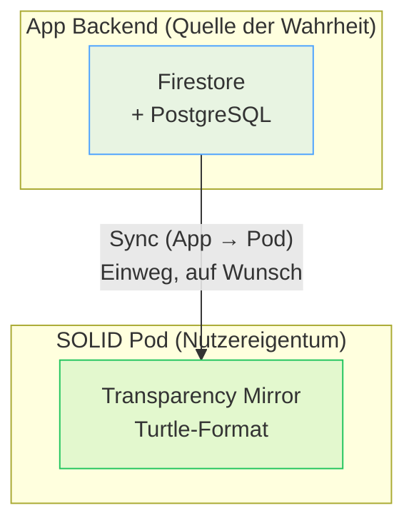

# MVP4 — "Meine Daten, Mein Pod"

<span class="status-badge status-badge--planned">Geplant</span>

> **Ziel:** Ein SOLID Pod dient als Transparenzspiegel fuer Nutzerdaten. Das App-Backend bleibt die primaere Datenquelle; ein verbundener Pod erhaelt auf Wunsch eine Einweg-Kopie. Nutzer koennen genau sehen, was die Plattform ueber sie weiss.

---

## Ueberblick

MVP4 ist der erste Schritt in Richtung echter Datensouveraenitaet. Anstatt den Nutzern nur zu versprechen, dass ihre Daten sicher sind, zeigt Future SkillR transparent, was gespeichert wird — in einem Pod, der dem Nutzer gehoert.

| Kennzahl | Wert |
|----------|------|
| Feature Requests | 3 |
| Status | <span class="status-badge status-badge--planned">Geplant</span> |
| Schwerpunkt | SOLID Pod, Datentransparenz, Datensouveraenitaet |
| Architektur-Basis | TC-019 (Solid Pod Storage Layer) |

---

## Feature Requests

| FR | Titel | Prioritaet | Status |
|----|-------|------------|--------|
| FR-076 | Solid Pod Connection | should | <span class="status-badge status-badge--planned">Geplant</span> |
| FR-077 | Pod Data Sync | should | <span class="status-badge status-badge--planned">Geplant</span> |
| FR-078 | Pod Data Viewer | could | <span class="status-badge status-badge--planned">Geplant</span> |

---

## Architektur

Das zentrale Prinzip: **App = Quelle der Wahrheit, Pod = Transparenzspiegel.**



### Warum Einweg-Sync?

- **App → Pod:** Die App schreibt Daten in den Pod. Der Nutzer kann sie dort lesen.
- **Pod → App:** Nicht in MVP4. Bidirektionaler Sync ist V2.0-Scope.
- **Kein Pod noetig:** Die App funktioniert normal ohne Pod (Graceful Degradation).

### Pod-Provider-Optionen

| Option | Beschreibung |
|--------|--------------|
| **Managed (lokal)** | Community Solid Server v7 als Docker-Compose-Service neben der App |
| **Extern** | Vom Nutzer bereitgestellte Pod-URL |

---

## Pod-Verbindung (FR-076)

Nutzer koennen von ihrer Profilseite aus einen Pod verbinden. Der Flow:

1. Nutzer klickt "Pod verbinden" auf der Profilseite
2. Auswahl: Managed Pod oder externe Pod-URL eingeben
3. Verbindung wird hergestellt und in PostgreSQL gespeichert
4. Status wird auf der Profilseite angezeigt

### API-Endpunkte

| Methode | Pfad | Beschreibung |
|---------|------|--------------|
| `POST` | `/api/v1/pod/connect` | Pod verbinden |
| `DELETE` | `/api/v1/pod/connect` | Pod trennen |
| `GET` | `/api/v1/pod/status` | Verbindungs- und Sync-Status |

### Datenbankfelder

Neue Spalten in der `users`-Tabelle:

- `pod_url` — Basis-URL des Pods
- `pod_webid` — WebID URI
- `pod_provider` — `none`, `managed` oder `external`
- `pod_connected_at` — Verbindungszeitpunkt
- `pod_last_synced_at` — Letzter Sync-Zeitpunkt
- `pod_sync_status` — `none`, `connected`, `synced`, `partial`

---

## Daten-Sync (FR-077)

Manueller Sync schreibt 5 Entitaetstypen vom App-Backend in den Pod:

| Entitaet | Pod-Pfad | Quelle |
|----------|----------|--------|
| Nutzerprofil | `/profile/state` | PostgreSQL `users` |
| Skill-Profil | `/profile/skill-profile` | PostgreSQL `skill_profiles` |
| Journey-Fortschritt | `/journey/vuca-state` | Frontend State |
| Engagement | `/profile/engagement` | Frontend State |
| Reflexionen | `/journal/reflections/{id}` | PostgreSQL `reflections` |

### Pod-Containerstruktur

```
/{username}/
  profile/
    card            # WebID Profile (foaf:Person)
    state           # Nutzerprofil
    skill-profile   # Skill-Profil
    engagement      # Engagement-Status
  journey/
    vuca-state      # Journey-Fortschritt
  journal/
    reflections/
      {id}          # Einzelne Reflexionen
```

### Sync-API

`POST /api/v1/pod/sync` loest den manuellen Sync aus. Der Nutzer klickt "Jetzt synchronisieren" — die App serialisiert die Daten im Turtle-Format und schreibt sie in den Pod.

### Fehlerbehandlung

- **Pod offline:** Fehlerstatus zurueckgeben, App laeuft normal weiter
- **Teilweise Fehler:** Verbleibende Entitaeten werden weiter synchronisiert, Fehler gesammelt
- **Pod ist nie blockierend:** Die App-Funktionalitaet ist nie vom Pod abhaengig

---

## Pod Data Viewer (FR-078)

Nutzer koennen die im Pod gespeicherten Daten in einem lesbaren Format anzeigen:

- `GET /api/v1/pod/data` gibt die Pod-Inhalte als strukturiertes JSON zurueck
- PodManagementCard auf der Profilseite zeigt: Verbindungsstatus, Pod-URL, letzter Sync, Sync-Indikator
- Buttons: "Jetzt synchronisieren", "Trennen" (mit Bestaetigung)

---

## Exit-Kriterien

- [ ] CSS laeuft als Docker-Compose-Service neben App, PostgreSQL, Redis
- [ ] Nutzer kann Pod von der Profilseite aus verbinden
- [ ] Initialer Sync erstellt Pod-Containerstruktur mit 5 Entitaetstypen
- [ ] Manueller Sync schreibt aktuellen App-Zustand im Turtle-Format in den Pod
- [ ] Nutzer kann Pod-Inhalte in lesbarem Format anzeigen
- [ ] Pod-Verbindungsstatus in PostgreSQL gespeichert
- [ ] App funktioniert normal ohne Pod (Graceful Degradation)
- [ ] Backend-Unit-Tests fuer Serializer, Client, Service, Handler
- [ ] Frontend-Tests fuer Pod-Service und Komponenten
- [ ] FR-076, FR-077, FR-078 dokumentiert
- [ ] TC-019 mit MVP4-Scope aktualisiert

!!! info "Bewusste Einschraenkung"
    MVP4 implementiert bewusst nur den Einweg-Sync (App → Pod) und manuellen Trigger. Automatischer Sync, bidirektionaler Sync und DPoP-Authentifizierung sind V2.0-Scope. Das Ziel ist Transparenz, nicht vollstaendige Dezentralisierung.
