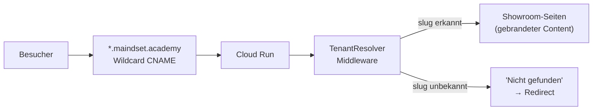

# MVP5 — "Sponsor Showrooms"

Geplant

> **Ziel:** Eine Multi-Tenant B2B-Plattform, auf der Unternehmen Skills sponsern und Sichtbarkeit durch echte Bildungsexpertise erlangen (BC-007 Bildungssponsoring). Gebrandete Micro-Sites unter `{slug}.maindset.academy` mit Skill-Showcases, Lernreisen und aggregierten Analytics.

---

## Ueberblick

MVP5 aktiviert das B2B-Geschaeftsmodell von maindset.ACADEMY. Unternehmen koennen als Bildungssponsoren auftreten und zeigen, warum bestimmte Faehigkeiten in der Praxis wichtig sind — ohne Werbung, sondern durch echte Expertise. Das Sponsoring bereichert die Lernreise der Jugendlichen, ohne sie einzuschraenken.

| Kennzahl | Wert |
|----------|------|
| Feature Requests | 7 (4 neue + 3 absorbierte V2.0-Features) |
| Status | Geplant |
| Schwerpunkt | Multi-Tenant, B2B, Showrooms, Stripe, Lernreise-Editor |
| Architektur-Basis | TC-030 (Multi-Tenant Showrooms), BC-011 (Sponsor Showrooms) |
| Implementierungsdauer | 8–12 Wochen in 4 Unterphasen |

---

## Voraussetzungen

MVP5 baut auf V1.0-Fundamenten auf:

| Voraussetzung | FR | Beschreibung |
|---------------|-----|-------------|
| Rollensystem | FR-027 | `sponsor_admin`-Rolle neben `user` und `admin` |
| DSGVO-Compliance | FR-033 | Einwilligungsmanagement fuer Sponsor-Daten |
| UI-Theme-System | FR-034 | CSS-Variablen, dynamisches Theming pro Sponsor |
| Security Headers | FR-059 | Per-Origin-Validierung fuer Subdomains |
| Legal Management | FR-067 | Konfigurierbare Impressum/Datenschutz-Seiten pro Sponsor |

---

## Feature Requests

### Neue Features

| FR | Titel | Prioritaet | Status |
|----|-------|------------|--------|
| FR-079 | Sponsor Showrooms | must | Geplant |
| FR-080 | Lernreise-Editor (Gestufter Zugang) | must | Geplant |
| FR-081 | Sponsor Analytics Dashboard | should | Geplant |
| FR-082 | Stripe Subscription Management | must | Geplant |

### Absorbierte V2.0-Features

Drei Feature Requests, die urspruenglich fuer V2.0 geplant waren, werden in MVP5 integriert:

| FR | Urspruenglicher Titel | MVP5-Adaption |
|----|----------------------|---------------|
| FR-022 | Company Moeglichkeitsraum Profile | Wird zum Showroom-Firmenprofil + "Ueber uns"-Bereich |
| FR-028 | Sponsored Content Integration | Wird zum Skill-Showcase mit LLM-Grounding-Kontext |
| FR-029 | Multiplikatoren-Onboarding | Adaptiert als 7-Schritte-Sponsor-Self-Service-Onboarding |

---

## Showroom-Architektur

### Subdomain-Routing

- **Wildcard-CNAME:** `*.maindset.academy` zeigt auf den Cloud-Run-Service
- **TenantResolver-Middleware:** Extrahiert den Slug aus dem Host-Header
- **TenantProvider (Frontend):** Laedt Sponsor-Konfiguration basierend auf Hostname
- **Unbekannte Subdomains:** "Showroom nicht gefunden" mit Redirect zu `maindset.academy`

### Oeffentliche Showroom-Seiten

| Seite | URL | Inhalt |
|-------|-----|--------|
| Showroom-Landing | `{sponsor}.maindset.academy/` | Hero mit Branding, Skill-Karten, Skill Sets, Lernreisen-Vorschau, "Ueber uns" |
| Skill-Detail | `/skills/{skill-slug}` | "Warum ist das wichtig?", "Was kannst du damit machen?", verwandte Skills |
| Skill-Set-Detail | `/skillsets/{set-slug}` | Gruppierte Skills mit verbindender Erzaehlung |

### Theming

Sponsoren konfigurieren:

- Logo (SVG/PNG, max 200px)
- Hero-Bild (max 5MB, 16:9)
- Primaerfarbe (WCAG AA auf `#0f172a`)
- Akzentfarbe
- Tagline (max 60 Zeichen)

CSS Custom Properties (`--sponsor-primary`, `--sponsor-accent`) werden zur Laufzeit injiziert.

---

## Sponsor-Dashboard

7-Tab-Dashboard fuer authentifizierte Sponsor-Admins:

| Tab | Funktion |
|-----|----------|
| **Uebersicht** | Status, Tier, URL, Zaehler |
| **Skills** | CRUD fuer einzelne Skills (Name, Beschreibung, VUCA-Dimension, Praxiskontext) |
| **Skill Sets** | CRUD, Skill-Mitglieder verwalten, Erzaehlungs-Editor |
| **Lernreisen** | Reise-Editor (FR-080) — gestuft nach Tier |
| **Showroom** | Branding-Konfiguration (Logo, Farben, Tagline, Hero-Bild) |
| **Analytics** | Aggregierter Traffic, Skill-Engagement, Conversion-Funnel (FR-081) |
| **Vertrag** | Plan-Details, Upgrade, Zahlungsmethode, Rechnungen (FR-082) |

---

## Sponsoring-Tiers

| Faehigkeit | Basic | Professional | Enterprise |
|-----------|-------|-------------|-----------|
| Skills | max 5 | max 20 | unbegrenzt |
| Skill Sets | max 1 | max 3 | unbegrenzt |
| Lernreisen | 0 | max 2 (Vorlage) | unbegrenzt (Voller Editor) |
| Analytics | nein | ja | ja |
| Matching | nein | nein | ja |
| Gebrandete Reisen | nein | nein | ja |

Alle Tiers beginnen mit einer 30-Tage-Testphase. Stripe verwaltet Abonnements, Tier-Wechsel und Rechnungsstellung.

---

## LLM-Kontext-Integration

Wenn ein Schueler ueber einen Showroom eine Reise startet, erhaelt der AI-Dialog `sponsor_context` als Grounding-Daten. Wichtig:

- Die **VUCA-Bingo-Matrix bleibt unbeeinflusst** — Sponsor-Kontext bereichert, schraenkt aber nicht ein
- "Supported by {Sponsor}" ist auf allen gesponserten Inhalten sichtbar
- SkillR-Header und -Footer bleiben auf allen Showroom-Seiten praesent

---

## Implementierungsphasen

| Phase | Umfang | Dauer |
|-------|--------|-------|
| **MVP5.1 — Grundlagen** | DB-Migrationen, Sponsor/Skill-CRUD, TenantResolver, Showroom-Seiten, Wildcard-DNS | 2–3 Wochen |
| **MVP5.2 — Dashboard & Onboarding** | 7-Schritte-Wizard, 7-Tab-Dashboard, Theming, Skill/Set-CRUD-UI | 2–3 Wochen |
| **MVP5.3 — Reisen & Zahlung** | Lernreise-Editor (FR-080), Stripe-Integration (FR-082), Trial-Logik, Tier-Enforcement | 2–3 Wochen |
| **MVP5.4 — Integration & Feinschliff** | LLM-Kontext-Injektion, Referral-Tracking, Analytics (FR-081), QR-Codes | 1–2 Wochen |

---

## 7-Schritte-Onboarding

Der Self-Service-Onboarding-Flow fuer neue Sponsoren:

1. **Entdeckung** — Landing-Page oder Direktlink
2. **Konto-Erstellung** — Firmenname, Ansprechpartner, E-Mail, Branche, Groesse
3. **Subdomain-Auswahl** — `{slug}.maindset.academy` (unveraenderlich nach Erstellung)
4. **Showroom-Konfiguration** — Branding → Firmenprofil → Erster Skill
5. **Tier-Auswahl** — Basic / Professional / Enterprise
6. **Vertrag & Zahlung** — 30-Tage-Testphase, optionale sofortige Zahlung
7. **Live-Schaltung** — URL, QR-Code, naechste Schritte

Zeitziel: Sponsor erstellt den ersten Skill in unter 15 Minuten.

---

## Exit-Kriterien

- [ ] `{slug}.maindset.academy` rendert den gebrandeten Showroom des Sponsors
- [ ] Unbekannte Subdomains zeigen "nicht gefunden"-Seite
- [ ] Sponsor kann sich in unter 15 Minuten selbst onboarden (Konto → Showroom → erster Skill)
- [ ] Skills werden mit Praxiskontext angezeigt ("Warum wichtig" + "Was kann man damit machen")
- [ ] Professional-Sponsor kann eine Reise aus Vorlage erstellen
- [ ] Enterprise-Sponsor kann eine Reise mit vollem Editor erstellen
- [ ] Stripe Trial-to-Paid-Conversion funktioniert End-to-End
- [ ] Analytics zeigen aggregierten Showroom-Traffic (keine individuellen Schueler-Daten)
- [ ] "Supported by {Sponsor}" Label auf allen gesponserten Inhalten sichtbar
- [ ] Schueler, der ueber Showroom einsteigt, erhaelt Sponsor-Kontext im AI-Dialog
- [ ] VUCA-Bingo-Matrix bleibt unbeeinflusst durch Sponsor-Kontext
- [ ] Alle sponsor-seitigen Texte sind auf Deutsch

!!! tip "Bildungssponsoring statt Werbung"
    Sponsoren zeigen keine Werbung. Sie zeigen Expertise. Die Sichtbarkeit entsteht durch echten Mehrwert fuer Jugendliche — nicht durch Banner, Pop-ups oder gesponsertes Ranking. Das ist der Kern des Bildungssponsoring-Modells (BC-007, BC-011).
