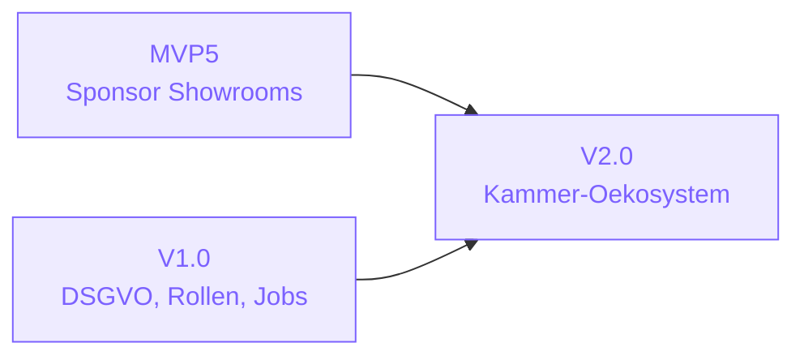
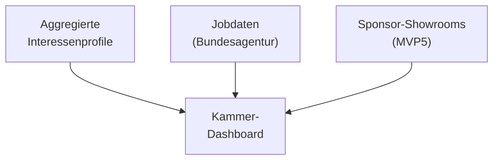
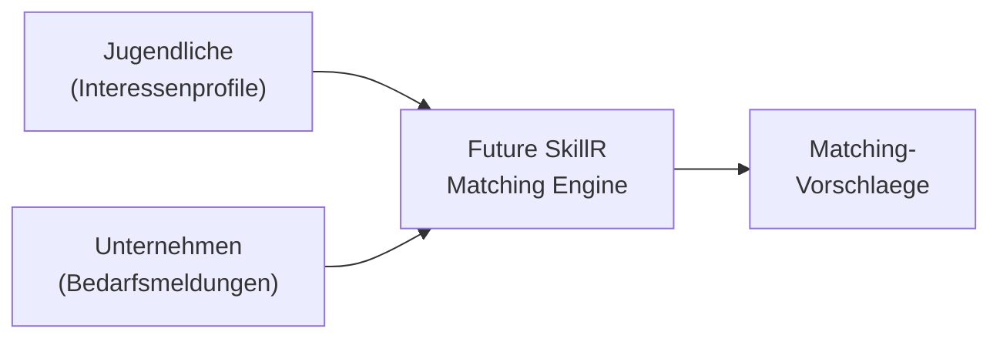

# V2.0 — "Oekosystem"

Geplant

> **Ziel:** Ein kammerbasiertes Oekosystem. Kammern verwalten Ausbildungslandschaften, Bedarfssignale fliessen ins Matching ein. Erloese durch Matching-Gebuehren zwischen Kammern, Unternehmen und Jugendlichen.

---

## Ueberblick

V2.0 schliesst den Kreis: Von der individuellen Interessenentdeckung (MVP1/2) ueber die sichere Plattform (MVP3/V1.0) und das B2B-Sponsoring (MVP5) hin zu einem echten Oekosystem, in dem Kammern, Unternehmen und Jugendliche zusammenfinden.

| Kennzahl | Wert |
|----------|------|
| Feature Requests | 7 (2 neue + 5 plattformuebergreifend) |
| Status | Geplant |
| Schwerpunkt | Kammer-Dashboard, Bedarfserfassung, Matching-Erloese |
| Voraussetzung | MVP5 (Sponsor-Infrastruktur) |
| Zielnutzer | 1000+ in IHK-Pilotregionen |

---

## Voraussetzungen

V2.0 baut auf der Sponsor-Infrastruktur von MVP5 auf und erweitert sie um kammerbasierte Features:

| Voraussetzung | Quelle | Beschreibung |
|---------------|--------|-------------|
| Sponsor-Showrooms | MVP5 (FR-079) | Kammern nutzen dieselbe Multi-Tenant-Infrastruktur |
| Stripe Subscriptions | MVP5 (FR-082) | Kammer-Abonnements nutzen dasselbe Zahlungssystem |
| Rollenbasierte Ansichten | V1.0 (FR-027) | `chamber_admin`-Rolle neben `sponsor_admin` |
| Job-Navigator | V1.0 (FR-018) | Jobdaten als Grundlage fuer Matching |
| DSGVO-Compliance | V1.0 (FR-033) | Datenschutz fuer alle Nutzergruppen |

---

## Feature Requests

### Neue Features

| FR | Titel | Prioritaet | Abhaengigkeiten | Status |
|----|-------|------------|-----------------|--------|
| FR-021 | Chamber Dashboard | could | FR-017, FR-079 | Geplant |
| FR-023 | Bedarfserfassung der Kammern | could | FR-021 | Geplant |

### Plattformuebergreifende Erweiterungen

V2.0 aktiviert und erweitert bestehende Konzepte:

| Bereich | Beschreibung | Business Concept |
|---------|-------------|-----------------|
| Matching-Erloese | Gebuehrenbasiertes Matching zwischen Angebot und Nachfrage | BC-001, BC-002 |
| Kammer-Unternehmens-Beziehungen | Verwaltung der Beziehungen ueber die Plattform | BC-009 |
| Bedarfsgewichtetes Matching | Kammer-Signale gewichten das Matching | BC-002 |
| Bidirektionaler Pod-Sync | Erweitert MVP4: Pod kann zurueck zur App synchronisieren | TC-019 |
| Automatischer Pod-Sync | Ersetzt manuellen Trigger durch Event-basierte Synchronisation | FR-077+ |

---

## Kammer-Dashboard (FR-021)

Kammern erhalten eine eigene Sicht auf die Ausbildungslandschaft ihrer Region:

### Funktionsumfang

- **Ausbildungslandschaft:** Ueberblick ueber verfuegbare Ausbildungsplaetze in der Region
- **Berufsfeld-Analyse:** Welche Berufsfelder werden von Jugendlichen entdeckt?
- **Angebot-Nachfrage:** Vergleich zwischen Interessenprofilen und verfuegbaren Plaetzen
- **Sponsor-Uebersicht:** Welche Unternehmen sind als Bildungssponsoren aktiv?
- **Trend-Erkennung:** Welche Skills und Interessen wachsen?

### Datenquellen

Alle Daten werden **ausschliesslich aggregiert** dargestellt. Keine individuellen Nutzerprofile sind fuer Kammern sichtbar.

---

## Bedarfserfassung (FR-023)

Kammern erfassen den Ausbildungsbedarf ihrer Mitgliedsunternehmen:

- **Bedarfsmeldung:** Unternehmen melden offene Ausbildungsplaetze mit Skill-Anforderungen
- **Bedarfsanalyse:** Aggregierte Sicht auf den regionalen Bedarf
- **Matching-Signal:** Bedarfsdaten fliessen als Gewichtung ins Matching ein
- **Zeitreihen:** Wie entwickelt sich der Bedarf ueber Quartale?

### Matching-Logik

Das Matching basiert auf Interessen, nicht auf Noten oder Leistung. Es zeigt Moeglichkeiten, keine Bewerbungsvorschlaege.

---

## Erloemodell

V2.0 aktiviert das Matching-Erloemodell (BC-001, BC-002):

| Erloesstrom | Beschreibung | Zahler |
|-------------|-------------|--------|
| **Sponsor-Abonnements** | Monatliche Gebuehr fuer Showroom-Zugang (Basic/Professional/Enterprise) | Unternehmen |
| **Matching-Gebuehren** | Gebuehr pro qualifiziertem Matching-Vorschlag | Kammern / Unternehmen |
| **Kammer-Lizenz** | Jahresgebhuehr fuer das Kammer-Dashboard | IHK / HWK |

!!! note "Kein Datenhandel"
    Die Erloese entstehen durch den Plattform-Service (Matching, Dashboard, Analytics) — **nicht** durch den Verkauf von Nutzerdaten. Individuelle Profile werden nie an Dritte weitergegeben.

---

## Skalierungsziele

| Metrik | Zielwert | Kontext |
|--------|---------|---------|
| Aktive Nutzer | 1000+ | In IHK-Pilotregionen |
| Sponsoren | 20+ | Aktive Showrooms mit Skills und Reisen |
| Kammern | 3+ | IHK-Pilotpartner mit Dashboard-Zugang |
| Ausbildungsplaetze | 500+ | Im Matching-System erfasst |
| Matching-Vorschlaege/Monat | 100+ | Qualifizierte Vorschlaege |

---

## Exit-Kriterien

- [ ] Kammern koennen die Ausbildungslandschaft ihrer Region einsehen
- [ ] Matching-Erloemodell generiert erste Einnahmen
- [ ] Kammer-Unternehmens-Beziehungen werden ueber die Plattform verwaltet
- [ ] 1000+ Nutzer in IHK-Pilotregionen
- [ ] Bedarfserfassung erfasst offene Ausbildungsplaetze mit Skill-Anforderungen
- [ ] Aggregierte Analytics fuer Kammern — keine individuellen Nutzerdaten sichtbar
- [ ] Bidirektionaler Pod-Sync funktioniert (MVP4-Erweiterung)

!!! success "Die Vision: Vom Prototyp zum Oekosystem"
    V2.0 schliesst den Kreis: Jugendliche entdecken Interessen → Unternehmen zeigen Expertise → Kammern orchestrieren den Ausbildungsmarkt → Alle profitieren. Future SkillR wird vom Tool zum Oekosystem.
