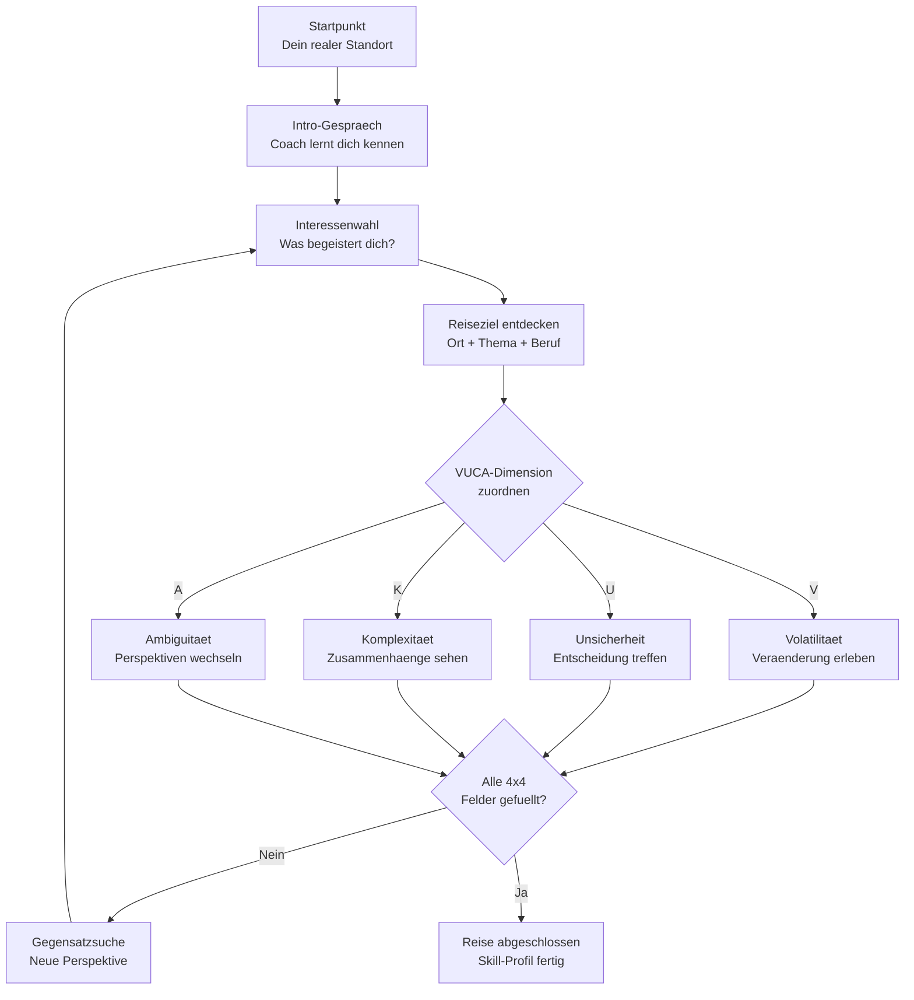

# Die Reise nach VUCA

Die **Reise nach VUCA** ist das Herzsueck von Future SkillR. Es ist eine dialogbasierte, virtuelle Weltreise, auf der Jugendliche ihre Interessen entdecken und ein persoenliches Skill-Profil aufbauen.

---

## Was bedeutet VUCA?

VUCA ist ein Modell, das die heutige Welt beschreibt — eine Welt im ständigen Wandel. Die vier Buchstaben stehen fuer:

| Dimension | Bedeutung | Im Kontext von Future SkillR |
|-----------|-----------|-------------------------------|
| **V** — Volatilitaet | Die Welt veraendert sich schnell und unvorhersehbar | Umgang mit Veraenderung, Flexibilitaet, Anpassungsfaehigkeit |
| **U** — Unsicherheit | Wir koennen die Zukunft nicht vorhersagen | Entscheidungen treffen, Risiken einschaetzen, Vertrauen in sich selbst |
| **K** — Komplexitaet | Alles haengt mit allem zusammen | Zusammenhaenge erkennen, Systeme verstehen, vernetztes Denken |
| **A** — Ambiguitaet | Vieles ist mehrdeutig, nicht schwarz oder weiss | Unterschiedliche Perspektiven aushalten, Vielfalt schaetzen |

!!! info "Warum VUCA?"
    VUCA wurde urspruenglich vom US-Militaer entwickelt und wird heute in der Bildungs- und Arbeitswelt genutzt. Fuer Jugendliche bedeutet es: Die Zukunft ist offen — und das ist keine Bedrohung, sondern eine Chance. Wer lernt, mit VUCA umzugehen, ist auf alles vorbereitet.

---

## So funktioniert die Reise

Die Reise beginnt an deinem echten Standort — deiner Stadt, deinem Dorf. Von dort aus folgt der KI-Coach deinen Interessen und nimmt dich mit auf eine virtuelle Reise um die Welt.

### Der Ablauf

### Schritt fuer Schritt

1. **Start:** Du meldest dich an und waehlst deinen KI-Coach
2. **Intro:** Der Coach stellt sich vor und stellt ein paar Einstiegsfragen
3. **Interesse waehlen:** Du nennst ein Thema, das dich interessiert — Musik, Technik, Tiere, Sport, Kochen, Gaming, was immer du willst
4. **Ort entdecken:** Der Coach verbindet dein Interesse mit einem Ort auf der Welt. Zum Beispiel: *Du magst Musik? Dann lass uns nach Nashville reisen — die Hauptstadt der Country-Musik!*
5. **VUCA erkunden:** An jedem Ort erkundest du eine der vier VUCA-Dimensionen. Der Coach stellt Fragen und regt zum Nachdenken an
6. **Feld fuellen:** Nach jeder Station fuellst du ein Feld in deiner VUCA-Bingo-Matrix
7. **Gegensatzsuche:** Der Coach zeigt dir bewusst auch das Gegenteil deiner bisherigen Interessen, um deinen Horizont zu erweitern
8. **Wiederholen:** Zurueck zu Schritt 3 — bis alle 16 Felder gefuellt sind

---

## Die VUCA-Bingo-Matrix

Das Ziel der Reise ist es, die **4x4 VUCA-Bingo-Matrix** zu vervollstaendigen. Jede Dimension hat vier Felder, die durch Erfahrungen an verschiedenen Orten gefuellt werden.

| | Feld 1 | Feld 2 | Feld 3 | Feld 4 |
|---|--------|--------|--------|--------|
| **V** — Volatilitaet | :material-checkbox-blank-outline: | :material-checkbox-blank-outline: | :material-checkbox-blank-outline: | :material-checkbox-blank-outline: |
| **U** — Unsicherheit | :material-checkbox-blank-outline: | :material-checkbox-blank-outline: | :material-checkbox-blank-outline: | :material-checkbox-blank-outline: |
| **K** — Komplexitaet | :material-checkbox-blank-outline: | :material-checkbox-blank-outline: | :material-checkbox-blank-outline: | :material-checkbox-blank-outline: |
| **A** — Ambiguitaet | :material-checkbox-blank-outline: | :material-checkbox-blank-outline: | :material-checkbox-blank-outline: | :material-checkbox-blank-outline: |

!!! tip "Stempel im Reisepass"
    Stell dir die Matrix vor wie einen Reisepass: Fuer jede Station bekommst du einen Stempel. Wenn alle 16 Stempel gesammelt sind, hast du die Reise nach VUCA abgeschlossen.

---

## Die Gegensatzsuche

Ein besonderes Prinzip von Future SkillR ist die **Gegensatzsuche**. Der KI-Coach zeigt dir bewusst auch Themen und Orte, die das Gegenteil deiner bisherigen Interessen darstellen.

### Warum?

Weil echte Orientierung bedeutet, den eigenen Horizont zu erweitern. Wer nur das erkundet, was schon bekannt ist, verpasst moeglicherweise spannende Moeglichkeiten.

### Beispiele

| Dein Interesse | Gegensatz | Was du entdecken koenntest |
|----------------|-----------|----------------------------|
| Technik / Programmieren | Handwerk / Koerperarbeit | Dass viele High-Tech-Berufe handwerkliches Geschick brauchen |
| Allein arbeiten | Teamarbeit | Dass Zusammenarbeit auch introvertierte Staerken nutzt |
| Stadt / Urban | Natur / Laendlich | Dass Nachhaltigkeit Stadt und Land verbindet |
| Theorie / Lesen | Praxis / Ausprobieren | Dass Wissen erst durch Anwendung lebendig wird |

!!! info "Kein Zwang"
    Die Gegensatzsuche ist kein Zwang. Der Coach schlaegt vor — du entscheidest, ob du dich darauf einlaesst. Aber oft fuehren gerade die ueberraschenden Umwege zu den spannendsten Entdeckungen.

---

## Das Reisetagebuch

Alles, was du auf deiner Reise erlebst, wird in deinem persoenlichen **Reisetagebuch** (Travel Journal) festgehalten:

- **Besuchte Orte** — wohin dich die Reise gefuehrt hat
- **Gespraeche** — die Dialoge mit deinem KI-Coach
- **VUCA-Fortschritt** — welche Felder bereits gefuellt sind
- **Entdeckungen** — Berufe, Themen und Faehigkeiten, die du erkundet hast

Das Reisetagebuch ist die Grundlage fuer dein Skill-Profil. Je mehr du erkundest, desto detaillierter wird es.

---

## Wie lange dauert die Reise?

Die Reise ist in **Micro-Sessions** aufgebaut. Jede Session dauert etwa 5 bis 10 Minuten und fuellt ein oder zwei Felder der VUCA-Matrix.

| Sessions | Fortschritt | Was du erreichst |
|----------|-------------|------------------|
| 1-2 | Einstieg | Erste Erfahrungen, Kennenlernen des Coaches |
| 3-6 | Mittendrin | Mehrere VUCA-Dimensionen erkundet |
| 7-12 | Fortgeschritten | Matrix fast vollstaendig, Profil nimmt Form an |
| 13-16+ | Abschluss | Alle 16 Felder gefuellt, vollstaendiges Skill-Profil |

!!! tip "Kein Zeitdruck"
    Du kannst die Reise in deinem eigenen Tempo machen. Ob du jeden Tag eine Session machst oder einmal pro Woche — dein Fortschritt geht nicht verloren.

---

## Weiter lesen

- [VUCA Bingo im Detail](../jugendliche/vuca-bingo.md) — So funktioniert die 4x4-Matrix
- [Dein KI-Coach](../jugendliche/ki-coach.md) — Wer begleitet dich auf der Reise?
- [Dein Skill-Profil](../jugendliche/dein-skill-profil.md) — Was entsteht am Ende?
