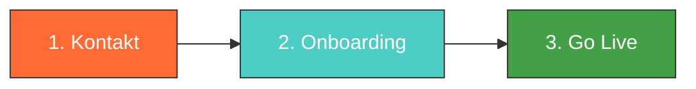

# Partner werden

**Sie moechten die naechste Generation unterstuetzen und dabei authentisch sichtbar werden? In drei Schritten werden Sie Bildungssponsor bei maindset.ACADEMY.**

---

## Drei Schritte zum Start

### Schritt 1: Kontakt aufnehmen

Schreiben Sie uns eine kurze Nachricht oder buchen Sie direkt ein unverbindliches Gespraech. Wir besprechen:

- Welche Skills und Themen fuer Ihre Branche relevant sind
- Welche Sponsoring-Stufe zu Ihren Zielen passt
- Wie der Onboarding-Prozess ablaeuft
- Ihre Fragen und Erwartungen

!!! tip "Unverbindlich und kostenlos"
    Das Erstgespraech ist unverbindlich und kostenlos. Wir moechten sicherstellen, dass Bildungssponsoring fuer beide Seiten passt — fuer Ihr Unternehmen und fuer die Jugendlichen auf der Plattform.

### Schritt 2: Onboarding

Nach Ihrer Entscheidung starten Sie das Self-Service-Onboarding:

| Aufgabe | Dauer | Beschreibung |
|---------|-------|-------------|
| **Profil anlegen** | 5 Min. | Name, Branche, Logo, Farben, "Ueber uns"-Text |
| **Showcases erstellen** | 5-10 Min./Stueck | Skill-Titel, Erklaerungen und Einstiegspunkte |
| **Vorschau pruefen** | 2 Min. | Ihren Showroom in der Vorschau ansehen |
| **Qualitaetspruefung** | 1-3 Werktage | Unser Team prueft Ihre Inhalte (Trust-Test) |

Das gesamte Self-Service-Onboarding ist in **unter 15 Minuten** erledigt. Die Qualitaetspruefung durch unser Team dauert in der Regel 1-3 Werktage.

### Schritt 3: Go Live

Nach bestandener Qualitaetspruefung geht Ihr Showroom live:

- Ihre Subdomain **{slug}.maindset.academy** wird aktiviert
- Ihre Skill-Showcases erscheinen auf der Plattform
- Die "Unterstuetzt von [Unternehmen]"-Kennzeichnung wird freigeschaltet
- Sie erhalten Zugang zu Ihrem Sponsor-Dashboard mit Nutzungsstatistiken

---

## Voraussetzungen

Bildungssponsoring steht Unternehmen offen, die folgende Kriterien erfuellen:

### Echte Bildungsabsicht

:material-check-circle:{ style="color: #43a047" } Ihr Unternehmen moechte genuesslich zur Skill-Entwicklung junger Menschen beitragen — nicht nur Sichtbarkeit kaufen.

### Relevante Skills und Inhalte

:material-check-circle:{ style="color: #43a047" } Sie koennen Skills und Themen beisteuern, die fuer Jugendliche relevant und lehrreich sind.

### Trust-Test-Bereitschaft

:material-check-circle:{ style="color: #43a047" } Sie akzeptieren, dass alle Inhalte den Trust-Test bestehen muessen: "Waere dieser Inhalt auch ohne den Firmennamen wertvoll?"

### Datenschutz-Akzeptanz

:material-check-circle:{ style="color: #43a047" } Sie akzeptieren, dass Sie **keine individuellen Nutzerdaten** erhalten — nur aggregierte, anonymisierte Statistiken.

!!! info "Wer passt zu uns?"
    Bildungssponsoring eignet sich besonders fuer Unternehmen, die Nachwuchskraefte suchen, ihr Employer Branding bei Gen Z staerken moechten oder sich als Bildungsfoerderer positionieren wollen. Branchen wie Handwerk, IT, Pflege, Technik und Kreativwirtschaft finden bei maindset.ACADEMY ein engagiertes Publikum.

---

## Was Sie als Sponsor erhalten

-   :material-storefront:{ .lg .middle } **Gebrandeter Showroom**

    ---

    Ihre eigene Micro-Site unter {slug}.maindset.academy mit Profil, Logo und Unternehmensfarben.

-   :material-school:{ .lg .middle } **Skill-Showcases**

    ---

    Bildungsinhalte zu Skills Ihrer Branche — sichtbar fuer alle Jugendlichen auf der Plattform.

-   :material-label:{ .lg .middle } **Sponsor-Kennzeichnung**

    ---

    "Unterstuetzt von [Unternehmen]" auf allen Ihren Inhalten — transparent und vertrauensbildend.

-   :material-chart-bar:{ .lg .middle } **Nutzungsstatistiken**

    ---

    Aggregierte, anonymisierte Daten: Wie viele Jugendliche Ihre Inhalte sehen und nutzen.

-   :material-account-group:{ .lg .middle } **Gen-Z-Sichtbarkeit**

    ---

    Authentische Praesenz dort, wo Jugendliche ihre Zukunft erkunden.

-   :material-handshake:{ .lg .middle } **Netzwerk**

    ---

    Zugang zu Veranstaltungen und dem Netzwerk aus Bildungstraegern, Kammern und anderen Sponsoren.

---

## Was Sie als Sponsor NICHT erhalten

Zum Schutz der Jugendlichen und der Plattform-Integritaet gibt es klare Grenzen:

| | Beschreibung |
|---|---|
| :material-close-circle:{ style="color: #e53935" } **Keine individuellen Nutzerdaten** | Kein Zugriff auf Profile, Namen oder Kontaktdaten einzelner Jugendlicher |
| :material-close-circle:{ style="color: #e53935" } **Kein Gespraechszugang** | Kein Einblick in die Dialoge zwischen Jugendlichen und KI-Coach |
| :material-close-circle:{ style="color: #e53935" } **Kein Einfluss auf die VUCA-Matrix** | Das Bingo-Raster und die Reisestruktur sind sponsorunabhaengig |
| :material-close-circle:{ style="color: #e53935" } **Keine Werbeplatzierung** | Keine Banner, Pop-ups oder Produktwerbung auf der Plattform |
| :material-close-circle:{ style="color: #e53935" } **Keine Ergebnis-Beeinflussung** | Das Skill-Profil des Jugendlichen bleibt objektiv und unabhaengig |

!!! warning "Diese Grenzen sind nicht verhandelbar"
    Die genannten Einschraenkungen sind Kernprinzipien der Plattform und gelten fuer alle Sponsoring-Stufen gleichermassen. Sie schuetzen das Vertrauen, das Jugendliche und Eltern in maindset.ACADEMY setzen.

---

## Sponsoring-Stufen im Vergleich

| | Basic | Premium | Enterprise |
|---|:---:|:---:|:---:|
| **Monatlich** | 299 EUR | 799 EUR | 1.999 EUR |
| **Jaehrlich** (2 Monate gratis) | 2.990 EUR | 7.990 EUR | 19.990 EUR |
| | | | |
| Showroom mit Subdomain | :material-check: | :material-check: | :material-check: |
| Unternehmensprofil & Branding | :material-check: | :material-check: | :material-check: |
| Skill-Showcases | Bis zu 5 | Bis zu 15 | Unbegrenzt |
| Lernreisen | — | Bis zu 3 | Unbegrenzt |
| Showroom-Editor | Standard | Standard | Vollstaendig |
| Basis-Analytik | :material-check: | :material-check: | :material-check: |
| Erweiterte Analytik | — | — | :material-check: |
| Kontext-Beitraege fuer KI-Coach | — | — | :material-check: |
| Dedizierter Ansprechpartner | — | — | :material-check: |
| Netzwerk-Events | :material-check: | :material-check: | :material-check: |

!!! tip "Unsicher, welche Stufe?"
    Starten Sie mit **Basic** und steigen Sie bei Bedarf um. Ein Upgrade ist jederzeit moeglich — Ihre bestehenden Inhalte bleiben erhalten.

---

## Haeufige Fragen von Unternehmen

??? question "Wie lange dauert es, bis mein Showroom online ist?"
    Nach dem Self-Service-Onboarding (ca. 15 Minuten) prueft unser Team Ihre Inhalte. In der Regel ist Ihr Showroom innerhalb von **1-3 Werktagen** live.

??? question "Kann ich meine Inhalte jederzeit aendern?"
    Ja. Ueber das Sponsor-Dashboard koennen Sie Ihr Profil, Ihre Showcases und Lernreisen jederzeit bearbeiten. Aenderungen an Inhalten durchlaufen erneut den Trust-Test (in der Regel innerhalb von 24 Stunden).

??? question "Was passiert, wenn ich kuendige?"
    Nach Kuendigung wird Ihr Showroom deaktiviert und Ihre Inhalte von der Plattform entfernt. Bereits generierte Skill-Profile der Jugendlichen bleiben davon unberuehrt — sie werden nicht rueckwirkend veraendert.

??? question "Kann ich eine Testphase nutzen?"
    Kontaktieren Sie uns — wir besprechen gerne individuelle Einstiegsmoeglichkeiten.

??? question "Erhalte ich eine Rechnung?"
    Ja. Sie erhalten monatlich oder jaehrlich eine ordnungsgemaesse Rechnung mit ausgewiesener MwSt.

??? question "Wer erstellt die Inhalte?"
    Sie erstellen die Inhalte selbst — oder in Zusammenarbeit mit unserem Redaktionsteam. Enterprise-Kunden erhalten dedizierte Unterstuetzung bei der Inhaltserstellung.

---

## Kontakt aufnehmen

Wir freuen uns auf Ihre Nachricht.

-   :material-email:{ .lg .middle } **Per E-Mail**

    ---

    partner@maindset.academy

    Wir antworten innerhalb von 2 Werktagen.

-   :material-phone:{ .lg .middle } **Per Telefon**

    ---

    Nach Terminvereinbarung per E-Mail.

    Gerne auch per Videokonferenz.

-   :material-calendar:{ .lg .middle } **Gespraech buchen**

    ---

    Vereinbaren Sie ein unverbindliches 30-Minuten-Gespraech.

    Schreiben Sie an partner@maindset.academy mit dem Betreff "Gespraech buchen".

---

## Naechste Schritte

- [:material-school: Bildungssponsoring](bildungssponsoring.md) — Das Modell im Detail verstehen
- [:material-eye: Sichtbarkeit statt Werbung](sichtbarkeit-statt-werbung.md) — Wie Ihre Inhalte wahrgenommen werden
- [:material-storefront: Showrooms](showrooms.md) — Wie Ihr Showroom aussieht und funktioniert
