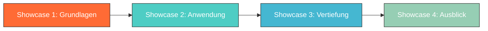

# Sponsor Showrooms

**Ihr eigener Auftritt im maindset.ACADEMY-Oekosystem — gebrandet, professionell und in unter 15 Minuten online.**

Jeder Bildungssponsor erhaelt einen eigenen Showroom: eine gebrandete Micro-Site unter **{slug}.maindset.academy**, auf der Jugendliche Ihr Unternehmen und Ihre Bildungsbeitraege entdecken koennen.

---

## Was ist ein Showroom?

Ein Showroom ist Ihre digitale Visitenkarte innerhalb der maindset.ACADEMY-Plattform. Er verbindet Ihr Unternehmensprofil mit den Skills und Themen, die Sie sponsern — und gibt Jugendlichen die Moeglichkeit, mehr ueber Ihre Branche zu erfahren.

!!! info "Keine externe Webseite"
    Der Showroom ist **kein Ersatz fuer Ihre Unternehmenswebseite**, sondern ein fokussierter Auftritt innerhalb des Bildungskontextes. Er zeigt, wie Ihr Unternehmen zur Skill-Entwicklung junger Menschen beitraegt.

### Zugang

Jeder Showroom ist unter einer eigenen Subdomain erreichbar:

```
https://{ihr-unternehmensname}.maindset.academy
```

Beispiele:

- `https://musterfirma.maindset.academy`
- `https://stadtwerke-beispiel.maindset.academy`
- `https://technik-ag.maindset.academy`

---

## Showroom-Bereiche

### 1. Unternehmensprofil

Der Einstieg in Ihren Showroom — Ihr Unternehmen auf einen Blick:

| Element | Beschreibung | In allen Stufen? |
|---------|-------------|:---:|
| **Unternehmensname** | Ihr offizieller Name | :material-check: |
| **Logo** | Ihr Unternehmenslogo (empfohlen: SVG oder PNG, min. 200x200px) | :material-check: |
| **Kurzprofil** | 2-3 Saetze, die beschreiben, wer Sie sind | :material-check: |
| **Branche** | Ihre Branchenzuordnung | :material-check: |
| **"Ueber uns"** | Ausfuehrlichere Beschreibung Ihres Unternehmens | :material-check: |
| **Unternehmensfarben** | Primaer- und Sekundaerfarbe fuer individuelles Branding | :material-check: |
| **Region** | Ihr Standort oder Ihre Standorte | :material-check: |

!!! tip "Schreiben Sie fuer Jugendliche"
    Ihr Showroom-Profil wird von 14- bis 20-Jaehrigen gelesen. Vermeiden Sie Fachjargon und Unternehmensfloskeln. Schreiben Sie stattdessen, was Ihr Unternehmen spannend macht — aus der Perspektive eines jungen Menschen, der die Welt entdeckt.

### 2. Skill-Showcases

Das Herzstu eck Ihres Showrooms — die Bildungsinhalte, die Sie beisteuern:

Jeder Skill-Showcase besteht aus:

- **Titel:** Ein ansprechender Name fuer den Skill (z.B. "Programmieren — Die Sprache der Zukunft")
- **Warum ist dieser Skill wichtig?** — Erklaerung der Relevanz
- **Was kann man damit machen?** — Berufsfelder und Taetigkeiten
- **Wie faengt man an?** — Einstiegspunkte

Showcases werden im Showroom als Karten dargestellt. Jugendliche koennen sie durchblaettern und entdecken, welche Skills Ihr Unternehmen unterstuetzt.

### 3. Lernreisen (Premium und Enterprise)

Lernreisen sind kuratierte Sammlungen von Skill-Showcases, die zusammen ein Themenfeld abdecken:



**Beispiel-Lernreise: "Einstieg in die Digitale Welt"**

| Station | Skill-Showcase | Dauer |
|---------|---------------|-------|
| 1 | "Was ist Programmieren?" | ca. 10 Min. |
| 2 | "Design Thinking — Probleme kreativ loesen" | ca. 10 Min. |
| 3 | "Daten lesen und verstehen" | ca. 10 Min. |
| 4 | "Cybersecurity — Das Internet sicher machen" | ca. 10 Min. |

Jugendliche koennen Lernreisen in ihrem eigenen Tempo absolvieren. Der Fortschritt wird im Skill-Profil sichtbar.

### 4. Analytik (Enterprise)

Enterprise-Sponsoren erhalten Zugang zu erweiterten Nutzungsstatistiken:

| Metrik | Beschreibung |
|--------|-------------|
| **Showcase-Aufrufe** | Wie oft wurden Ihre Skill-Showcases angesehen? |
| **Showroom-Besuche** | Wie oft wurde Ihr Showroom aufgerufen? |
| **Lernreise-Starts** | Wie viele Jugendliche haben eine Lernreise begonnen? |
| **Lernreise-Abschluesse** | Wie viele haben eine Lernreise abgeschlossen? |
| **Beliebteste Skills** | Welche Ihrer Showcases wecken das meiste Interesse? |
| **Regionale Verteilung** | Aus welchen Regionen kommen die Besucher? (anonymisiert) |
| **Zeitraum-Vergleich** | Wie entwickelt sich die Nutzung ueber die Zeit? |

!!! warning "Datenschutz geht vor"
    Alle Statistiken sind **aggregiert und anonymisiert**. Sie zeigen Trends und Muster, aber niemals individuelle Nutzer. Minimum-Schwellenwerte stellen sicher, dass aus kleinen Zahlen keine Rueckschluesse auf Einzelpersonen moeglich sind.

---

## Stufen und Funktionen

| Funktion | Basic | Premium | Enterprise |
|----------|:-----:|:-------:|:----------:|
| **Showroom-Subdomain** | :material-check: | :material-check: | :material-check: |
| **Unternehmensprofil** | :material-check: | :material-check: | :material-check: |
| **Unternehmensfarben & Logo** | :material-check: | :material-check: | :material-check: |
| **"Ueber uns"-Sektion** | :material-check: | :material-check: | :material-check: |
| **Skill-Showcases** | Bis zu 5 | Bis zu 15 | Unbegrenzt |
| **Lernreisen** | — | Bis zu 3 | Unbegrenzt |
| **Showroom-Editor** | Standard-Layout | Standard-Layout | Vollstaendiger Editor |
| **Basis-Analytik** | Aufrufe & Besuche | :material-check: | :material-check: |
| **Erweiterte Analytik** | — | — | :material-check: |
| **Dedizierter Ansprechpartner** | — | — | :material-check: |
| **Monatlicher Beitrag** | 299 EUR | 799 EUR | 1.999 EUR |

---

## Individuelles Branding

Ihr Showroom traegt die Handschrift Ihres Unternehmens:

### Anpassbare Elemente

- **Primaerfarbe** — wird fuer Ueberschriften, Buttons und Akzente verwendet
- **Sekundaerfarbe** — wird fuer Hintergruende und dezente Elemente verwendet
- **Logo** — erscheint im Header des Showrooms
- **"Ueber uns"-Text** — Ihre Beschreibung in Ihrer Sprache
- **Showcase-Reihenfolge** — Sie bestimmen, welche Skills zuerst angezeigt werden

### Feste Elemente (nicht aenderbar)

- **Layout-Struktur** — einheitliches Raster fuer konsistente Nutzererfahrung
- **"Unterstuetzt von"-Kennzeichnung** — einheitliches Format
- **Navigation** — Rueckkehr zur Hauptplattform immer moeglich
- **Footer** — maindset.ACADEMY-Branding und rechtliche Hinweise
- **Datenschutzhinweise** — standardisierte Informationen

!!! info "Warum feste Elemente?"
    Einheitliche Grundelemente stellen sicher, dass Jugendliche sich auf jeder Showroom-Seite sofort zurechtfinden. Die Plattform bleibt vertrauenswuerdig, weil das Nutzererlebnis konsistent ist — unabhaengig davon, welchen Showroom man besucht.

---

## Onboarding: In 15 Minuten online

Das Erstellen Ihres Showrooms ist als Self-Service-Prozess gestaltet:

### Schritt 1: Profil anlegen (5 Minuten)

- Unternehmensname und Branche eingeben
- Logo hochladen
- Kurzprofil und "Ueber uns"-Text verfassen
- Primaer- und Sekundaerfarbe waehlen

### Schritt 2: Showcases erstellen (5-10 Minuten pro Showcase)

- Skill-Titel waehlen
- "Warum wichtig?", "Was kann man damit machen?", "Wie faengt man an?" ausfuellen
- Vorschau pruefen

### Schritt 3: Veroeffentlichen (1 Minute)

- Showroom-Vorschau pruefen
- Subdomain bestaetigen
- "Veroeffentlichen" klicken

!!! tip "Unterstuetzung durch unser Team"
    Sie muessen das nicht allein machen. Unser Onboarding-Team unterstuetzt Sie gerne — per E-Mail, Telefon oder Videokonferenz. Enterprise-Kunden erhalten einen dedizierten Ansprechpartner.

---

## Beispiel-Showroom

So koennte Ihr Showroom aussehen (vereinfachte Darstellung):

```
┌──────────────────────────────────────────┐
│  [Logo] Musterfirma GmbH                 │
│  Technologie & Innovation seit 1985      │
├──────────────────────────────────────────┤
│                                          │
│  Ueber uns                               │
│  Wir entwickeln Software, die Menschen   │
│  hilft, besser zusammenzuarbeiten.       │
│                                          │
├──────────────────────────────────────────┤
│                                          │
│  Unsere Skill-Showcases                  │
│                                          │
│  ┌──────────┐  ┌──────────┐  ┌────────┐ │
│  │Program-  │  │Design    │  │Daten-  │ │
│  │mieren    │  │Thinking  │  │analyse │ │
│  └──────────┘  └──────────┘  └────────┘ │
│                                          │
├──────────────────────────────────────────┤
│                                          │
│  Lernreise: Einstieg in die digitale     │
│  Welt (4 Stationen)                      │
│                                          │
├──────────────────────────────────────────┤
│  Unterstuetzt von Musterfirma GmbH       │
│  maindset.ACADEMY — Bildungssponsoring     │
└──────────────────────────────────────────┘
```

---

## Naechste Schritte

- [:material-handshake: Partner werden](partner-werden.md) — So erstellen Sie Ihren Showroom
- [:material-eye: Sichtbarkeit statt Werbung](sichtbarkeit-statt-werbung.md) — Wie Ihre Inhalte wahrgenommen werden
- [:material-school: Bildungssponsoring](bildungssponsoring.md) — Das Modell im Detail
