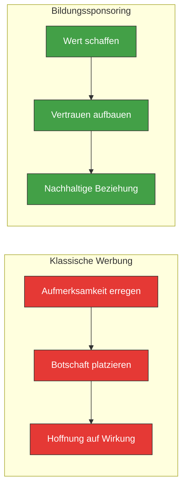

# Sichtbarkeit statt Werbung

**Die Generation Z unterscheidet sofort zwischen echtem Wert und Werbung. Bei maindset.ACADEMY setzen wir auf das, was wirkt: Vertrauen durch Bildungsbeitraege.**

---

## Vertrauensaufbau vs. Aufmerksamkeitsjagd

Klassisches Marketing basiert auf **Aufmerksamkeit**: Wer am lautesten ist, wird gesehen. Bildungssponsoring basiert auf **Vertrauen**: Wer am nuetzlichsten ist, wird geschaetzt.

| | Aufmerksamkeitsjagd | Vertrauensaufbau |
|---|---|---|
| **Strategie** | Unterbrechen | Bereichern |
| **Wahrnehmung** | "Schon wieder Werbung" | "Das ist hilfreich" |
| **Halbwertszeit** | Sekunden | Monate bis Jahre |
| **Kosten pro Kontakt** | Steigend (Ad-Inflation) | Sinkend (kumulativer Wert) |
| **Bei Gen Z** | Weitgehend wirkungslos | Hohe Resonanz |
| **Datenbedarf** | Tracking, Targeting, Profiling | Aggregierte Nutzung genuegt |

!!! info "Warum Gen Z Werbung ignoriert"
    Studien zeigen: Ueber 70% der 14- bis 24-Jaehrigen nutzen Adblocker. Weitere 80% geben an, Werbung in Apps bewusst zu ignorieren. Die Generation, die Sie erreichen moechten, hat gelernt, Werbung auszublenden. Was sie nicht ausblenden: echten Nutzen.

---

## Wie Sichtbarkeit bei maindset.ACADEMY funktioniert

### 1. Skill-Showcases — Ihr Wissen, ihr Nutzen

Skill-Showcases sind kompakte Bildungsbausteine, die Jugendlichen erklaeren, warum ein bestimmter Skill relevant ist und was man damit anfangen kann.

**Aufbau eines Skill-Showcases:**

| Abschnitt | Inhalt | Beispiel (IT-Branche) |
|-----------|--------|----------------------|
| **Warum ist dieser Skill wichtig?** | Relevanz im Alltag und in der Arbeitswelt | "Programmieren ist wie eine Superkraft: Du kannst Dinge erschaffen, die vorher nicht existierten." |
| **Was kann man damit machen?** | Konkrete Berufsfelder und Taetigkeiten | "Apps entwickeln, Roboter steuern, Spiele designen, Webseiten bauen, KI trainieren." |
| **Wie faengt man an?** | Einstiegspunkte fuer Interessierte | "Probier Scratch oder Python aus — beides ist kostenlos und macht Spass." |
| **Sponsor-Kennzeichnung** | Transparente Zuordnung | "Unterstuetzt von [Unternehmen]" |

!!! tip "Der Unterschied zur Werbung"
    Beachten Sie: Der Showcase erklaert den Skill, nicht das Unternehmen. Die Sponsor-Kennzeichnung ist sichtbar, aber dezent. Der Jugendliche nimmt wahr: "Dieses Unternehmen hilft mir, etwas Neues zu lernen" — nicht "Dieses Unternehmen will, dass ich mich bewerbe."

### 2. Kontext-Anreicherung — Ihre Expertise im Gespraech

Der KI-Coach kann Sponsor-Kontext nutzen, um Gespraeche inhaltlich zu bereichern. Das funktioniert so:

**Ohne Sponsor-Kontext:**
> Coach: "Programmieren ist ein gefragter Skill. Viele Unternehmen suchen Entwicklerinnen und Entwickler."

**Mit Sponsor-Kontext:**
> Coach: "Programmieren ist ein gefragter Skill. Wusstest du, dass man mit Code auch medizinische Geraete steuern kann? In der Medizintechnik arbeiten Programmiererinnen daran, Diagnosen schneller und genauer zu machen."

!!! warning "Klare Regel"
    Der KI-Coach nennt **niemals** einen Firmennamen im Gespraech. Der Sponsor-Kontext bereichert das Wissen, aber die Zuordnung zum Sponsor ist nur im Showroom sichtbar — nicht im Dialog.

### 3. Showroom — Ihre digitale Visitenkarte

Jeder Sponsor erhaelt einen gebrandeten Showroom unter **{slug}.maindset.academy**. Dort finden Jugendliche:

- Ihr Unternehmensprofil und Ihre Mission
- Alle von Ihnen gesponserten Skill-Showcases
- Lernreisen zu Ihren Themen (Premium/Enterprise)
- Einen "Ueber uns"-Bereich mit Ihren Werten

Der Showroom ist der Ort, an dem die Verbindung zwischen Bildungsinhalt und Sponsor transparent wird. Jugendliche, die einen Skill spannend finden, koennen dort mehr ueber den Sponsor erfahren — auf eigene Initiative.

---

## Transparente Kennzeichnung

Transparenz ist das Fundament des Vertrauens. Deshalb kennzeichnen wir Sponsoring immer klar und einheitlich:

### Wie die Kennzeichnung aussieht

Auf jedem gesponserten Inhalt steht:

> **Unterstuetzt von [Unternehmen]**

Diese Kennzeichnung ist:

- :material-check-circle: **Immer sichtbar** — nicht versteckt oder klein gedruckt
- :material-check-circle: **Einheitlich gestaltet** — gleiches Format fuer alle Sponsoren
- :material-check-circle: **Ehrlich formuliert** — "Unterstuetzt von", nicht "Praesentiert von" oder "Powered by"
- :material-check-circle: **Nicht anklickbar** — kein direkter Link zur Unternehmenswebseite im Lernkontext

### Wo die Kennzeichnung erscheint

| Ort | Kennzeichnung |
|-----|---------------|
| Skill-Showcase | "Unterstuetzt von [Unternehmen]" am Ende des Inhalts |
| Lernreise | "Diese Lernreise wird unterstuetzt von [Unternehmen]" im Header |
| Showroom | Vollstaendiges Unternehmensprofil mit Logo und Beschreibung |
| KI-Gespraech | **Keine Kennzeichnung** — der Coach nennt keine Sponsoren |

---

## Was Sponsoring NICHT beeinflusst

Die Integritaet der Plattform ist nicht verhandelbar. Sponsoring hat **keinen Einfluss** auf:

### Das VUCA Bingo

Die VUCA-Matrix — das Herzstu eck der Reise — bleibt vollstaendig unabhaengig von Sponsoring-Interessen. Welche Felder freigeschaltet werden, haengt ausschliesslich von den Interaktionen des Jugendlichen ab.

### Das Skill-Profil

Das persoenliche Skill-Profil wird durch die KI auf Basis der Gespraeche erstellt — nicht auf Basis von Sponsor-Praeferenzen. Ein IT-Sponsor kann nicht bewirken, dass "Programmieren" im Profil hoeher bewertet wird.

### Die Coach-Empfehlungen

Der KI-Coach arbeitet im Interesse des Jugendlichen. Wenn ein Jugendlicher kein Interesse an Technik zeigt, wird der Coach keine technischen Themen forcieren — unabhaengig davon, ob ein IT-Unternehmen Sponsor ist.

### Die Reihenfolge der Inhalte

Es gibt keine "bezahlte Platzierung". Skill-Showcases werden nach Relevanz fuer den Jugendlichen angezeigt, nicht nach dem Sponsoring-Betrag.

---

## Wirkungsmessung

Wie erfahren Sie als Sponsor, ob Ihre Inhalte ankommen? Durch **aggregierte, anonymisierte Statistiken**:

### Was Sie erfahren

- :material-check-circle: Wie viele Jugendliche Ihre Skill-Showcases angesehen haben
- :material-check-circle: Welche Showcases am meisten Interesse geweckt haben
- :material-check-circle: Wie viele Jugendliche Ihren Showroom besucht haben
- :material-check-circle: Welche Lernreisen gestartet und abgeschlossen wurden
- :material-check-circle: Regionale Verteilung der Nutzung (anonymisiert)

### Was Sie NICHT erfahren

- :material-close-circle:{ style="color: #e53935" } Wer die einzelnen Nutzer sind
- :material-close-circle:{ style="color: #e53935" } Was einzelne Jugendliche im KI-Gespraech gesagt haben
- :material-close-circle:{ style="color: #e53935" } Wie das Skill-Profil eines bestimmten Nutzers aussieht
- :material-close-circle:{ style="color: #e53935" } Kontaktdaten von Jugendlichen oder Eltern
- :material-close-circle:{ style="color: #e53935" } Individuelle Nutzungsverlaeufe

!!! info "Datenschutz als Feature"
    Wir betrachten Datenschutz nicht als Einschraenkung, sondern als Feature. Gerade weil wir keine individuellen Daten weitergeben, koennen Jugendliche und Eltern der Plattform vertrauen — und damit auch den Sponsoren, die sie unterstuetzen.

---

## Ihre Inhalte, unsere Qualitaet

Bevor Inhalte auf der Plattform erscheinen, durchlaufen sie eine Qualitaetspruefung:

1. **Trust-Test** — Ist der Inhalt auch ohne den Firmennamen wertvoll?
2. **Alterseignung** — Ist Sprache und Komplexitaet fuer Jugendliche ab 14 geeignet?
3. **Neutralitaet** — Enthaelt der Inhalt versteckte Werbebotschaften?
4. **Faktenpruefung** — Sind alle Aussagen korrekt und aktuell?
5. **Paedagogischer Wert** — Traegt der Inhalt zur Interessenentwicklung bei?

Inhalte, die einen dieser Punkte nicht erfuellen, werden mit konkretem Feedback zurueckgegeben. Unser Redaktionsteam unterstuetzt Sie gerne bei der Ueberarbeitung.

---

## Naechste Schritte

- [:material-storefront: Showrooms](showrooms.md) — Wie Ihr gebrandeter Auftritt aussieht
- [:material-handshake: Partner werden](partner-werden.md) — So starten Sie in drei Schritten
- [:material-school: Bildungssponsoring](bildungssponsoring.md) — Das Modell im Detail
